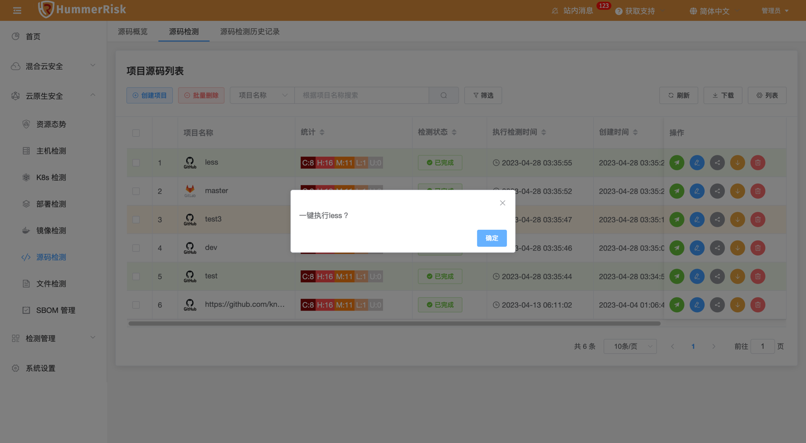

### 源码检测概述

!!! abstract "模块概述"
    「源码检测模块」功能，包括如何配置项目源码，以及使用源码检测规则进行安全检测。通过对源码依赖的扫描，发现项目中存在的漏洞。

### 工作流程

!!! abstract "工作流程"
    下图是本模块的主要工作流程。
    { width="95%" }

### 项目源码配置

!!! abstract "项目源码配置"
    1. 源码检测是一个项目软件安全检测的一部分，所以需要选择项目和版本信息。
    2. 目前绑定仓库支持两种类型：GitHub 和 GitLab 。
    3. Token 的获取：首先私有仓库需要填入Token，公有仓库无需填写Token。
    4. 首先需要把源代码仓库中的项目绑定进来，点击[创建项目]，在弹出窗口中填写相关信息。
    5. 待检测项可以是项目的分支 Branch、标签 Tag 或项目提交标识 Commit（只识别一项，如果都填写，优先 Branch）。
    { width="95%" }
    创建项目源码需要的字段信息：
    <table>
        <tr bgcolor=#FFC125>
            <td>参数</td> 
            <td>说明</td>
       </tr>
        <tr>
            <td>项目名称</td>
            <td>git项目在当前系统中的显示别名</td>
        </tr>
        <tr>
            <td>Git 仓库类型</td>
            <td>GitHub或GitLab</td>
        </tr>
        <tr>
            <td>Token</td>
            <td>Git 项目仓库认证所需的 Token ,该Token需要对项目资源有访问权限</td>
        </tr>
        <tr>
            <td>Url</td>
            <td>Git 项目地址 Url</td>
        </tr>
        <tr>
            <td>Branch</td>
            <td>Git 项目分支 Branch</td>
        </tr>
        <tr>
            <td>Tag</td>
            <td>Git 项目标签 Tag</td>
        </tr>
        <tr>
            <td>Commit</td>
            <td>Git 项目提交标识 Commit</td>
        </tr>
    </table>

!!! warning "Gtihub Token 的获取"
    1. 登录你的帐号，登录后点击右上角你的头像的Settings.
    2. 选择左侧菜单的“Developer settings”一项
    3. 再选择“Personal access tokens”
    4. 点击“Generate a personal access token” 
    5. 设置 token 名字勾选权限 。在 Note 中随便填一个描述名称，下面的复选框是你这个token需要的权限.之后点击生成Token按钮。
    6. 复制token值
    7. 下面这个就是你的token了，可以直接复制使用。（记住这个token值 ，此值只显示一次）
    { width="95%" }

!!! warning "GitLab Token 的获取"
    1. 登录您的 GitLab 账号，点击头像进入【Settings】
    2. 在左侧栏中选定【Access Tokens】
    3. 再在右边输入名字，勾选【Scopes】下的所有选项，最后点击【Create Personal access token】。
    4. Token 生成后，请立即妥善保存。离开此页面后，您将无法在 GitLab 上查询到您刚刚获取到的 Token！
    { width="95%" }

!!! abstract "执行检测"
    - 项目源码列表中会显示已绑定的项目，验证成功可以正常访问的状态会显示为 [有效]。  
    - 点击 [执行检测] 按钮，可以对项目执行检测任务。
    { width="95%" }

### 源码检测结果

!!! abstract "源码检测结果"
    1. 源码检测结果列表会显示出所有的检测任务。
    { width="95%" }
    2. 统计列中的数字表示漏洞数量，点击该数字可以打开和该项目相关的漏洞列表
    { width="95%" }
    3. 点击源码检测结果列表中状态列中的按钮，可以打开检测的详细日志页面，在这里可以看到检测的详细内容。
    { width="95%" }
    4. 源码检测的漏洞和SBOM数据可以通过SBOM管理统一查看。
    { width="95%" }    

### 源码检测历史记录

!!! abstract "历史记录"    
    - 查看到所有检测历史记录，查看过往的执行情况。
    { width="95%" }
    - 通过检测结果 json 对比，可以发现漏洞差异。
    { width="95%" }

### 源码检测概览

!!! abstract "源码检测概览"
    - 通过源码检测概览页面，我们可以快速分析出当前管理的源码项目数据，以便于管理员快速发现安全问题。
    { width="95%" }
