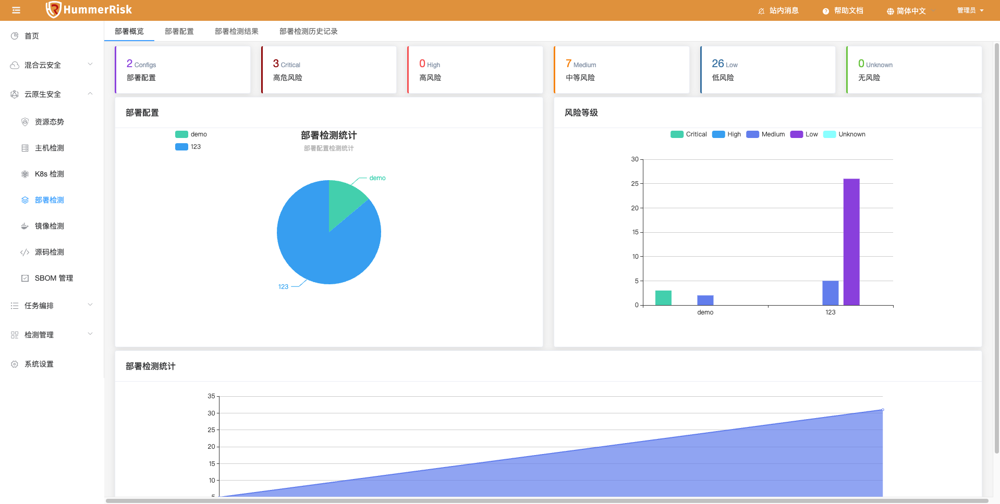
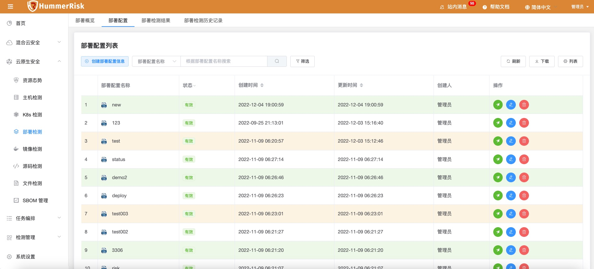
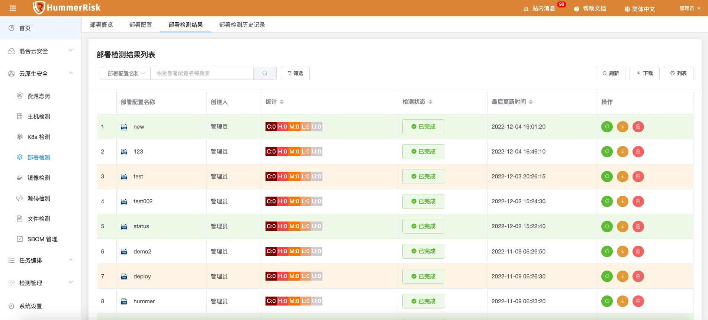
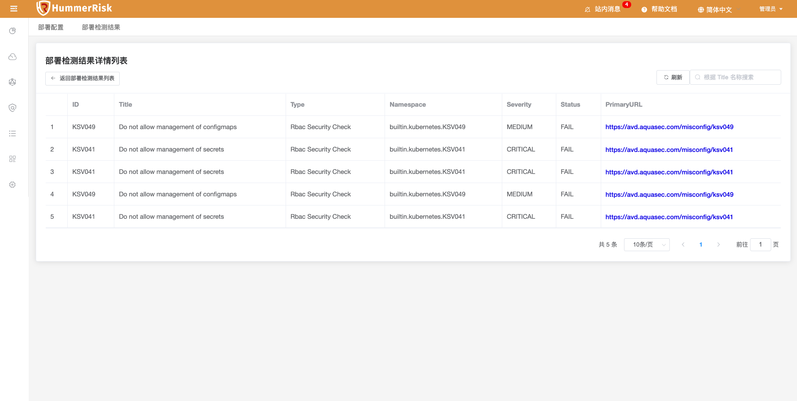
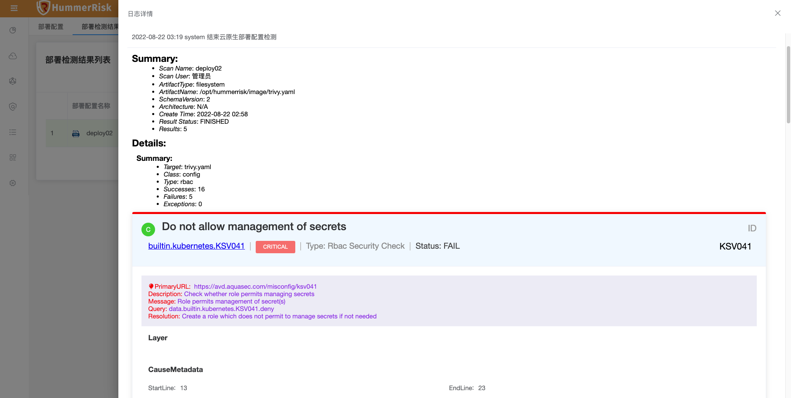
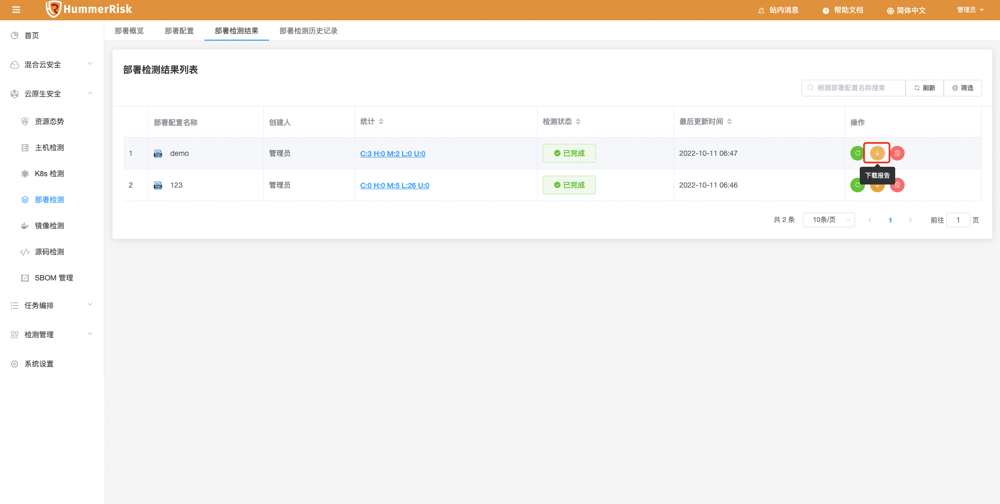
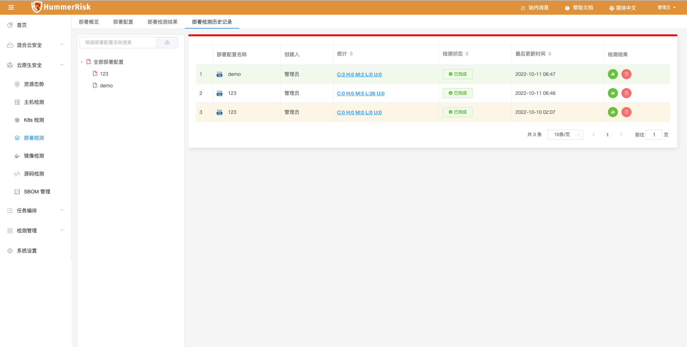
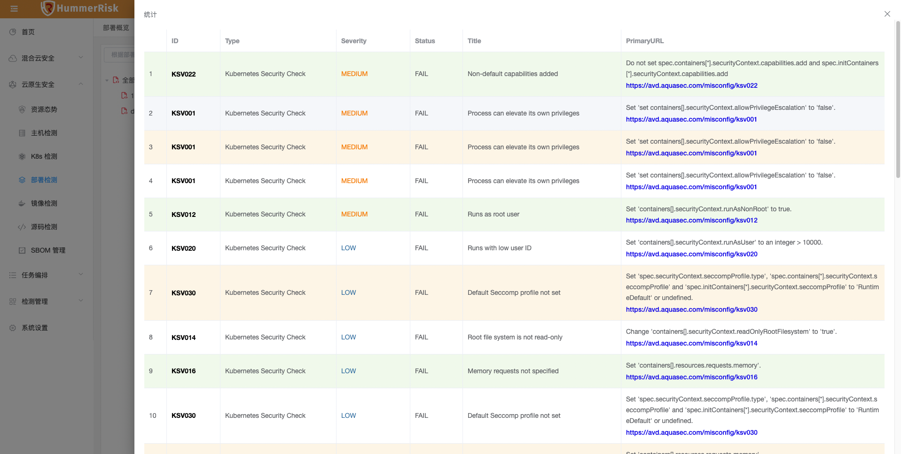
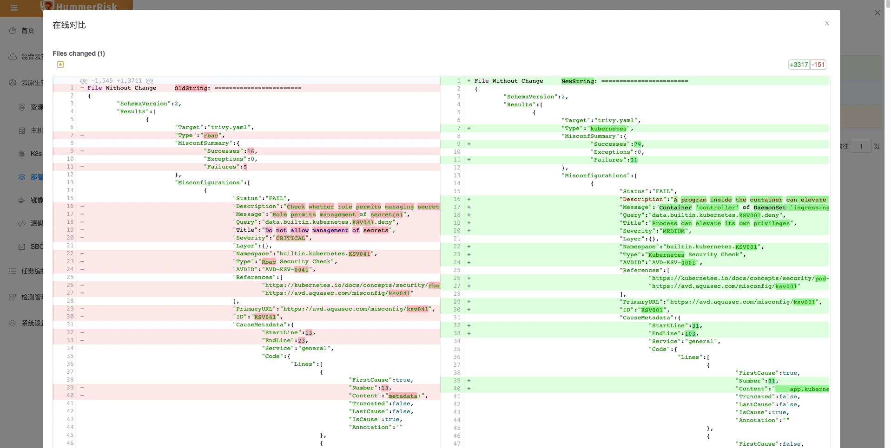

!!! info "K8s 部署检测"
    云原生部署检测功能，输入 K8s 部署配置 YAML 文件，即可进行部署检测，输出部署配置检测结果。

### 部署概览

!!! abstract "部署概览"
    部署检测数据概览。

{ width="95%" }

### 部署配置

!!! abstract "部署配置"
    输入 K8s 部署配置 YAML 文件，即可进行部署检测。

{ width="95%" }

### 部署检测结果
!!! abstract "部署检测结果"
    K8s 部署检测结果列表，点击"统计按钮"进入详情列表，点击"状态按钮"查看日志与报告。

{ width="95%" }
{ width="95%" }
{ width="95%" }
{ width="95%" }

### 部署检测历史记录
!!! abstract "部署检测历史记录"

{ width="95%" }
{ width="95%" }
{ width="95%" }
