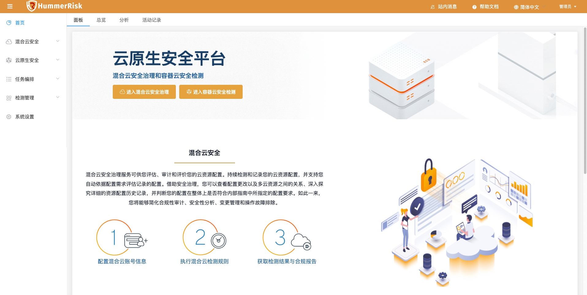
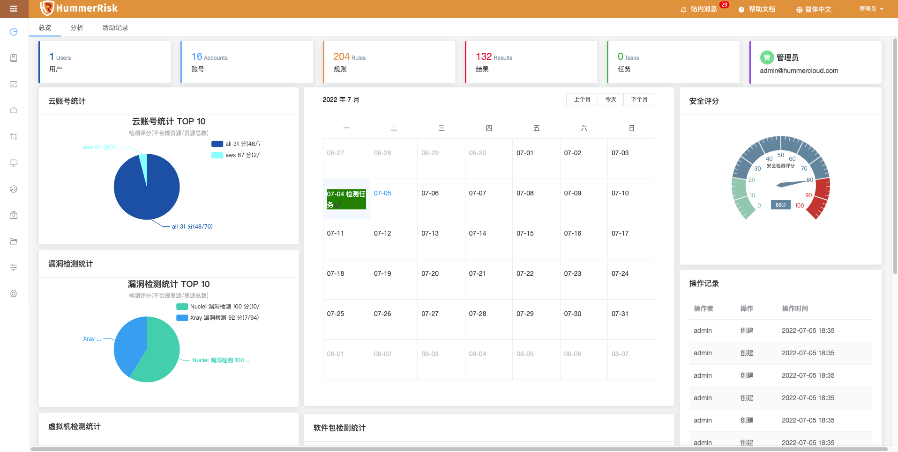
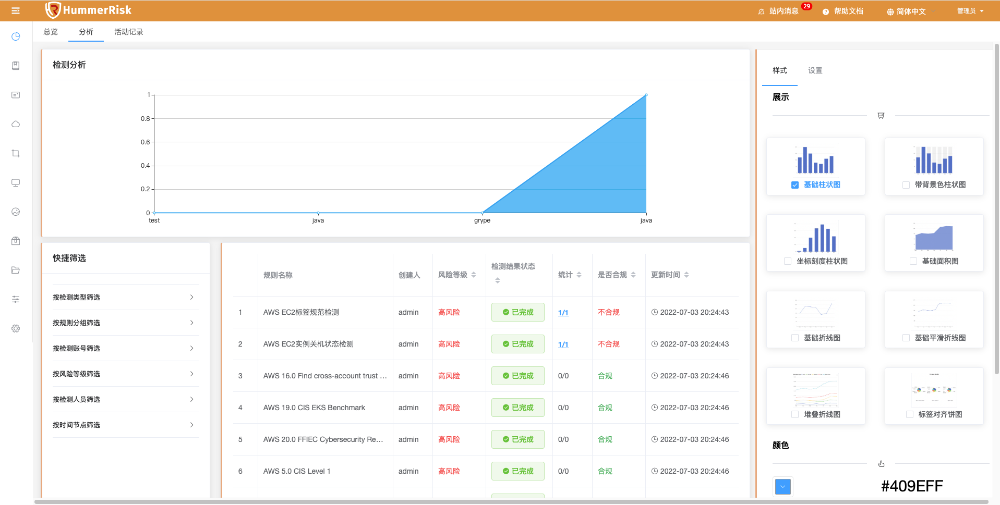
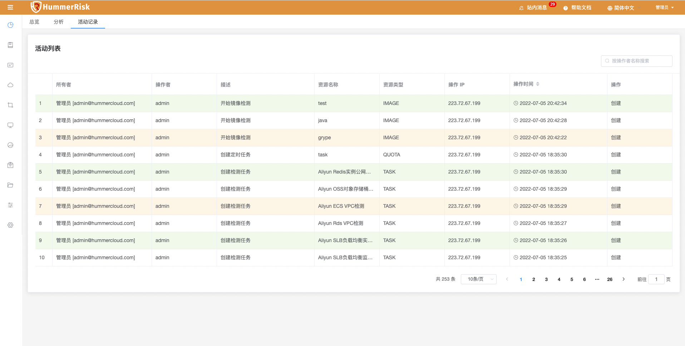

!!! info "首页"
    - 包含面板、总览、分析、活动记录。主要作用是快速进入场景、集中展示和分析检测数据、记录操作的日志。
    - 首页概况，展示了检测结果的核心信息。
    - 首页分为面板、总览、分析、活动记录等页面，默认显示概览页面。

### 面板

!!! abstract "面板"
    首页面板，登录访问直接到面板，可快速进入混合云安全与云原生安全模块。

{ width="95%" }

### 总览

!!! abstract "总览"
    总览页面展示用户数、账号数、规则数、结果数、任务数、安全评分等信息，以及云账号统计、漏洞统计、虚机统计、软件包溶剂、镜像统计，通过日历展示任务执行情况。

{ width="95%" }

### 分析

!!! abstract "分析"
    * 通过用户自定义展示样式与颜色，按分析周期、检测人员、检测类型、检测账号等信息进行分析。
    * 通过按检测类型筛选、按检测分组筛选、按检测账号筛选、按风险等级筛选、按检测人员筛选、按时间节点筛选数据，获取检测结果。

{ width="95%" }

### 活动记录

!!! abstract "活动记录"
    活动页面记录并显示了所有的用户主要活动信息，包括操作人、操作、操作描述、资源名称、资源类型、操作 IP、时间等。

{ width="95%" }
