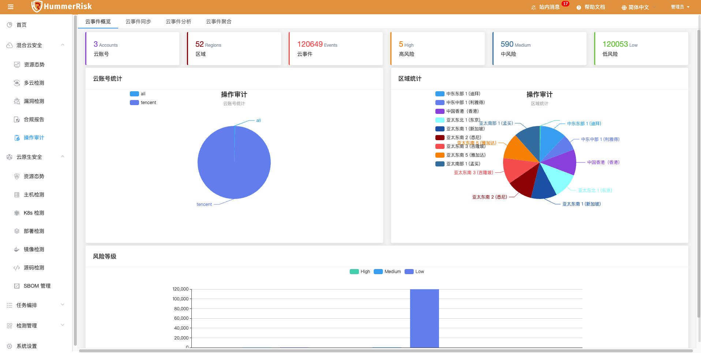
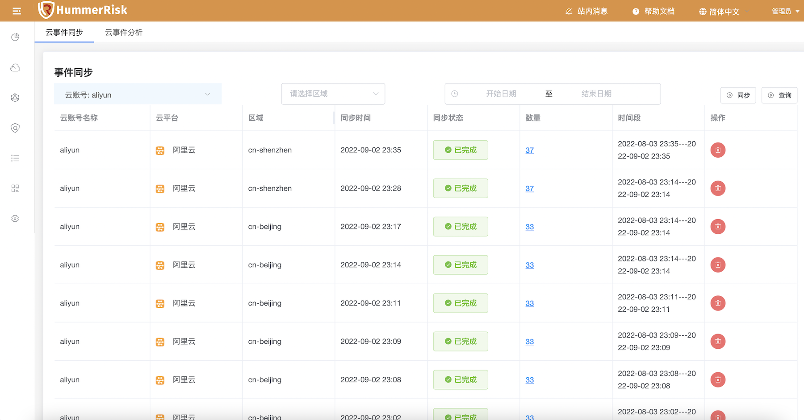
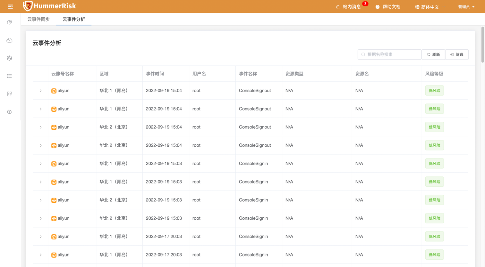
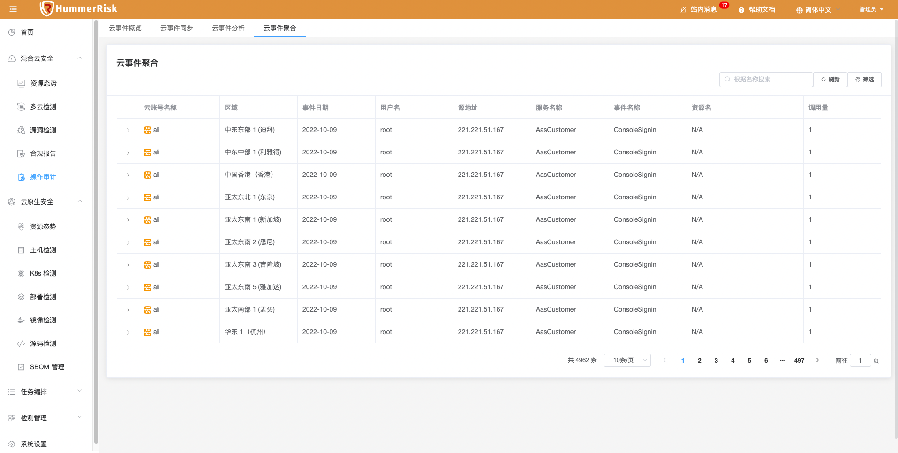

!!! tip "操作审计"
    - 云操作审计，帮助您监控并记录多云账号的活动，包括通过云控制台、OpenAPI、开发者工具对云上产品和服务的访问和使用行为。
    - 您可以在 HummerRisk 上查看这些行为事件，然后进行行为分析、安全分析、资源变更行为追踪和行为合规性审计等操作。

### 操作审计概览

!!! abstract "操作审计概览"
    操作审计数据概览。

{ width="95%" }

### 云事件同步

!!! abstract "云事件同步"
    获取云事件同步日志列表，选择云账号、区域及事件事件范围点击同步按钮可同步云事件。

{ width="95%" }

### 云事件分析

!!! abstract "云事件分析"
    根据云账号、区域、日期范围等条件查询云事件。

{ width="95%" }

### 云事件聚合

!!! abstract "云事件聚合"
    根据同步的云事件数据进行深度聚合查询。

{ width="95%" }

