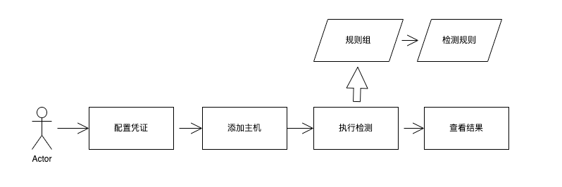

### 文件检测概述

!!! abstract "模块概述"
    「文件检测模块」功能，包括如何配置项目源码，以及使用源码检测规则进行安全检测。通过对源码依赖的扫描，发现项目中存在的漏洞。

### 工作流程

!!! abstract "工作流程"
    下图是本模块的主要工作流程。
    { width="95%" }

## 文件检测

!!! info "文件检测"
    手动添加项目依赖文件(单独文件或包含依赖文件的压缩包zip或tar)，例如：pom.xml、package.json、yarn.lock、pnpm.yaml等，检测依赖项的漏洞风险等信息。

### 依赖文件概览

{ width="95%" }

### 依赖文件管理

!!! abstract "依赖文件管理"
    依赖文件管理，手动添加依赖文件或压缩文件夹，执行一键检测。

{ width="95%" }
{ width="95%" }

### 依赖文件检测结果

!!! abstract "依赖文件检测结果"
    依赖文件检测结果，点击"统计按钮"进入详情列表，点击"状态按钮"查看日志与报告。

{ width="95%" }
{ width="95%" }
{ width="95%" }

### 依赖文件检测历史记录

!!! abstract "依赖文件检测历史记录"
    依赖文件检测历史记录，查看历史检测数据信息。

{ width="95%" }
{ width="95%" }
