### 概览
!!! abstract "概览"
    - HummerRisk 是开源的云原生安全平台，以非侵入的方式解决云原生环境的安全和治理问题。核心能力包括混合云的安全治理和云原生安全检测。
    - 本文将介绍如何使用HummerRisk 在云原生安全领域进行「镜像检测」，通过「镜像检测」功能，可以对镜像进行深入扫描，获取镜像的内部结构，检测镜像的依赖存在哪些漏洞。文章内容包括「镜像检测」的使用流程、配置信息详细说明、基础功能使用等。目前HummerRisk支持绑定镜像仓库后根据同步后的镜像列表进行扫描，或手动指定镜像以及上传tar包进行安全扫描。
    - 本文将使用由Harbor提供的私有Docker镜像仓库为例，演示如何进行镜像扫描。

### 工作流程
!!! abstract "工作流程"
    完成 “镜像检测”我们需要通过一下几个步骤来完成：
    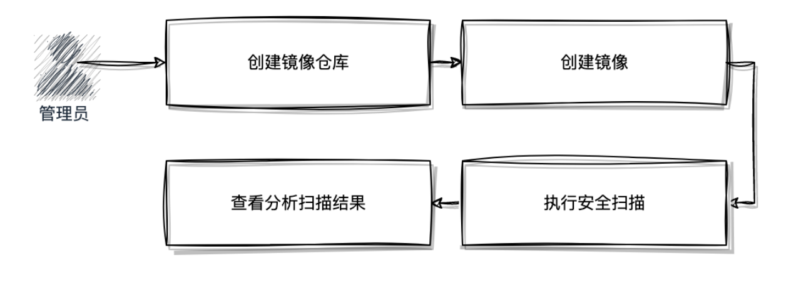{ width="95%" }

### 镜像仓库管理
!!! abstract "镜像仓库管理"
    HummerRisk目前支持的镜像仓库包括Harbor、DockerHub、Nexus，如果是其他类型的仓库可选择Other，具体步骤如下：

    1. 登录到HummerRisk系统当中，点击云原生安全；
    2. 点击 「镜像检测」，点击“创建镜像仓库”；
    3. 填写 镜像仓库的配置信息；
    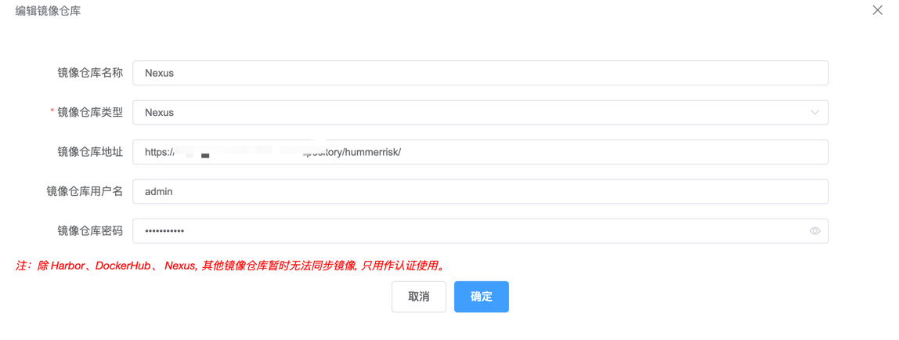{ width="95%" }
    4. 填写完成后点击“确认”
    5. 创建完成后可以点击“同步镜像”查看账号的有效性并同步镜像列表
    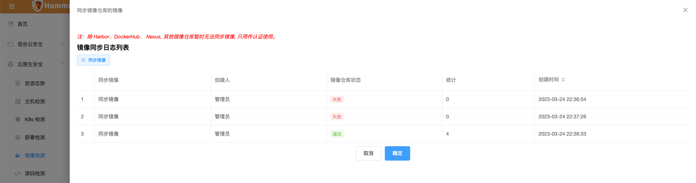{ width="95%" }
    6. 相关参数说明：
    <table>
        <tr bgcolor=#FFC125>
            <td>参数</td> 
            <td>说明</td>
       </tr>
        <tr>
            <td>镜像仓库名称</td>
            <td>镜像仓库在 HummerRisk 系统中的显示名称</td>
        </tr>
        <tr>
            <td>镜像仓库类型</td>
            <td>镜像仓库类型，根据实际情况选择，目前适配验证过的仓库包括Harbor、DockerHub、Nexus</td>
        </tr>
        <tr>
            <td>镜像仓库地址</td>
            <td>镜像仓库访问地址，通常为 https://<仓库IP或域名>:<端口></td>
        </tr>
        <tr>
            <td>镜像仓库用户名</td>
            <td>镜像仓库用户名，尤其是私有仓库，必须填写。用于身份校验，否则镜像无法拉取</td>
        </tr>
        <tr>
            <td>镜像仓库密码</td>
            <td>镜像仓库密码，尤其是私有仓库，必须填写。用于身份校验，否则镜像无法拉取</td>
        </tr>
    </table>

### 镜像管理
!!! abstract "镜像管理"
    - 通过「镜像管理」功能，我们可以更好的管理应用发布镜像，同时在一些没有私有镜像仓库，或一些公共镜像仓库中，用户可以手动创建镜像，以便于完成后续的镜像扫描工作。
    - HummerRisk将镜像与SBOM中的项目和版本进行关联，方便对应用的安全版本进行管理和维护，使用镜像管理前，请现在「SBOM管理」中创建项目和版本。

    创建镜像的详细步骤和参数说明如下：

    1. 登录到HummerRisk系统当中，点击云原生安全；
    2. 点击 「镜像检测」功能，在菜单栏选择“镜像管理”；
    3. 点击“创建镜像”，输入正确的镜像信息以及参数，参数的说明见下方表格 
    <table>
        <tr bgcolor=#FFC125>
            <td>参数</td> 
            <td>说明</td>
       </tr>
        <tr>
            <td>Sbom项目	</td>
            <td>「SBOM管理」中创建的项目名称</td>
        </tr>
        <tr>
            <td>项目版本</td>
            <td>「SBOM管理」功能中项目的版本</td>
        </tr>
        <tr>
            <td>镜像名称</td>
            <td>镜像仓库访问地址，通常为 https://<仓库IP或域名>:<端口></td>
        </tr>
        <tr>
            <td>是否绑定镜像仓库</td>
            <td>镜像仓库用户名，尤其是私有仓库，必须填写。用于身份校验，否则镜像无法拉取</td>
        </tr>
        <tr>
            <td>是否启用代理</td>
            <td>镜像仓库密码，尤其是私有仓库，必须填写。用于身份校验，否则镜像无法拉取</td>
        </tr>
        <tr>
            <td>是否上传镜像图片</td>
            <td>该镜像在HummerRisk系统中的显示图片，便于区分</td>
        </tr>
        <tr>
            <td>备注</td>
            <td>对镜像使用的一些描述</td>
        </tr>
        <tr>
            <td>镜像类型</td>
            <td>目前支持三种方式：  
            <ul>
              <li>1.从镜像仓库获取，选择此项可以直接关联镜像仓库</li>
              <li>2.手写镜像地址，例如在Dockerhub公开库中的镜像会自动拉取</li>
              <li>3. 手动上传镜像离线包，通常是 docker save 出来的 .tar 的镜像压缩包</li>
            </ul>
            </td>
        </tr>
        <tr>
            <td>镜像地址：标签</td>
            <td>填写完整的镜像地址，包括 URL 和 TAG</td>
        </tr>
        <tr>
            <td>镜像列表</td>
            <td>如果该镜像是在私有仓库中，可以和镜像列表中镜像进行绑定</td>
        </tr>
        <tr>
            <td>镜像地址</td>
            <td>手动上传tar包时，需要通过此项上传离线文件</td>
        </tr>
    </table>
    4. 填写正确的信息后，点击“确认”
    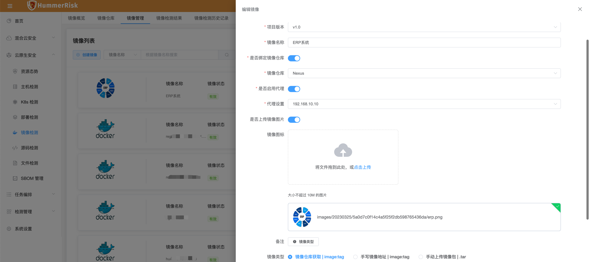{ width="95%" }
    5. 点击“检测”，对该镜像执行
    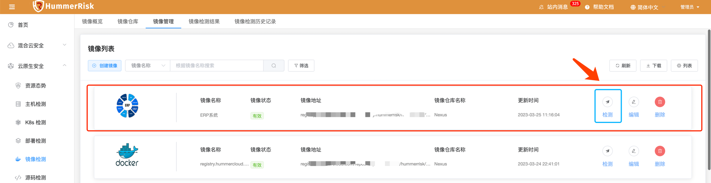{ width="95%" }

### 检测结果

!!! abstract "检测结果"
    镜像检测完成后，会输出检测结果，检测结果并通过可视化的页面查看风险情况，已经漏洞名称和解决办法。

    - 执行镜像检测后，可以在镜像检测结果页面查看所有检测结果。
    - 列表中会显示出所有执行过的检测任务。
    - 检测状态显示当前任务的执行情况，正在执行的任务会显示为 [正在处理]，已经执行完的任务显示为 [已完成] 或 [异常]

    详细步骤如下：

    1. 登录到HummerRisk系统当中，点击「云原生安全」；
    2. 点击 「镜像检测」，点击“镜像检测结果”；
    3. 此时可以查看到镜像列表，如果检测完的镜像状态应该是“已完成”，点击“统计”中的内容既可以查看详细的检测结果，统计的结果分为5个等级，分别是：
    <table>
        <tr >
            <td bgcolor=#FFC125>等级</td> 
            <td>等级	C(Critical)</td>
            <td>H(High)</td> 
            <td>M(Medium)</td> 
            <td>L(low)</td> 
            <td>U(Unkown)</td>
       </tr>
        <tr>
            <td bgcolor=#FFC125>说明</td> 
            <td>高危</td>
            <td>高风险</td> 
            <td>中等风险</td> 
            <td>低风险</td> 
            <td>无风险</td>
        </tr>
        <tr>
    </table>
    4. 查看详细检测结果
    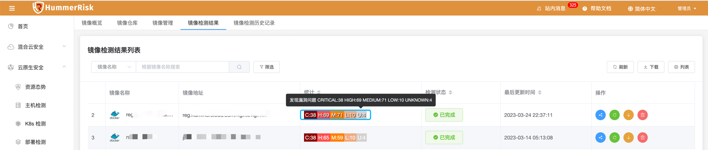{ width="95%" }
    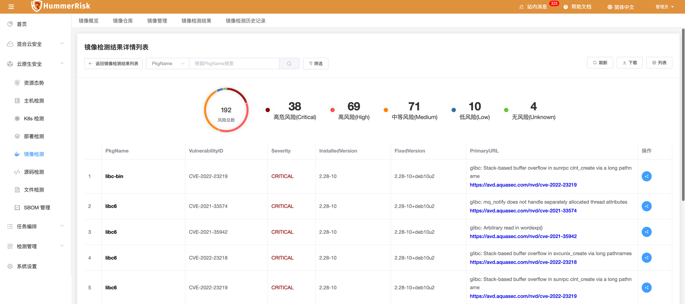{ width="95%" }
    5. 若需要查看检测结果详情，可以点击检测统计进行详细展示页面
    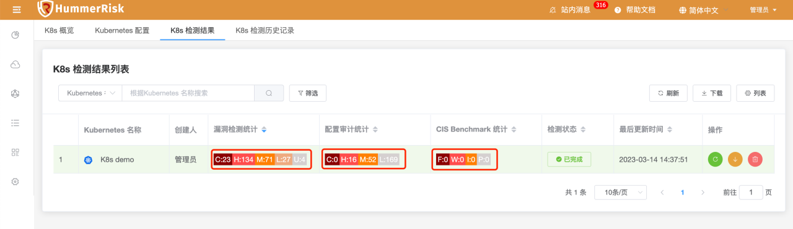{ width="95%" }
    6. 以“漏洞检测”为例，点击“漏洞检测统计”结果后，可查看到如下漏洞详情页面，根据漏洞详情页面中的信息，我们可以查看到存在漏洞的软件名称、CVEID、风险等级、修复版本号等
    { width="95%" }

### 镜像检测历史记录
!!! abstract "镜像检测历史记录"
    通过「镜像检测历史记录」功能，可以查看每个镜像的历史检测结果，同时可以对比多次检测结果。

    - 历史镜像检测清单：
    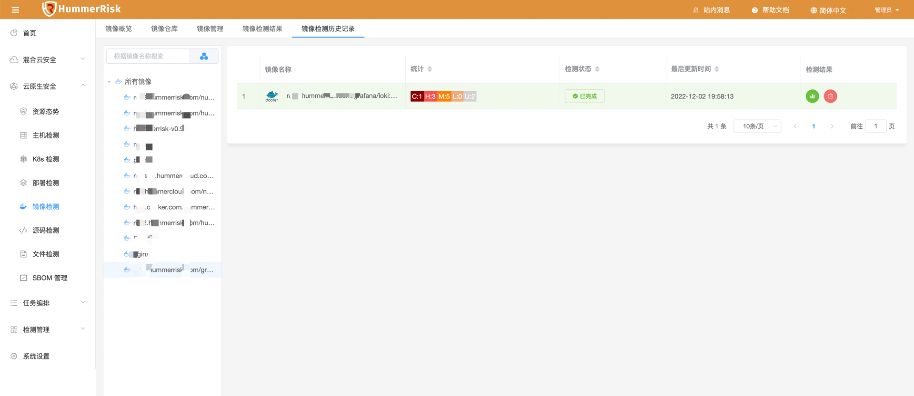{ width="95%" }
    - 查看历史检测结果：
    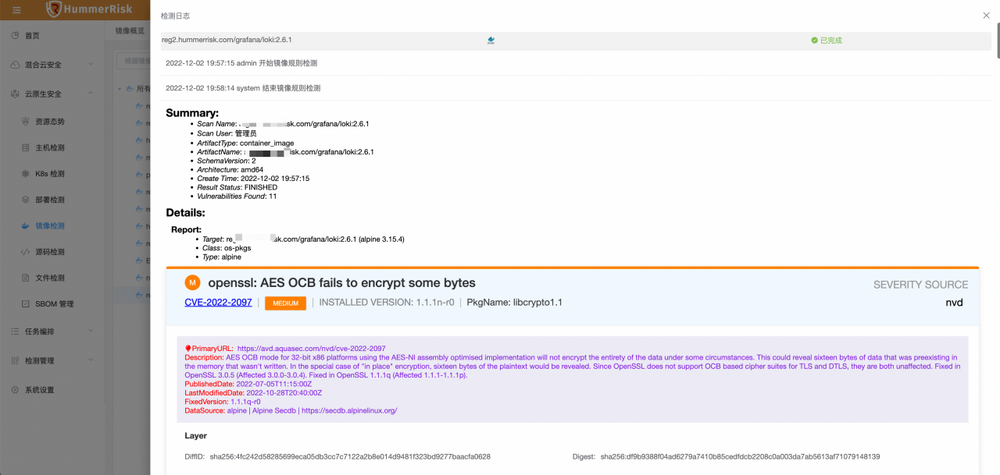{ width="95%" }

### 镜像概览

!!! abstract "镜像概览"
    - 通过「镜像概览」页面，我们可以快速分析出当前管理的所有镜像的安全状态，以便于管理员快速发现安全问题。包括根据仓库的统计、根据漏洞风险等级的统计
    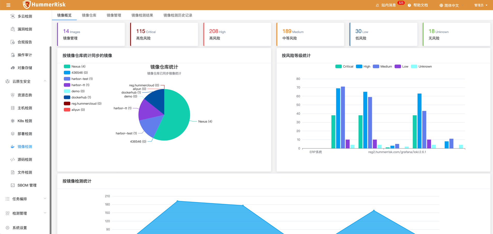{ width="95%" }
