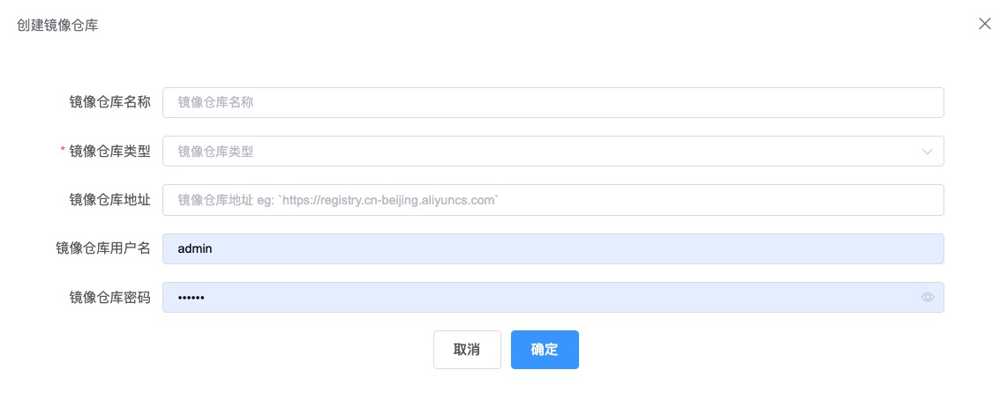

### 镜像管理

在本模块中，可以对镜像进行深入扫描，获取镜像的内部组成，检测镜像依赖存在哪些漏洞，
同时会生成镜像的SBOM信息，在SBOM管理中可以参看。

> 首先可以在系统中绑定镜像仓库，之后检测的镜像可以从绑定的镜像仓库中查找和获取的，点击上方的创建镜像仓库，可以添加新的仓库。在页面中需要填入一下信息：  
* 镜像仓库名称：在本系统中显示的镜像仓库别名  
* 镜像仓库类型：目前支持两种类型 harbor 和 other。如果选择 other 不会同步镜像，只做登录验证，后续获取镜像需要指定镜像地址。
* 镜像仓库地址：镜像仓库的实际访问地址，请确保 HummerRisk 和仓库地址网络畅通  
* 镜像仓库用户名：登录镜像仓库用的用户名  
* 镜像仓库密码：登录镜像仓库的用户对应的密码

> 创建完成镜像仓库后，页面中会列出所有已经绑定的镜像仓库。系统会对创建的仓库进行校验，可以正常访问的仓库会显示为有效状态。可以对仓库进行修改和删除操作。

> 在镜像管理页面，我们可以对具体需要检测的镜像进行管理。
> 镜像列表中会显示出已经创建成功的待检测镜像，列表会显示出镜像的名称、状态、地址等信息。   
> 通过校验的镜像，镜像状态会显示为 [有效]，可以对其执行检测。

> 新增镜像信息。点击[创建镜像按钮]，在弹出填写相关信息可以新增镜像。

* Sbom 项目：需要指定一个项目
* 项目版本：需要选择项目中的一个版本
* 镜像名称：新建镜像在系统中显示的名称，按需要填写即可。
* 是否绑定镜像仓库：打开开关，就表示使用前面已经绑定好的仓库，可以从下拉列表中选择要使用的仓库。
* 是否启用代理：如果访问仓库需要通过代理连接，可以打开开关，并且选择代理。此处的代理需要在[设置]>[系统设置]>[代理设置]中进行配置。
* 是否上传镜像图片：新建镜像默认使用docker图标，如果需要替换可以打开本开关，上传图片。
* 镜像类型：支持三种镜像类型
  * 镜像仓库获取，前面选取好绑定的镜像仓库后，从已经同步的镜像信息中选择一个。
  * 填写镜像地址和标签信息，绑定的仓库是不支持自动同步的，需要指定镜像地址等信息
  * 直接上传tar包。

### 执行镜像检测
> 在镜像列表中，选择希望执行检测的镜像，点击列表后的[检测]按钮，确认后系统就会对该镜像进行检测。

### 镜像检测结果

>执行镜像检测后，可以在镜像检测结果页面查看所有检测结果。
> 列表中会显示出所有执行过的检测任务。   
> 检测状态显示当前任务的执行情况，正在执行的任务会显示为 [正在处理]，已经执行完的任务显示为 [已完成] 或 [异常]   

> [统计] 会直接显示出本次检测任务发现的不合规资源数量，点击数字会跳转到漏洞信息列表。

> 点击检测状态中的 [已完成] 按钮，可以打开检测日志详情，在里面可以查看到本次日志检测的详细信息。  
> 包括检测的执行情况，直接结果的详细情况，相关漏洞的详细情况，SBOM 信息等。

