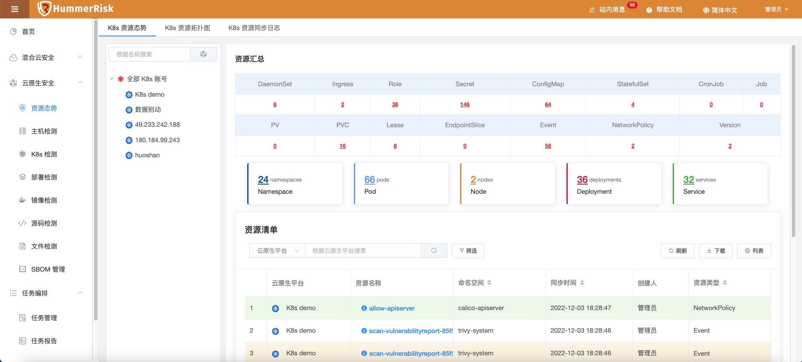
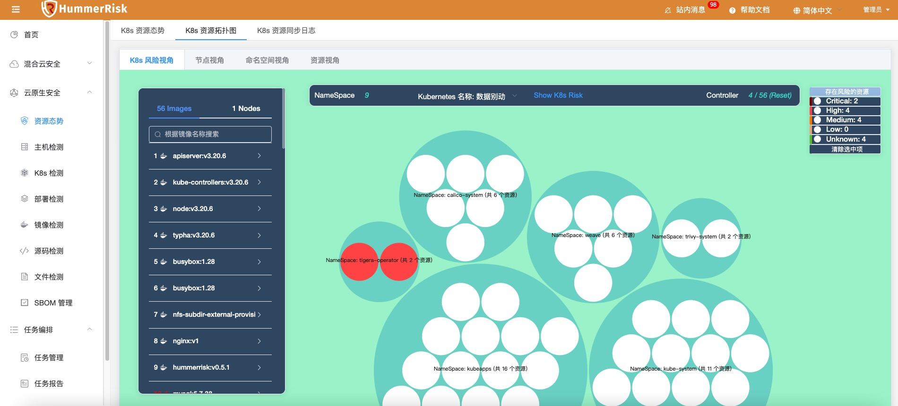
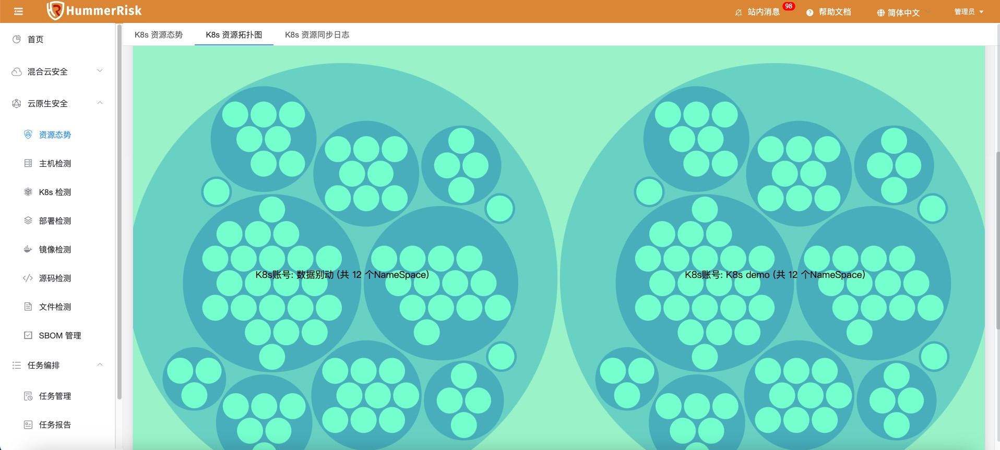
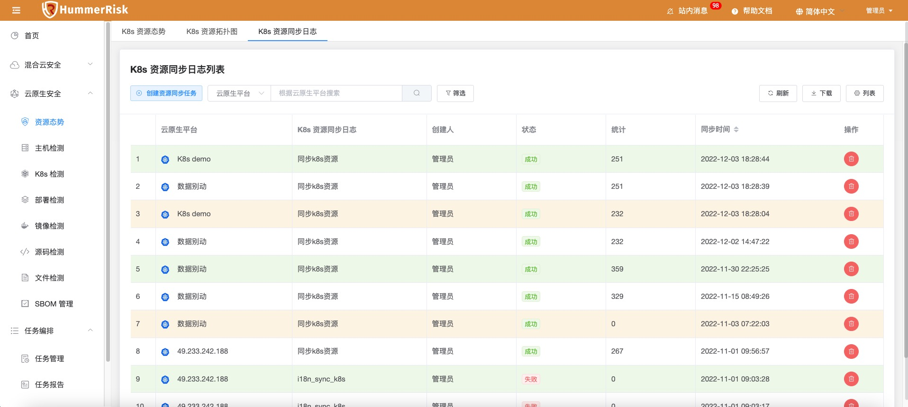

!!! abstract "模块概述"
    「资源态势模块」主要目标是实现对多个 K8s 环境进行统一资源信息查看的能力，以表格型的数据和可视化的拓扑图两种形式，来全面的呈现多 K8s 的整体信息。
    另外，结合系统中的安全检测结合，将资源信息和风险信息充分整合，实现快速的风险定位。
### 资源态势

!!! abstract "K8s 资源态势"
    在这里可以绑定多个 K8s 环境信息，即可获取 K8s 的 Namespace、Pod、Node、Deployment、Service 等20余种资源信息。
    可以通过左侧菜单来选择是查看全部 K8s 的资源态势信息，还是某个环境的。

{ width="95%" }

### 拓扑图

!!! abstract "K8s 资源拓扑图"
    - K8s 资源拓扑图功能，根据同步 K8s 资源汇总信息，形成拓扑图。拓扑图会包括风险视角、节点视角、命名空间视角和资源视角。
    - 风险视角，根据 K8s 资源关联镜像与检测与进行过的镜像漏洞检测，会在拓扑图中显示出关联的风险。

{ width="95%" }

!!! abstract "K8s 资源拓扑图示例"
    - 节点视角，以节点来聚合显示资源，也就是资源实际归属于哪个node。
    - 命名空间视角，以命名空间来聚合显示资源。
    - 资源视角，根据资源的类型，来聚合显示 K8s 中的资源。

{ width="95%" }- 
### 同步日志

!!! abstract "K8s 资源同步日志"
    绑定完 K8s 账号是可以自动获取资源态势信息的。同时，也可以在同步日志页面手动获取资源态势信息。手动创建同步任务，即可查看同步资源数与同步状态。

{ width="95%" }
