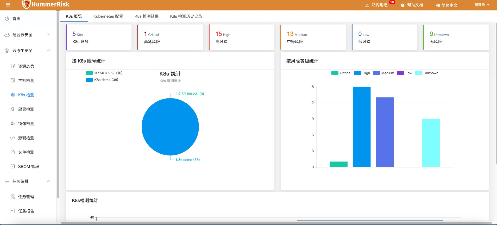
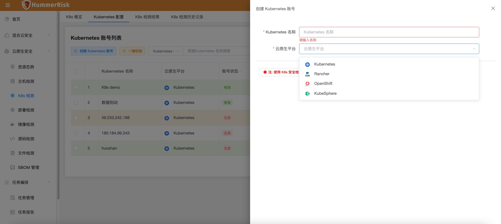
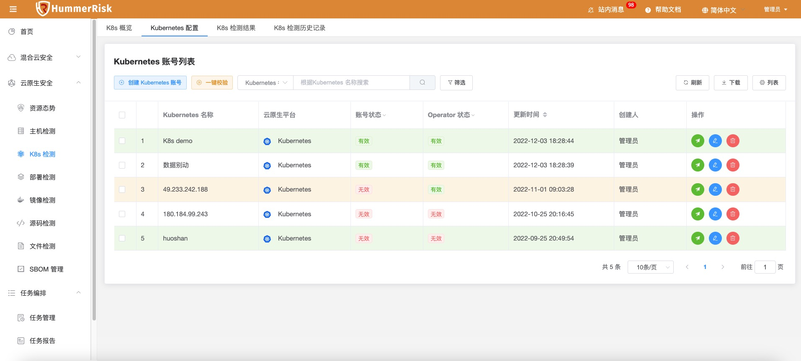
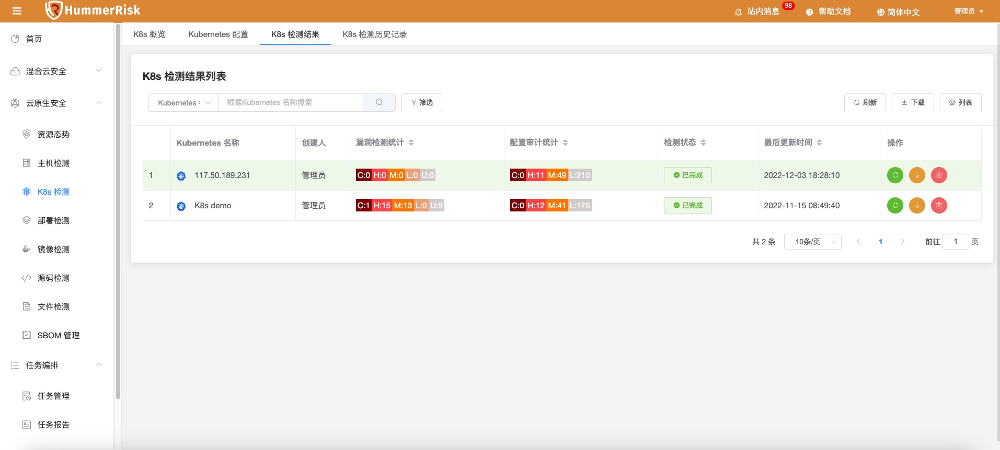
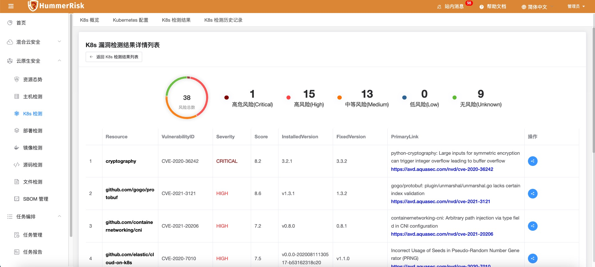
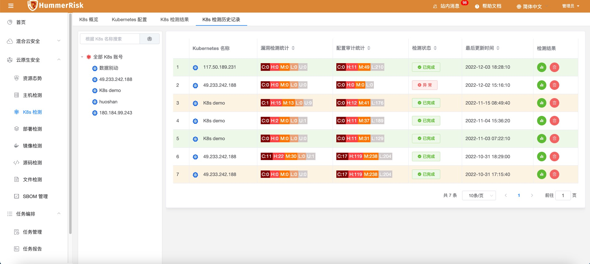

### K8s 检测前置条件

#### 1. 安装 tirvy-operator
!!! info "使用云原生 K8s 安全检测任务前需在k8s集群上安装 tirvy-operator"
    ```shell
    # 1.添加 chart 仓库
    helm repo add hummer https://registry.hummercloud.com/repository/charts
    
    # 2.更新仓库源
    helm repo update
    
    # 3.开始安装, 可以自定义应用名称和NameSpace
    helm install trivy-operator hummer/trivy-operator \
     --namespace trivy-system \
     --set="image.repository=registry.cn-beijing.aliyuncs.com/hummerrisk/trivy-operator" \
     --create-namespace --set="trivy.ignoreUnfixed=true"
    
    # 4.检测operator是否启动成功
    kubectl get pod -A|grep trivy-operator
    trivy-system   trivy-operator-69f99f79c4-lvzvs           1/1     Running            0          118s
    ```

#### 2. k8s 账号添加校验

!!! question "添加校验"
    1. 确定部署 hummerrisk 的主机可以访问该 k8s 集群的 6443 端口，需要网络可达、端口可以通，如果不通可以检查防火墙;
    2. 确定提供的 k8s Token 有足够的权限，hummerrisk 会通过该 Token 调用 k8s apiserver 的 api
    3. k8s token 权限可以参考如下
    创建 ServiceAccount
    ```yaml
    cat <<EOF > hummer-sa.yaml
    apiVersion: v1
    kind: ServiceAccount
    metadata:
      name: hummer
      namespace: kube-system
    EOF
    ```
    创建 clusterrolebinding
    ```yaml
    cat <<EOF > hummer-clusterrolebinding.yaml
    apiVersion: rbac.authorization.k8s.io/v1
    kind: ClusterRoleBinding
    metadata:
      name: hummer-user
    roleRef:
      apiGroup: rbac.authorization.k8s.io
      kind: ClusterRole
      name: cluster-admin
    subjects:
      - kind: ServiceAccount
      name: hummer
      namespace: kube-system
    EOF
    ```
    创建资源
    ```bash
    kubectl create -f ./hummer-sa.yaml
    kubectl create -f ./hummer-clusterrolebinding.yaml
    ```

#### 3. 获取 token
!!! question "获取 token"
    ```bash
    # 获取 token
    kubectl -n kube-system describe secret $(kubectl -n kube-system get secret | grep hummer | awk '{print $1}') | grep token: | awk '{print $2}'
    ```

### K8s 概览

!!! abstract "K8s 概览"
    K8s 检测数据概览。

{ width="95%" }

!!! warning "注意"
    K8s 配置与云原生 K8s 环境安全检测功能，绑定 K8s Url 与 Token 信息即可进行安全检测，并生成安全漏洞结果。

### K8s 账号配置
!!! abstract "云原生检测结果"
    绑定 K8s 账号, 即可执行安全检测。

{ width="95%" }
{ width="95%" }

### K8s 检测结果
!!! abstract "云原生检测结果"
    - K8s 检测结果列表，检测结果会涉及两方面：漏洞和配置错误。
    - 「漏洞检测统计」和「配置审计统计」中会显示出本次检测涉及的风险数量，点击数字可以进入详细的信息页面。
    - 点击「检测状态」的按钮可以查看日志与报告。
    - 点击操作中的「下载」按钮可以下载报告。

{ width="95%" }
{ width="95%" }
{ width="95%" }
{ width="95%" }

### K8s 检测历史记录

{ width="95%" }
