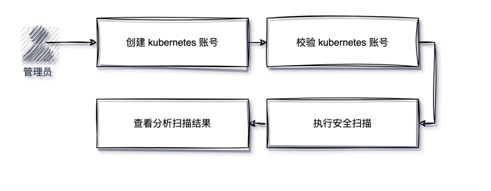
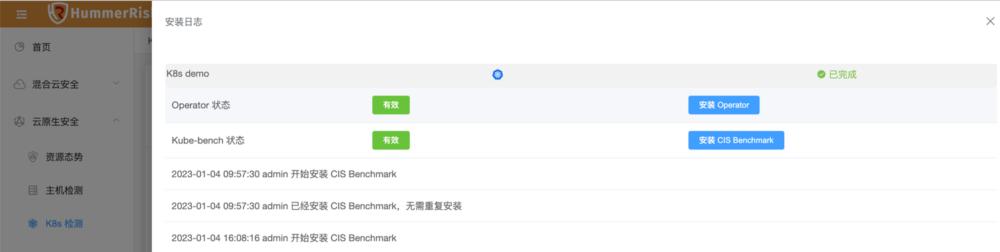
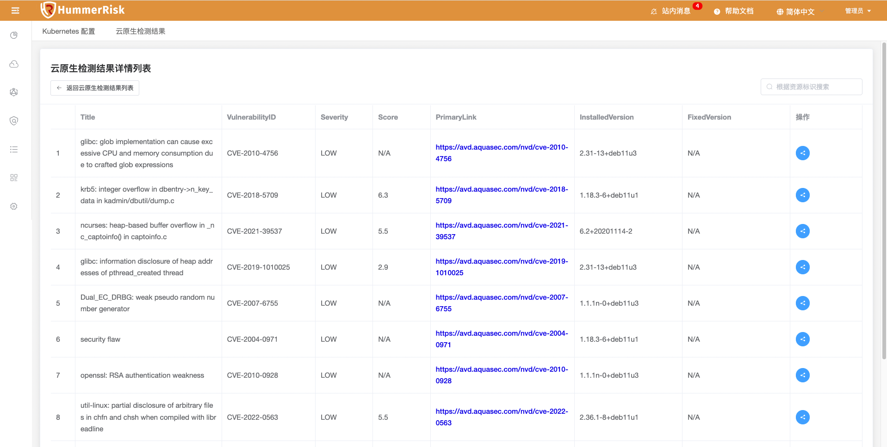
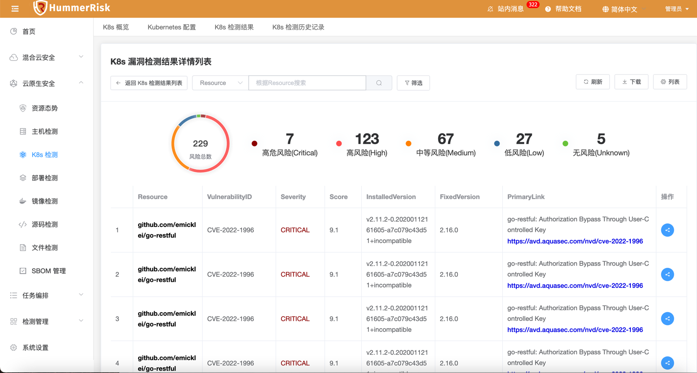
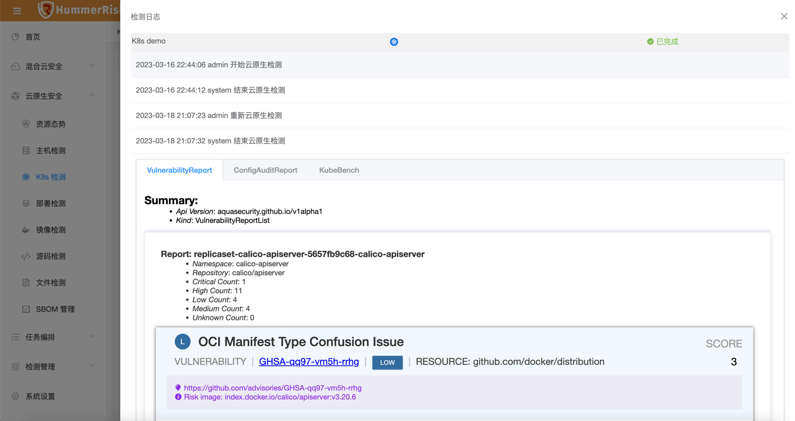
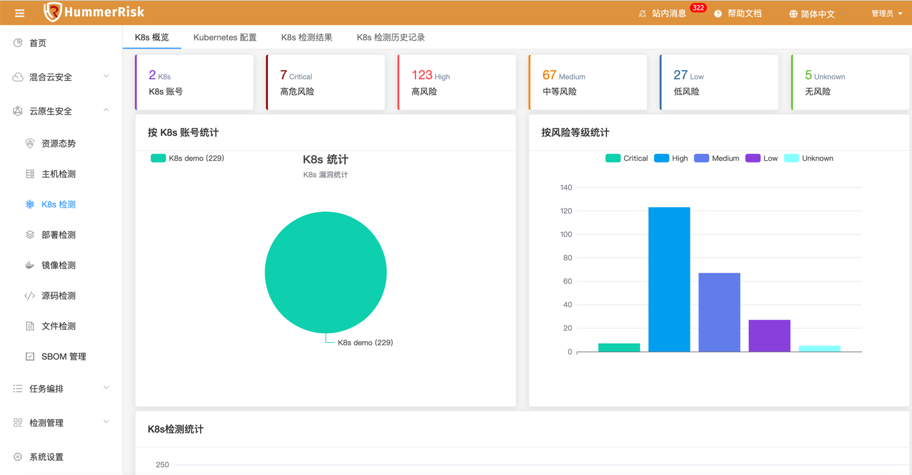

### K8s 检测概述

!!! abstract "- 概述"
    「Kubernetes 检测」功能，包括 Kubernetes 检测使用流程、配置信息详细说明、基础功能使用等。

### K8s 检测前置条件

#### 1. 安装 tirvy-operator
!!! info "使用云原生 K8s 安全检测任务前需在k8s集群上安装 tirvy-operator"
    ```shell
    # 1.添加 chart 仓库
    helm repo add hummer https://registry.hummercloud.com/repository/charts
    
    # 2.更新仓库源
    helm repo update
    
    # 3.开始安装, 可以自定义应用名称和NameSpace
    helm install trivy-operator hummer/trivy-operator \
     --namespace trivy-system \
     --set="image.repository=registry.cn-beijing.aliyuncs.com/hummerrisk/trivy-operator" \
     --create-namespace --set="trivy.ignoreUnfixed=true"
    
    # 4.检测operator是否启动成功
    kubectl get pod -A|grep trivy-operator
    trivy-system   trivy-operator-69f99f79c4-lvzvs           1/1     Running            0          118s
    ```

#### 2. k8s 账号添加校验

!!! question "添加校验"
    1. 确定部署 hummerrisk 的主机可以访问该 k8s 集群的 6443 端口，需要网络可达、端口可以通，如果不通可以检查防火墙;
    2. 确定提供的 k8s Token 有足够的权限，hummerrisk 会通过该 Token 调用 k8s apiserver 的 api
    3. k8s token 权限可以参考如下
    创建 ServiceAccount
    ```yaml
    cat <<EOF > hummer-sa.yaml
    apiVersion: v1
    kind: ServiceAccount
    metadata:
      name: hummer
      namespace: kube-system
    EOF
    ```
    创建 clusterrolebinding
    ```yaml
    cat <<EOF > hummer-clusterrolebinding.yaml
    apiVersion: rbac.authorization.k8s.io/v1
    kind: ClusterRoleBinding
    metadata:
      name: hummer-user
    roleRef:
      apiGroup: rbac.authorization.k8s.io
      kind: ClusterRole
      name: cluster-admin
    subjects:
      - kind: ServiceAccount
        name: hummer
        namespace: kube-system
    EOF
    ```
    创建资源
    ```bash
    kubectl create -f ./hummer-sa.yaml
    kubectl create -f ./hummer-clusterrolebinding.yaml
    ```

#### 3. 获取 token
!!! question "获取 token"
    ```bash
    # 获取 token
    kubectl -n kube-system describe secret $(kubectl -n kube-system get secret | grep hummer | awk '{print $1}') | grep token: | awk '{print $2}'
    ```

### 工作流程
!!! abstract "「K8s 检测」- 工作流程"
    完成 “K8s检测”我们需要通过以下几个步骤来完成：
    { width="75%" }

### Kubernetes 账号管理
!!! abstract "「K8s 检测」- 创建 Kubernetes 账号.进行kubernetes 检测的第一步是“创建kubernetes 账号”，因此需要确保你填写的相关配置信息无误，kubernetes 账号创建完成后，可以勾选该账号进行一键校验。具体步骤如下："
    1. 登录到HummerRisk系统当中，点击云原生安全；
    2. 点击 “K8s检测”，点击“创建 kubernetes 账号”；
    3. 填写 kubernetes的配置信息；
    4. 选择创建完成的kubernetes账号，点击“一键校验”，返回“成功”则代表kubernetes填写正确且可正常访问。
        <table>
            <tr bgcolor=#FFC125>
                <td>参数</td> 
                <td>说明</td>
           </tr>
            <tr>
                <td>Kubernetes 名称</td>
                <td>k8s账号在当前系统中的显示名称</td>
            </tr>
            <tr>
                <td>云原生平台</td>
                <td>选择云原生提供商，目前支持原生kubernetes、rancher、OpenShift、kubesphere</td>
            </tr>
            <tr>
                <td>API Server</td>
                <td>K8s APIServer 组件的地址，通常为 https://<api-server-ip>:6443</td>
            </tr>
            <tr>
                <td>Token</td>
                <td>用于 API Server验证的token，可以在K8s集群上手动创建，该Token需要对K8s资源有访问权限</td>
            </tr>
            <tr>
                <td>Trivy Server</td>
                <td>Trivy Server服务的IP地址，根据部署环境而定。
                  <ul>
                  <li>如果 HummerRisk以主机方式运行，则 <hummerrisk-trivy-server-ip> 为主机 IP。</li>
                  <li>如果 HummerRisk在 k8s 上运行，则 <hummerrisk-trivy-server-ip> 和端口为节点 IP 和 NodePort 端口。</li>
                  <li>若配置的有 ingress 则可配置域名。eg:  `https://40.140.219.236` eg:  `https://tirvyserver.example.com`</li>
                  </ul>
                </td>
            </tr>
            <tr>
                <td>Trivy Port</td>
                <td>Trivy Server的端口，默认4975, 如果trivy Server运行的端口做了修改或代理配置，则需要修改为实际端口。</td>
            </tr>
            <tr>
                <td>是否启用代理</td>
                <td>开启后可选择代理进行配置使用</td>
            </tr>
            <tr>
                <td>代理设置</td>
                <td>选择系统设置中的的代理服务器用于API代理访问</td>
            </tr>
        </table>

### 执行扫描
!!! abstract "「K8s 检测」- 执行扫描"
    1. 执行扫描前需要确定 Operator和 kube-bench 已经安装，默认 HummerRisk 会自动安装，点击 kubernetes 账号的「安装日志」可以查看，如下图：
    { width="95%" }
    2. 如果Operator和 kube-bench状态不是“有效”，可以点击对应的安装按钮，重新执行安装。
    3. 之后进行扫描任务，详细步骤如下：
    - 登录到HummerRisk系统当中，点击云原生安全；
    - 点击 “K8s检测”，在对应kubernetes账号栏目点击“执行检测按钮”；
      { width="95%" }
    - 等待检测成功。


### 检测结果
!!! abstract "「K8s 检测」- 检测结果。Kubernetes检测完成后，会输出检测结果，并通过可视化的页面帮助安全管理分析、洞察 kubernetes安全状态。详细步骤如下："
    1. 登录到HummerRisk系统当中，点击云原生安全；
    2. 点击 “K8s检测”，点击“K8s检测结果”；
    3. 此时可以查看当前kubernetes安全状态，包含漏洞检测统计、配置审计统计、CIS统计等，同时根据风险级别进行分类统计，目前分为5类风险等级，包括：
    <table>
        <tr >
            <td bgcolor=#FFC125>等级</td> 
            <td>等级	C(Critical)</td>
            <td>H(High)</td> 
            <td>M(Medium)</td> 
            <td>L(low)</td> 
            <td>U(Unkown)</td>
       </tr>
        <tr>
            <td bgcolor=#FFC125>说明</td> 
            <td>高危</td>
            <td>高风险</td> 
            <td>中等风险</td> 
            <td>低风险</td> 
            <td>无风险</td>
        </tr>
        <tr>
    </table>
    4. 若需要查看检测结果详情，可以点击检测统计进行详细展示页面
    { width="95%" }
    5. 以“漏洞检测”为例，点击“漏洞检测统计”结果后，可查看到如下漏洞详情页面，根据漏洞详情页面中的信息，我们可以查看到存在漏洞的软件名称、CVEID、风险等级、修复版本号等
    { width="95%" }
    6. 其他结果包括「配置审计报告 」「K8s CIS Benchmark 合规报告」
    7. 查看检测详细日志，“检测状态”会显示当前检测的执行状况，状态包括：“正在处理”，“已完成”，“异常”，“告警”。点击状态按钮，会打开检测的详细日志页面，帮助定位执行中遇到的问题，如下图：
    { width="95%" }

### K8s 概览
!!! abstract "「K8s 检测」- K8s 概览"
    - 通过K8s概览页面，我们可以快速分析出当前管理的kubernetes集群安全状态，以便于管理员快速发现安全问题。
    { width="95%" }
