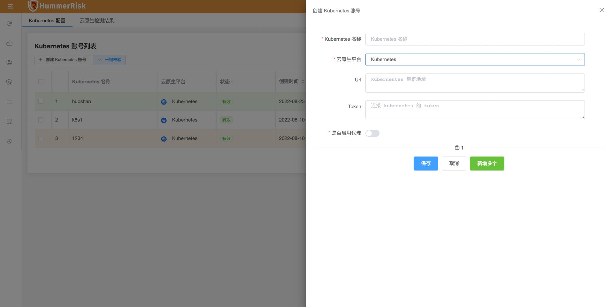
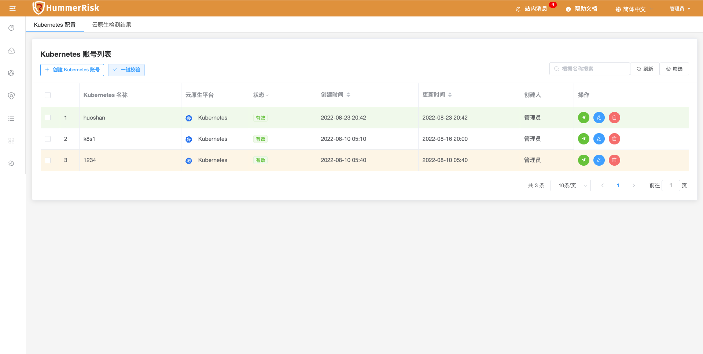
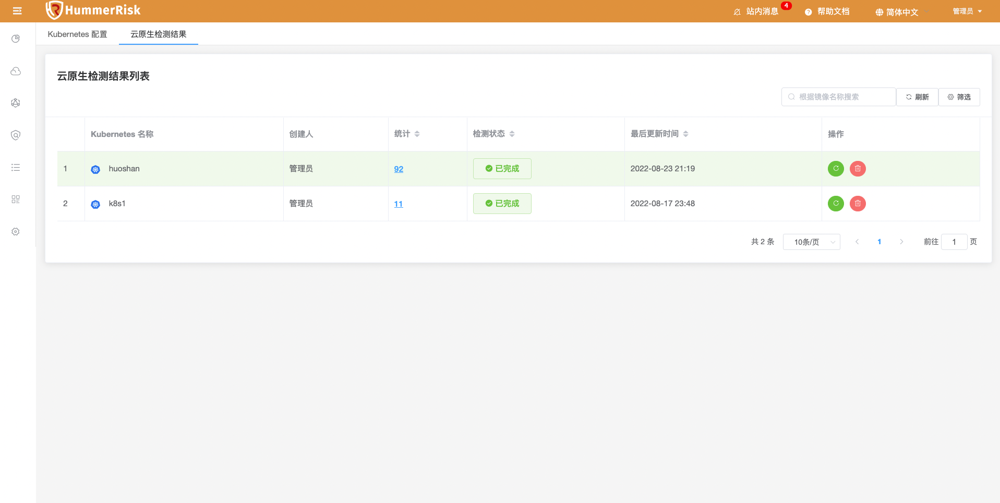
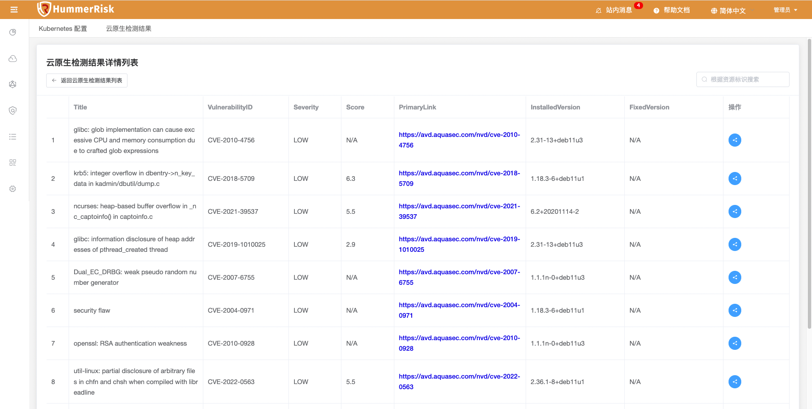

!!! info "使用云原生安全扫描任务前需在k8s集群上安装 tirvy-operator"

```shell
# 1.添加 chart 仓库
helm repo add hummer https://registry.hummercloud.com/repository/charts

# 2.更新仓库源
helm repo update

# 3.开始安装, 可以自定义应用名称和NameSpace
helm install trivy-operator hummer/trivy-operator \
 --namespace trivy-system \
 --set="image.repository=registry.cn-beijing.aliyuncs.com/hummerrisk/trivy-operator" \
 --create-namespace --set="trivy.ignoreUnfixed=true"

# 4.检测operator是否启动成功
kubectl get pod -A|grep trivy-operator
trivy-system   trivy-operator-69f99f79c4-lvzvs           1/1     Running            0          118s
```


!!! info "K8s 配置与云原生 K8s 环境安全检测功能，绑定 K8s Url 与 Token 信息即可进行安全检测，并生成安全漏洞结果。"

#### 1.绑定 K8s 账号, 即可执行安全检测。

{ width="900px" }
{ width="900px" }

#### 2.云原生检测结果列表，点击"统计按钮"进入详情列表，点击"状态按钮"查看日志与报告。

{ width="900px" }
{ width="900px" }
{ width="900px" }
{ width="900px" }
