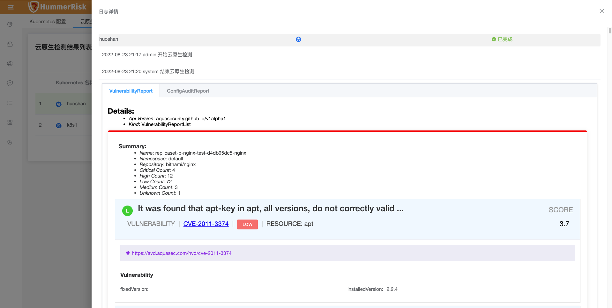
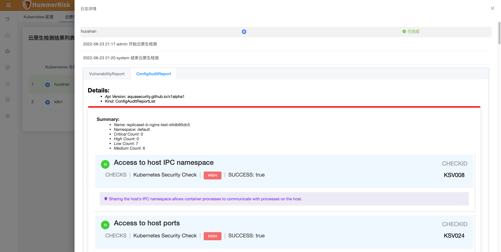

### K8s 检测

K8s 配置与云原生 K8s 环境安全检测功能，绑定 K8s Url 与 Token 信息即可进行安全检测，并生成安全漏洞结果。

> 绑定 K8s 账号, 即可执行安全检测。

{ width="900px" }
{ width="900px" }

> 云原生检测结果列表，点击"统计按钮"进入详情列表，点击"状态按钮"查看日志与报告。

{ width="900px" }
{ width="900px" }
{ width="900px" }
{ width="900px" }
