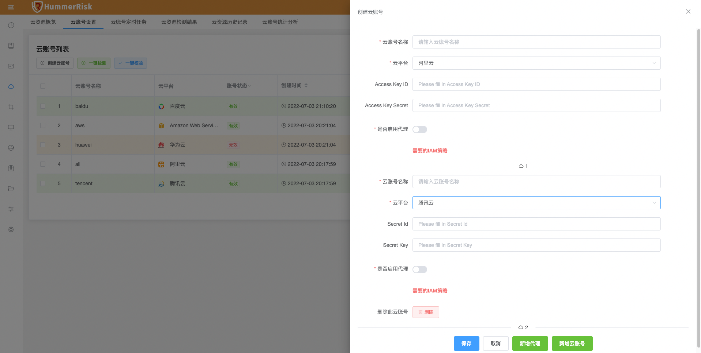
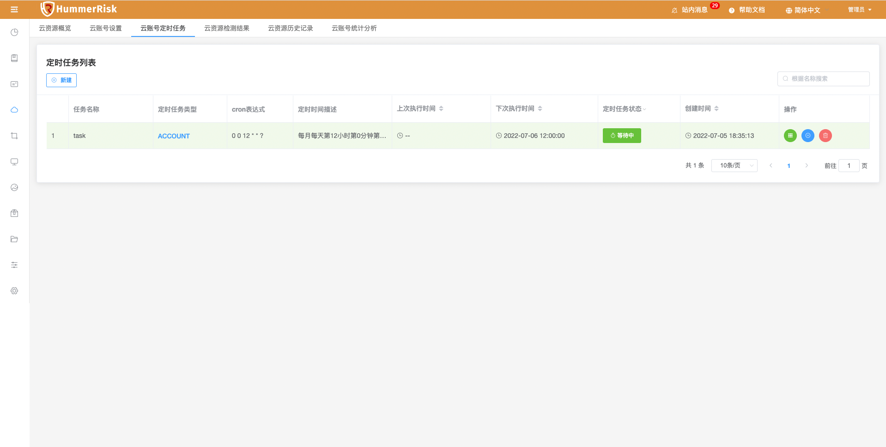
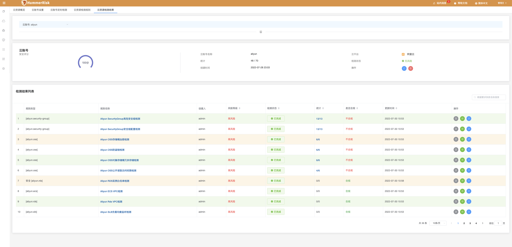

> 云账号设置，主要用来记录云账号认证信息，保存检测参数，用于按检测规则检测云平台资源。

### 云账号概览

> 云账号概览可以查看云资源检测情况。

### 云账号设置

> 云账号列表页面提供了对云账号的创建、删除、编辑、查找、校验、检测、调参等操作。

> 新增云账号信息（可批量）。云账号可绑定代理。

> 编辑云账号信息。

> 在新增/编辑云账号信息的页面快速添加代理。

> 查看云平台对应的 IAM 策略信息。

> 云账号调参列表页面，提供了对当前云账号的规则则信息参数的保存、清除等操作，以及针对现有参数的快速检测操作。

> 保存参数：将规则列表的参数绑定到此云账号，以便于以后次云账号安全检测的过程中将按此用户定义数据进行检测。

> 快速检测：可以根据已经填写的区域信息与参数表示，立即检测执行选中的规则行。

> 快捷设置：可以批量设置区域信息到规则列表中。

> 清除参数：将绑定到此云账号的参数清空，以后检测的过程中将按规则列表中的默认的参数检测。

### 云账号定时任务

> 定时任务列表页面，可以创建定时任务，便于定时检测某些云账号或某些规则。
 

### 云资源检测结果

> 云资源检测结果列表页面，可以查看所有云账号检测结果。

> 

### 云资源历史记录

> 云资源历史记录根据云账号，展示历史检测安全评分。

> 

### 云资源统计分析

> 云资源统计分析根据云账号，展示不同维度的检测结果信息，包括检测规则、规则组别、等保条例、规则标签、检测区域、检测资源等维度展示数据。

> 
