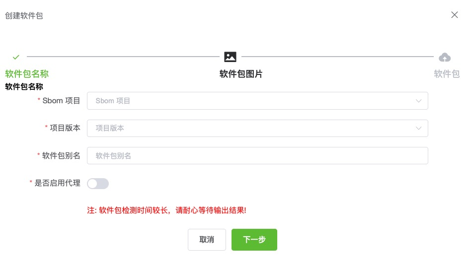
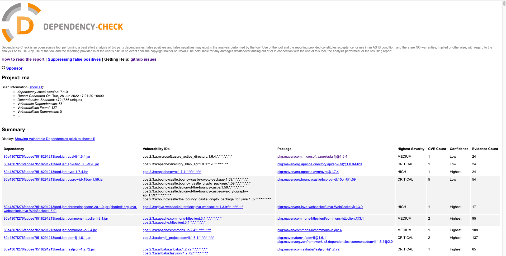

软件依赖主要是检测软件相关依赖的漏洞风险，主要集中情况下使用：
* 没有源码，只有编译后的打包结果，比如 .jar/.war等文件
  * 目前支持最好的java和.Net两种语言
* 有源码包，并没有使用仓库管理

### 软件包管理   

首先我们需要对希望检测的软件包进行管理，软件包管理列表页面提供了对软件包的创建、删除、编辑、查找、校验、检测等操作。

新增加一个软件包需要三步
* 软件包基本信息填写，包括项目、版本、名称和代理信息。
* 设置软件包的图片，这里系统提供了没人图片可以使用，也可以自己上传图片
* 上传实际的待检软件包。请注意上传的文件类型的支持列表。目前支持最好的java和.Net两种语言。

### 软件包检测结果

> 执行检测后，可以在检测结果查看相关信息，列表中数据会直接显示检测发现的漏洞，点击可以查看列表。  
> 点击检测状态列的按钮，可以查看结果的详细日志，包括检测到所有可能的漏洞信息，及软件包相关的软件物料清单信息。

