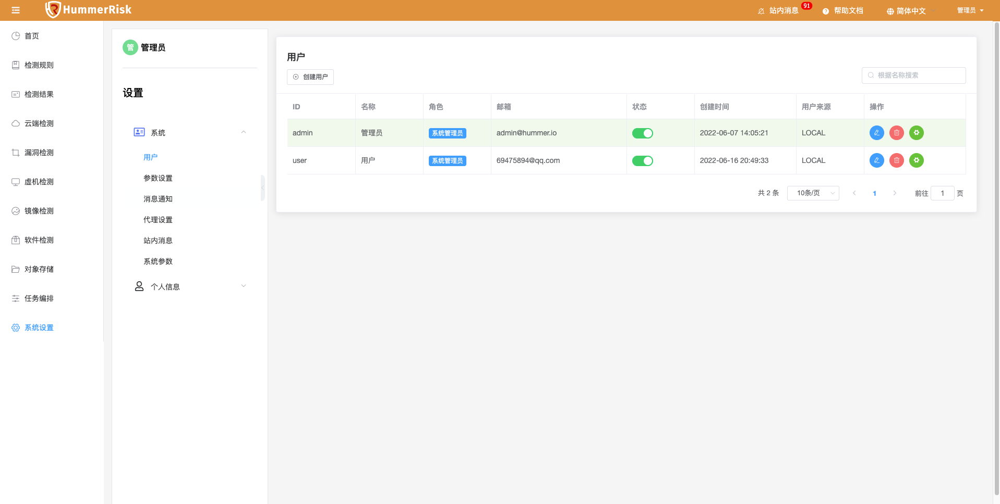

### 流程

> HummerRisk 通过简易操作实现多种资源安全检测，操作流程如下。

    系统设置 -> 用户配置 -> 消息通知 -> 代理设置

    检测规则 -> 规则标签 -> 规则组 -> 风险条例

    云资源配置 -> 云资源检测规则 -> 云资源检测结果 -> 合规统计

    漏洞配置 -> 漏洞检测规则 -> 漏洞检测结果

    虚拟机配置 -> 虚拟机检测规则 -> 虚拟机检测结果

    软件包配置 -> 软件包检测规则 -> 软件包检测结果

    镜像配置 -> 镜像检测规则 -> 镜像检测结果

    任务编排 -> 多种检测规则自由搭配 -> 基于任务的检测结果 -> 任务分析

### 主菜单

### 登录

!!! warning "默认 web 登录账户: admin 密码：hummer"
