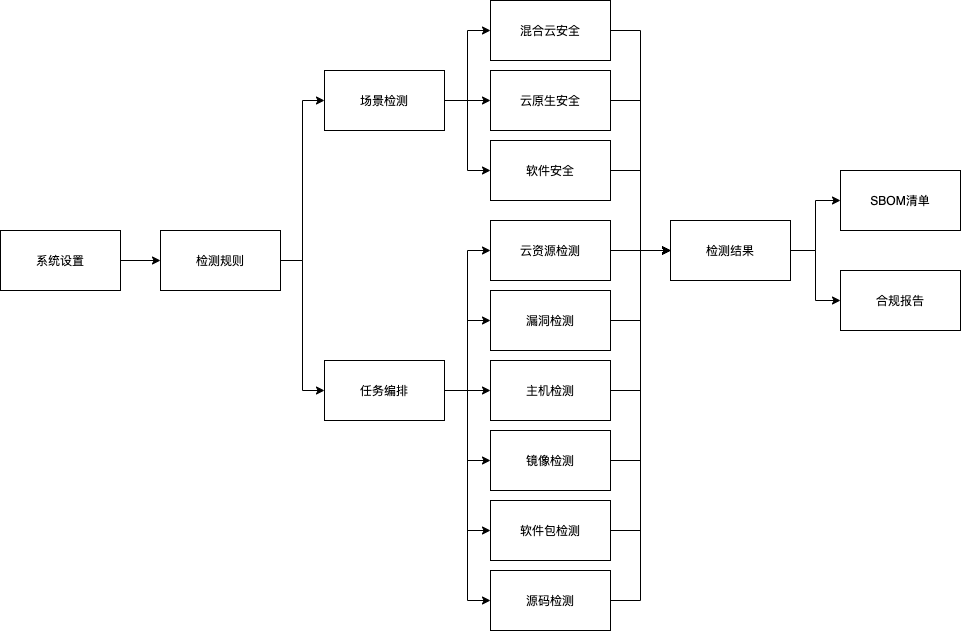

### 流程

!!! info "使用场景"
    HummerRisk 通过简易操作实现多种资源安全检测，操作流程如下:

{ width="95%" }

!!! example "功能分类"
    1. 系统设置 -> 用户配置 -> 消息通知 -> 代理设置
    2. 检测规则 -> 规则标签 -> 规则组 -> 风险条例
    3. 云资源配置 -> 云资源检测规则 -> 云资源检测结果 -> 合规报告 -> 云资源态势
    4. 漏洞配置 -> 漏洞检测规则 -> 漏洞检测结果 -> 合规报告
    5. 主机配置 -> 主机检测规则 -> 主机检测结果
    6. K8s 配置 -> K8s 检测结果 -> K8s 资源态势
    7. 部署配置 -> 部署配置检测结果
    8. 镜像管理 -> 镜像检测结果(绑定SBOM) -> SBOM 分析下载报告
    9. 源码管理 -> 源码检测结果(绑定SBOM) -> SBOM 分析下载报告
    10. 文件管理 -> 文件检测结果(绑定SBOM) -> SBOM 分析下载报告
    11. 任务编排 -> 多种检测规则自由搭配 -> 基于任务的检测结果 -> 任务分析

### 主菜单

{ width="95%" }

### 登录

{ width="95%" }

!!! warning "默认 web 登录账户: admin 密码：hummer"
