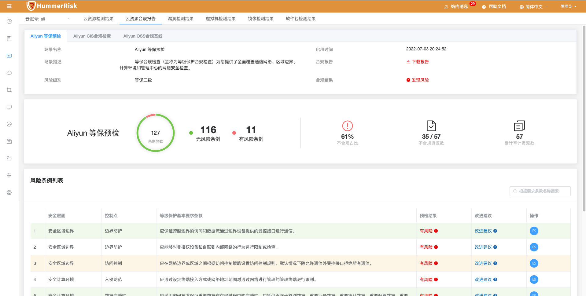
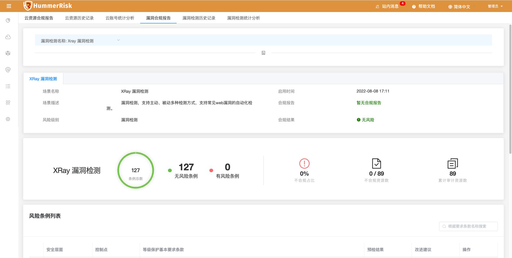

### 云资源合规报告

> 合规报告页面，展示按规则组与等保条例统计资源合规报告信息。

### 云资源历史记录

> 云资源历史记录根据云账号，展示历史检测安全评分。

 

### 云资源统计分析

> 云资源统计分析根据云账号，展示不同维度的检测结果信息，包括检测规则、规则组别、等保条例、规则标签、检测区域、检测资源等维度展示数据。

 

### 漏洞检测合规报告

> 漏洞检测合规报告页面，展示按规则组与等保条例统计资源合规报告信息。

### 漏洞检测历史记录

> 漏洞历史记录根据漏洞，展示历史检测安全评分。

 

### 漏洞检测统计分析

> 漏洞统计分析根据漏洞，展示不同维度的检测结果信息，包括检测规则、规则组别、等保条例、规则标签、检测区域、检测资源等维度展示数据。

 
