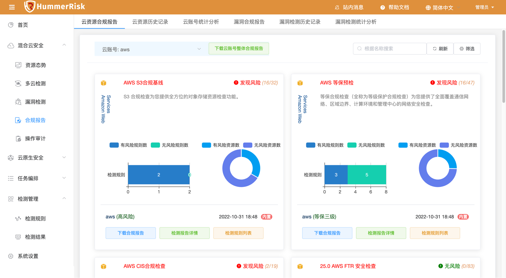
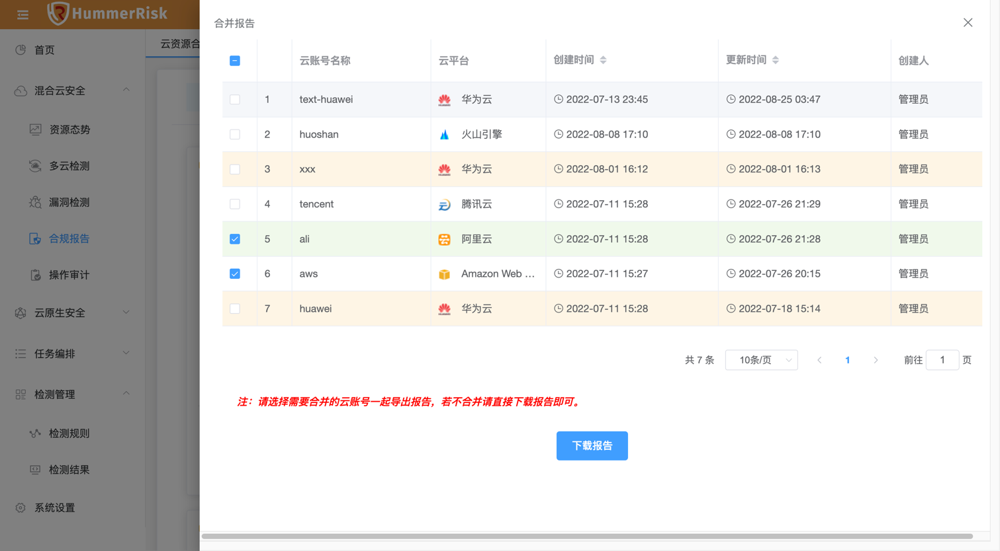
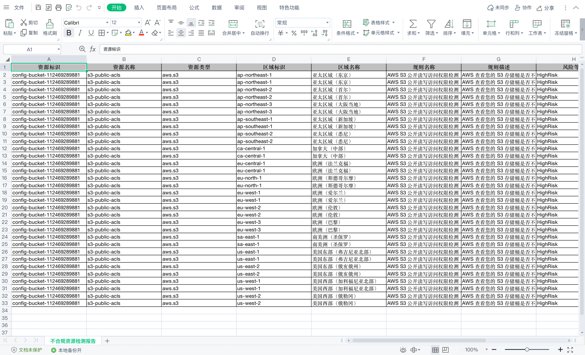
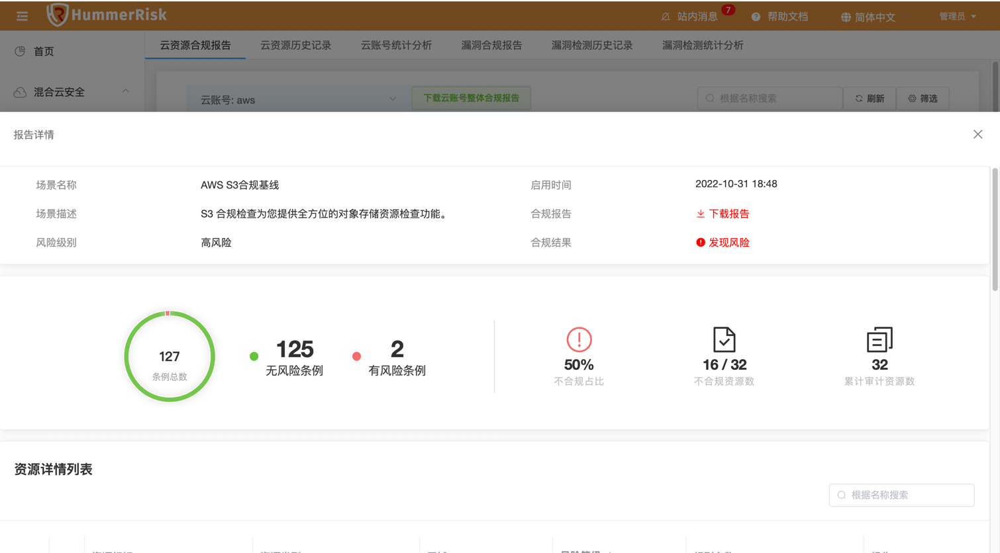
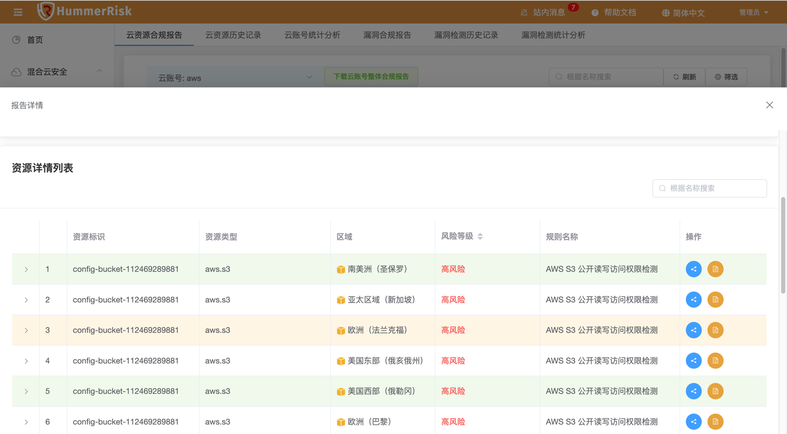
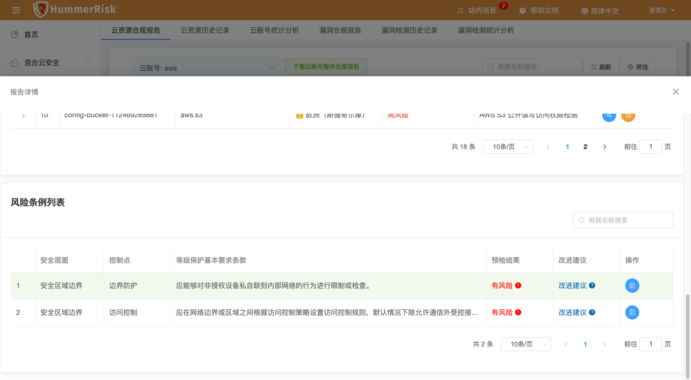
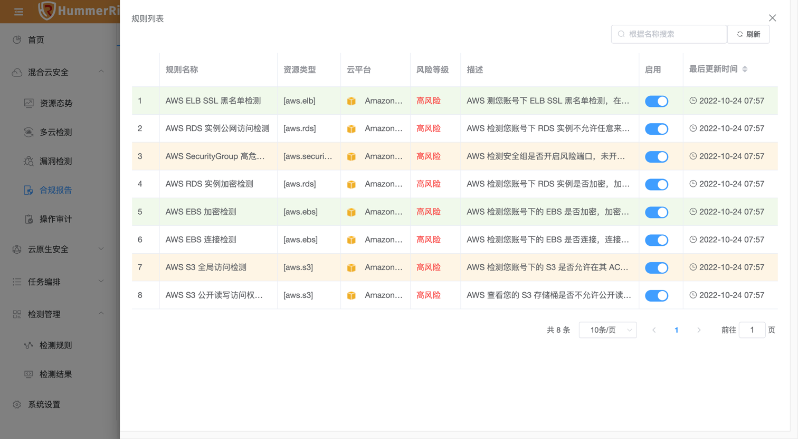
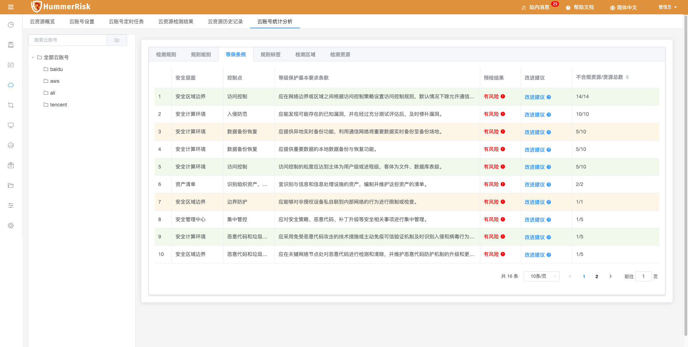
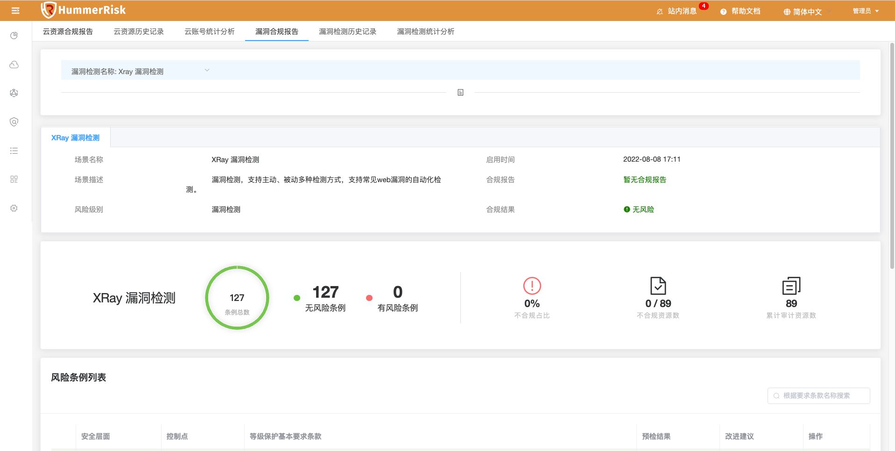
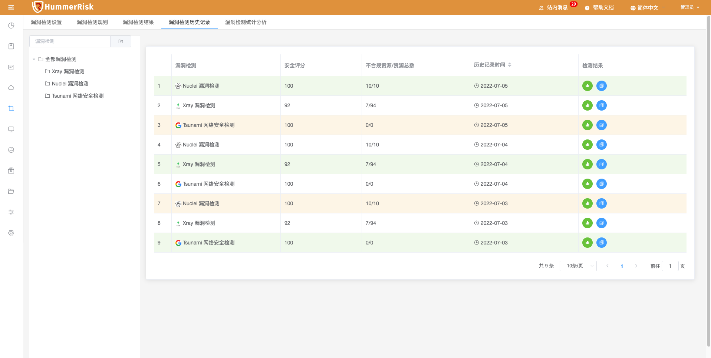

### 云资源合规报告

!!! abstract "合规报告列表"
    - 合规报告页面，展示按规则组与等保条例统计资源合规报告信息。
    - 云资源检测合规报告，按已检测规则组分类，可查看/下载云资源合规报告。

{ width="95%" }

!!! tip "下载云账号整体合规报告"
    下载云账号整体合规报告。选择一个以上的云账号进行合并下载。

{ width="95%" }

!!! tip "展示"
    报告以 Excel 形式展示：

{ width="95%" }

!!! tip "检测报告详情"
    报告详情展示检测内容与风险数据，下方显示不合规的资源列表和风险条例列表。
{ width="95%" }
{ width="95%" }
{ width="95%" }

!!! tip "检测规则列表"
    规则列表展示检测的规则组里面具体检测了什么规则。
{ width="95%" }

### 云资源历史记录

!!! abstract "云资源历史记录"
    云资源历史记录根据云账号，展示历史检测安全评分。

 { width="95%" }

### 云资源统计分析

!!! abstract "云资源统计分析"
    云资源统计分析根据云账号，展示不同维度的检测结果信息，包括检测规则、规则组别、等保条例、规则标签、检测区域、检测资源等维度展示数据。

 { width="95%" }

### 漏洞检测合规报告

!!! abstract "漏洞检测合规报告"
    漏洞检测合规报告页面，展示按规则组与等保条例统计资源合规报告信息。

{ width="95%" }

### 漏洞检测历史记录

!!! abstract "漏洞检测历史记录"
    漏洞历史记录根据漏洞，展示历史检测安全评分。

 { width="95%" }

### 漏洞检测统计分析

!!! abstract "漏洞检测统计分析"
    漏洞统计分析根据漏洞，展示不同维度的检测结果信息，包括检测规则、规则组别、等保条例、规则标签、检测区域、检测资源等维度展示数据。

 { width="95%" }
