!!! info "检测结果"
    检测结果页面，展示整体资源检测结果的信息，并根据资源对应的规则展示资源信息、检测日志等信息。

!!! warning "注意"
    注：检测结果在每个菜单模块有单独显示，此处只是将所有类型检测结果统一展示。

### 云资源检测结果

!!! abstract "云资源检测结果"
    展示混合云安全合规检测的结果和安全评分。可以重新检测与删除检测。

{ width="95%" }

!!! abstract "云资源检测日志"
    点击检测状态查看日志信息, 可以查看区域的检测日志、检测API、检测结果等信息。

{ width="95%" }

!!! abstract "云资源检测详情"
    检测结果详情页面，根据云账号对应的规则展示具体资源详细信息。

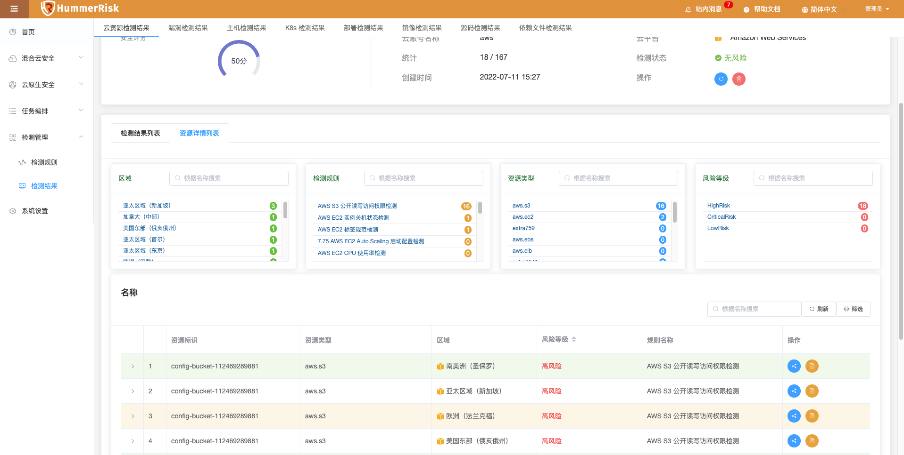{ width="95%" }

### 漏洞检测结果

!!! abstract "漏洞检测结果"
    展示漏洞检测的结果和安全评分。可以重新检测与删除检测。

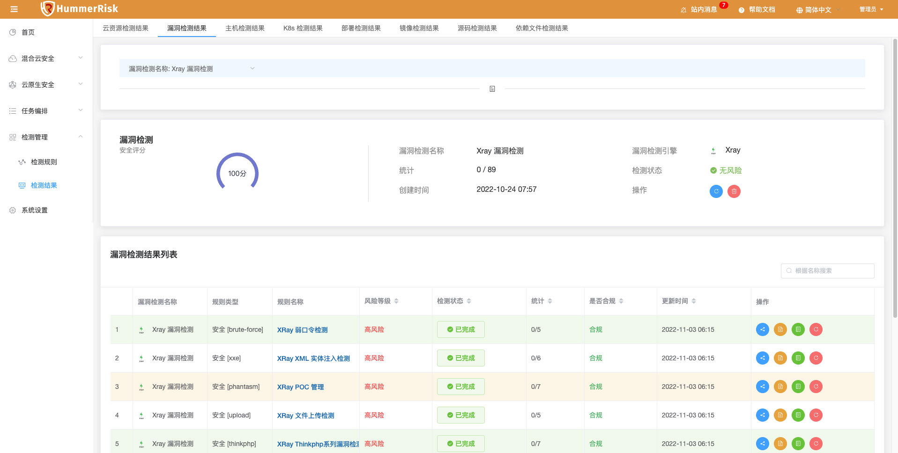{ width="95%" }

!!! abstract "漏洞检测日志"
    点击检测状态查看日志信息, 可以查看检测日志、检测结果等信息。

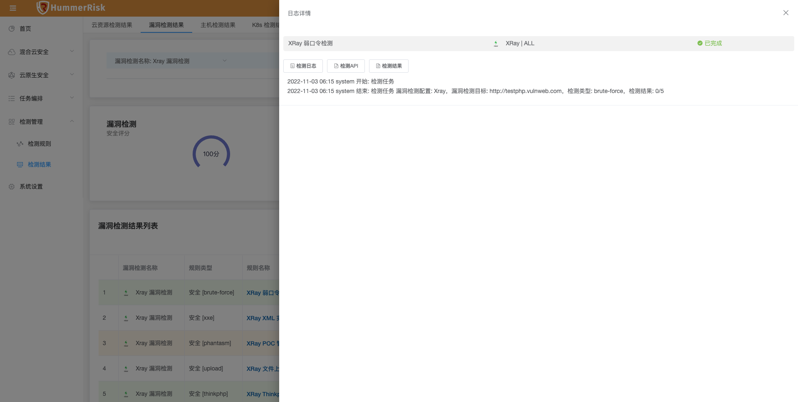{ width="95%" }

!!! abstract "漏洞检测详情"
    检测结果详情页面，根据检测目标对应的规则展示具体资源详细信息。

### 主机检测结果

!!! abstract "主机检测结果"
    展示主机检测的结果。可以重新检测与删除检测。

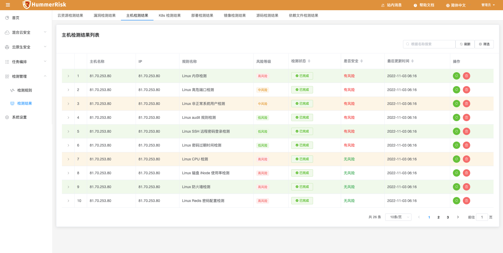{ width="95%" }

!!! abstract "主机检测日志"
    点击检测状态查看日志信息, 可以查看检测日志、检测结果等信息。

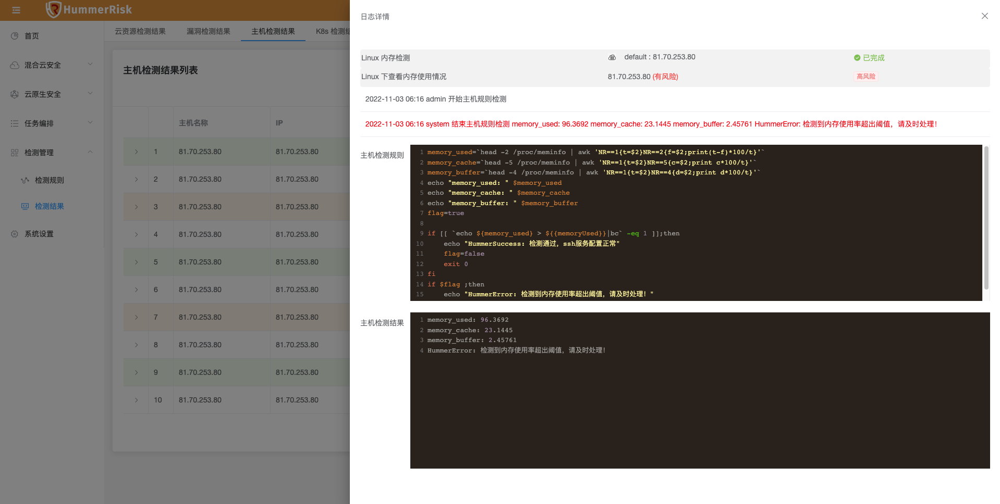{ width="95%" }

### K8s 检测结果

!!! abstract "K8s 检测结果"
    展示 K8s 检测结果的结果。可以重新检测与删除检测。

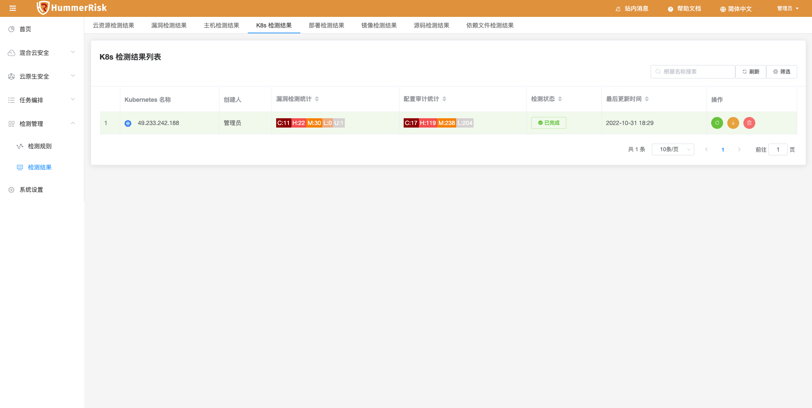{ width="95%" }

!!! abstract "K8s 检测日志"
    点击检测状态查看日志信息, 可以查看检测日志、检测结果等信息。

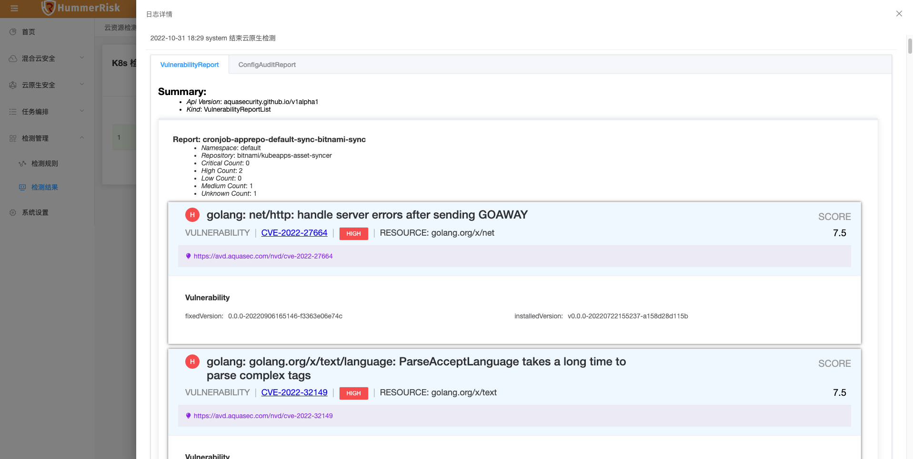{ width="95%" }

!!! abstract "K8s 检测详情"
    检测结果详情页面，根据检测目标展示具体资源详细信息。

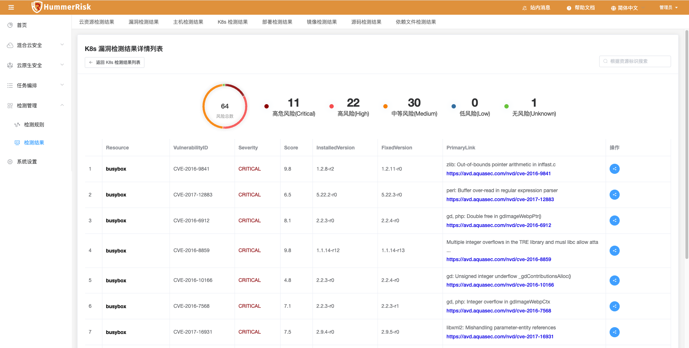{ width="95%" }

### 部署检测结果

!!! abstract "部署检测结果"
    展示部署检测的结果。可以重新检测与删除检测。

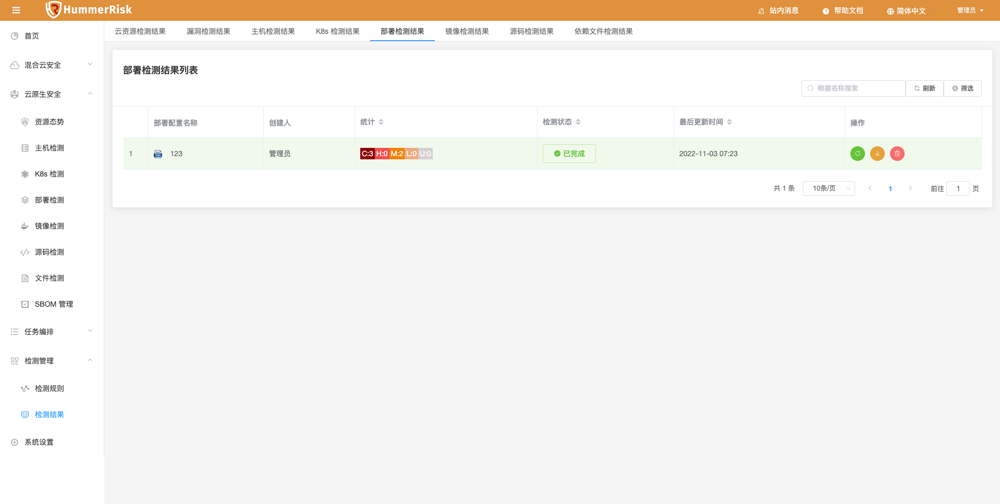{ width="95%" }

!!! abstract "部署检测日志"
    点击检测状态查看日志信息, 可以查看检测日志、检测结果等信息。

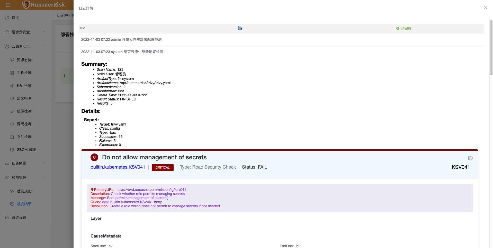{ width="95%" }

!!! abstract "部署检测详情"
    检测结果详情页面，根据检测目标展示具体资源详细信息。

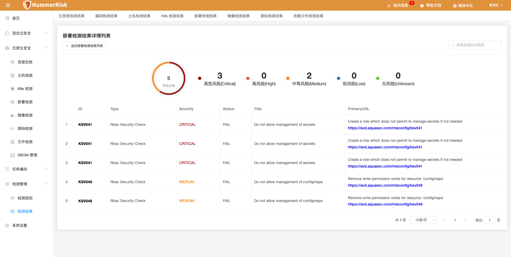{ width="95%" }

### 镜像检测结果

!!! abstract "镜像检测结果"
    展示镜像检测的结果。可以重新检测与删除检测。

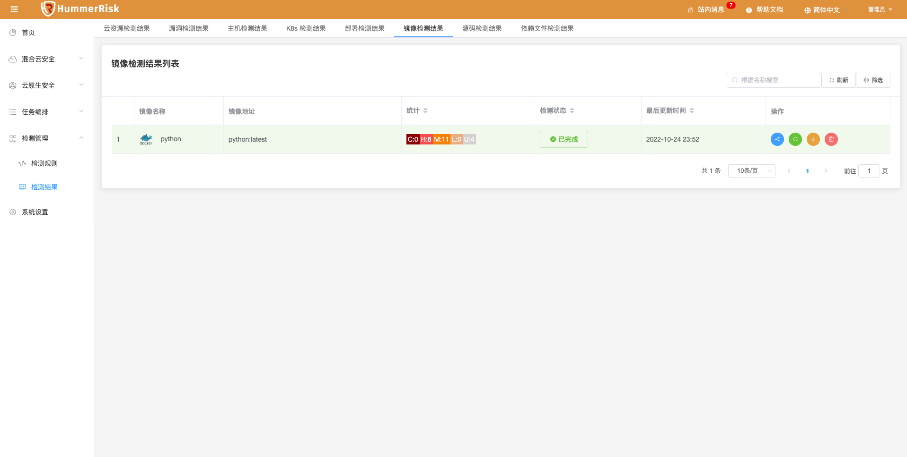{ width="95%" }

!!! abstract "镜像检测日志"
    点击检测状态查看日志信息, 可以查看检测日志、检测结果等信息。

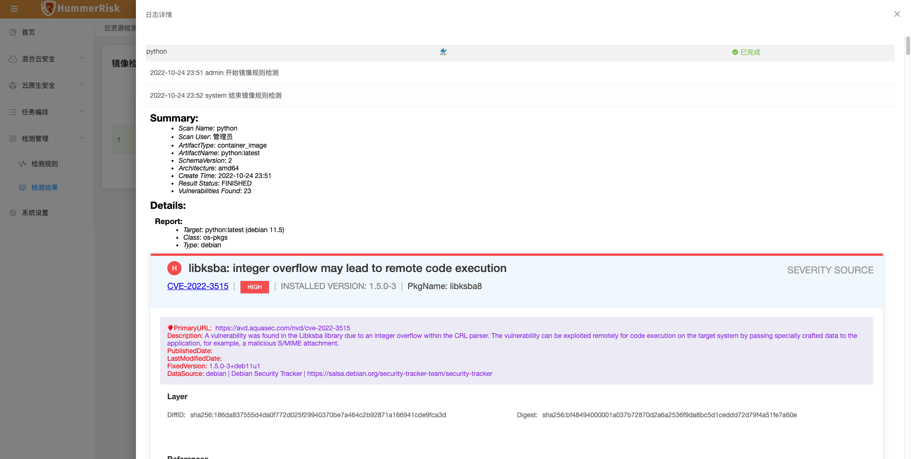{ width="95%" }

!!! abstract "镜像检测详情"
    检测结果详情页面，根据检测目标展示具体资源详细信息。

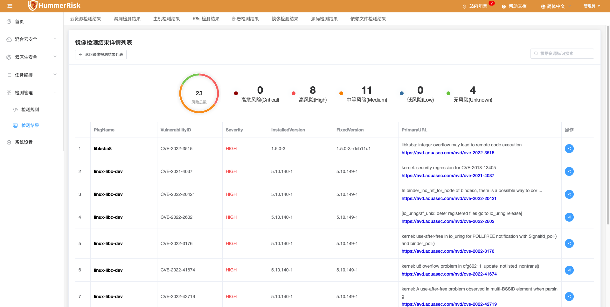{ width="95%" }

### 源码检测结果

!!! abstract "源码检测结果"
    展示源码检测的结果。可以重新检测与删除检测。

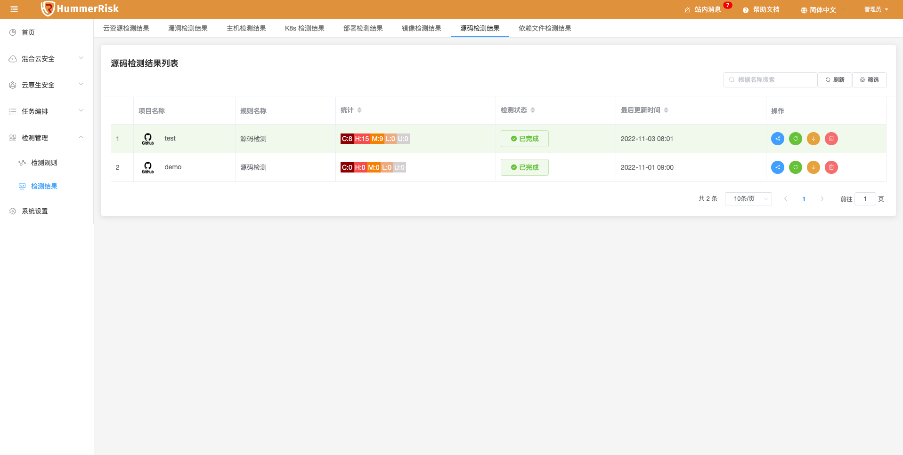{ width="95%" }

!!! abstract "源码检测日志"
    点击检测状态查看日志信息, 可以查看检测日志、检测结果等信息。

{ width="95%" }

!!! abstract "源码检测详情"
    检测结果详情页面，根据检测目标展示具体资源详细信息。

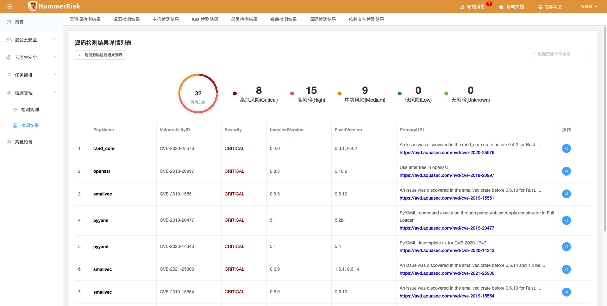{ width="95%" }

### 依赖文件检测结果

!!! abstract "依赖文件检测结果"
    展示依赖文件检测结果的结果和安全评分。可以重新检测与删除检测。

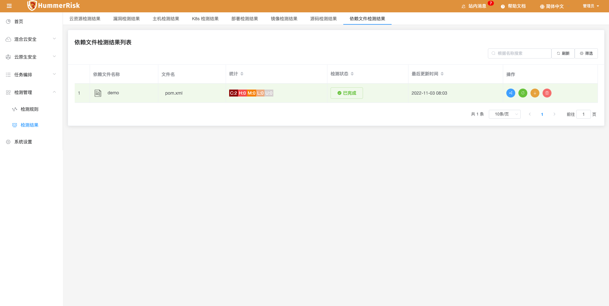{ width="95%" }

!!! abstract "依赖文件检测结果日志"
    点击检测状态查看日志信息, 可以查看检测日志、检测结果等信息。

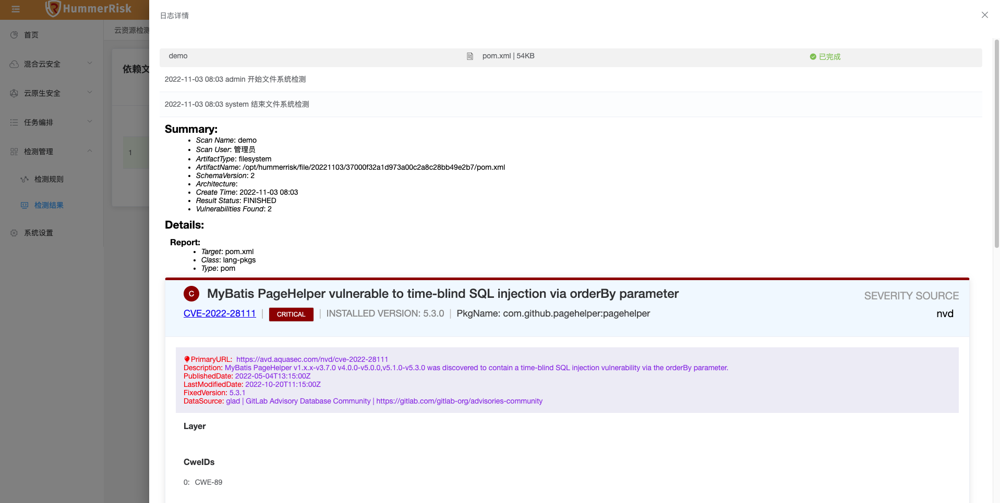{ width="95%" }

!!! abstract "依赖文件检测详情"
    检测结果详情页面，根据检测目标展示具体资源详细信息。

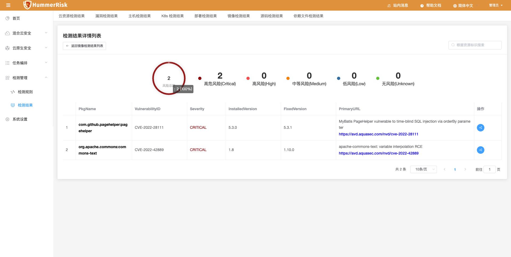{ width="95%" }
