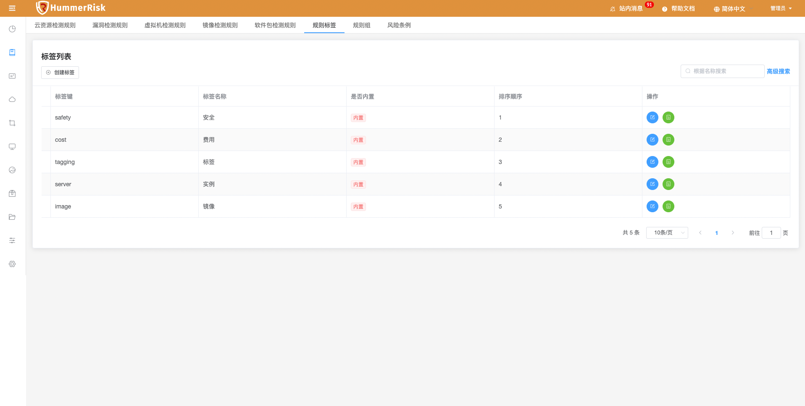
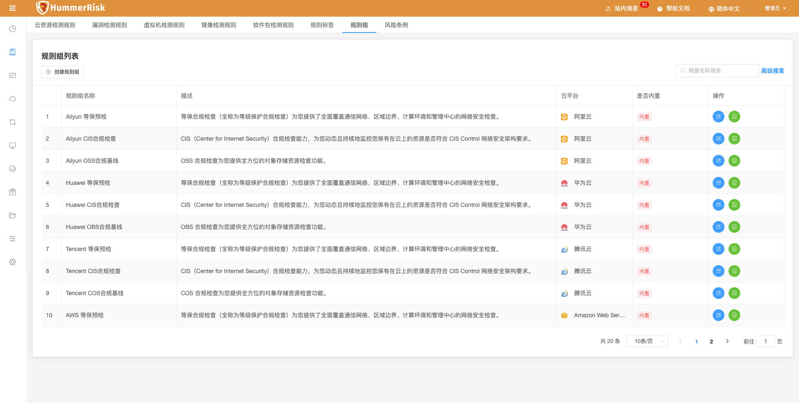

> 规则是 HummerRisk 针对各种资源检测进行检测的基础，它定义了需要检测与过滤的基本内容。规则标签、规则组、等保条例、漏洞等从不同维度针对检测规则的统计划分。

#### 注：内置检测规则只有添加对应的账号后才自动显示。

### 检测规则

> 检测规则页面提供了对规则的创建、关闭、删除、编辑、查找等操作。hummerrisk 系统初始化时会默认创建规则，用户也可以根据自己的需要手动创建规则，但是要注意云资源规则内容符合 Yaml 格式规范。

> 新增/编辑检测规则。

### 规则标签

> 规则标签页面提供了对规则标签的创建、删除、编辑、查找等操作。hummerrisk 系统初始化时会默认创建内置的规则标签，用户也可以根据自己的需要手动创建规则标签。

### 规则组

> 规则组页面提供了对规则组的创建、删除、编辑、查找等操作。hummerrisk 系统初始化时会默认创建内置的对应云平台的规则组，用户也可以根据自己的需要手动创建规则组。

> 

### 风险条例

> 风险条例可以查看等级保护要求条款，可以看到改进建议。

> 
