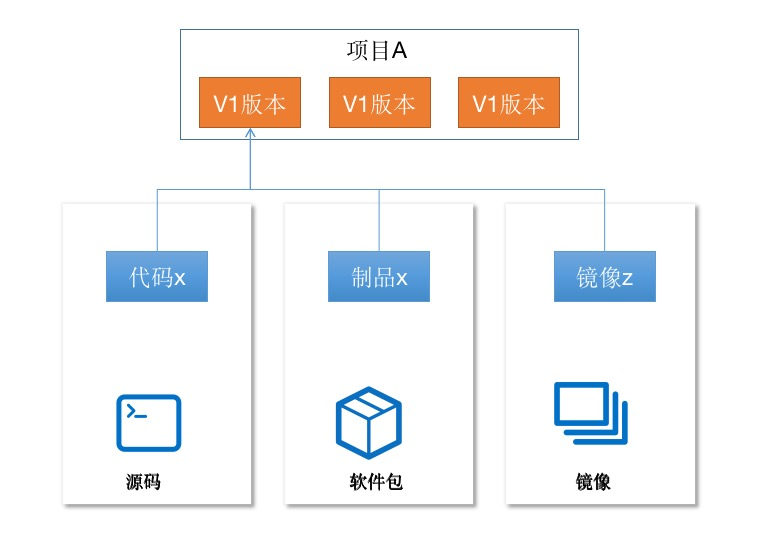
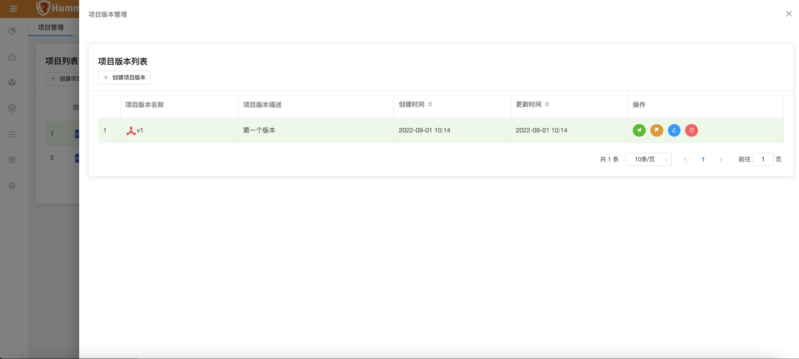
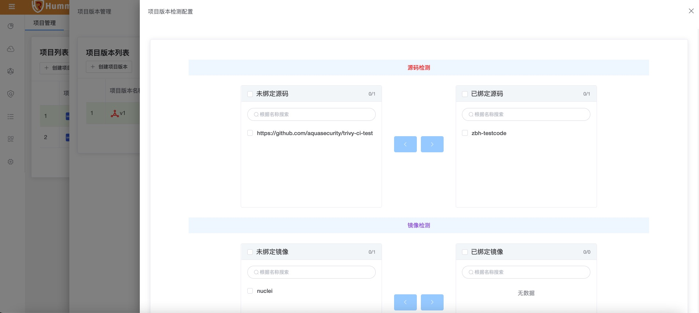
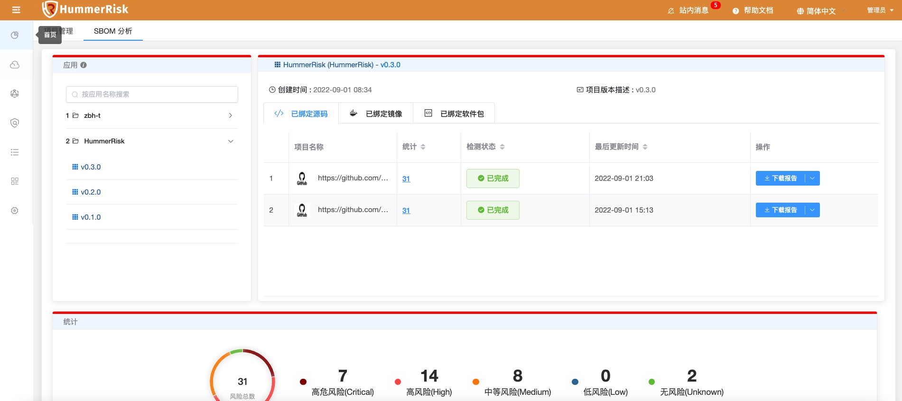

## SBOM 管理

基于软件的供应链安全，我们在进行源码、制品包、镜像检测的时候都会生成SBOM数据，所以在使用软件安全部分功能时，需要先创建逻辑的项目和版本，来和后面的源码、软件包、镜像进行关联。

{ width="900px" }

### 项目管理

项目是整个软件安全部分的顶级逻辑概念，我们首先需要创建项目，填写基本的名称和描述即可。

创建完成项目后，还需要创建版本，点击项目列表后的 [版本管理] 按钮打开页面。

{ width="900px" }

项目之下就是版本，版本也是直接和各个检测元素关联。点击创建项目版本可以新建版本，在创建完版本后，还可以管理版本管理的检测内容，调整各种配置。也可以点击一键检测，执行检测任务。

{ width="900px" }

### SBOM 分析

根据项目绑定的源码、镜像或软件包，生成软件物料清单，并结合漏洞生成 SBOM + CVE。

{ width="900px" }
