!!! abstract "模块概述"
    HummerRisk 是开源的云原生安全平台，以非侵入的方式解决云原生环境的安全和治理问题。核心能力包括混合云的安全治理和容器云安全检测。
    以下将介绍HummerRisk中的「主机检测模块」功能，包括如何管理主机、管理凭证，以及使用主机检测规则进行安全检测。
### 工作流程

!!! abstract "工作流程"
    下图是本模块的主要工作流程。
    { width="95%" }

### 凭证管理

主机检测模块中，首先介绍凭证的管理和配置，想要连接到目标主机，需要使用对应的凭证。
!!! abstract "创建凭证"
    我们可以在系统中创建凭证，这样在后续的主机管理和检测时就无需每一次都临时填写。系统中创建的凭证支持3种类型：    

    * 密码    
    * 密钥文本     
    * 密钥文件     
    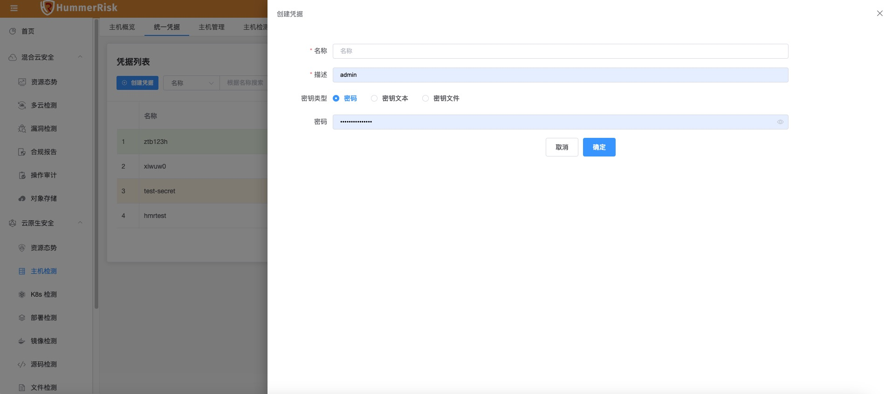{ width="95%" }
!!! abstract "凭证列表"
    在统一凭证列表中，可以查看系统中管理的全部凭证，点击每条记录后的操作按钮，可以对凭证执行修改和删除。凭证列表可以过滤筛选，可以通过名称、描述和创建人快速过滤，也可以打开高级筛选页面，进行更复杂的筛选，筛选条件包括：    
    
    * 名称   
    * 创建人   
    * 描述   
    * 更新时间   
    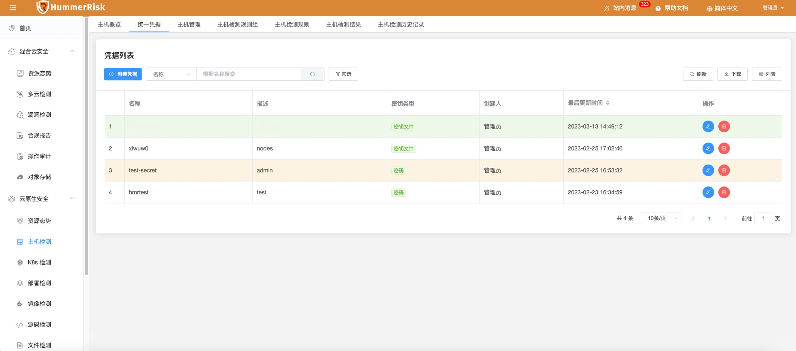{ width="95%" }
    
### 主机管理    
在添加完凭证之后，我们来到主机管理部分。主机也就是我们想要检测的目标，我们首先要将主机的信息添加到系统中来。

!!! abstract "创建主机"
    首先创建主机，点击创建主机按钮打开页面。
    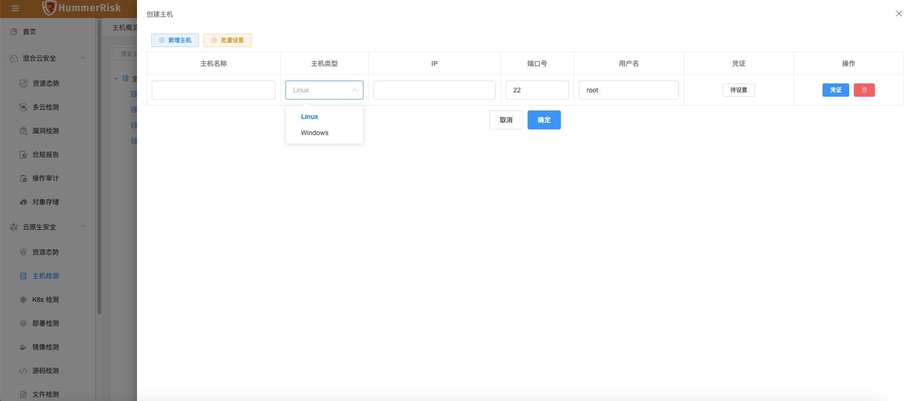{ width="95%" }    
    创建主机需要填写以下信息：
    <table>
            <tr bgcolor=#FFC125>
                <td>参数</td> 
                <td>说明</td>
           </tr>
            <tr>
                <td>主机名称</td>
                <td>主机名称是在系统中的显示名称，起到标识作用。</td>
            </tr>
            <tr>
                <td>主机类型</td>
                <td>支持创建的主机类型为 Linux 和 Windows。</td>
            </tr>
            <tr>
                <td>IP</td>
                <td>HummerRisk通过IP连接目标主机，目前主持IPV4的IP</td>
            </tr>
            <tr>
                <td>端口</td>
                <td>默认情况下Linux端口为22，Windows端口为5985，请记得根据实际情况修改。</td>
            </tr>
            <tr>
                <td>用户名</td>
                <td>连接到目标主机执行检测脚本的用户。</td>
            </tr>
            <tr>
                <td>凭证</td>
                <td>连接主机时使用的认证信息，可以临时填写，我们推荐在前文介绍的统一凭证中配置使用。</td>
            </tr>
    </table>

    点击设置凭证，我们可以对主机绑定凭证，既可以是临时填写的，也可以是之前已经添加好的统一管理凭证。配置好凭证后，在列表中会显示出主机绑定的凭证类型。    
    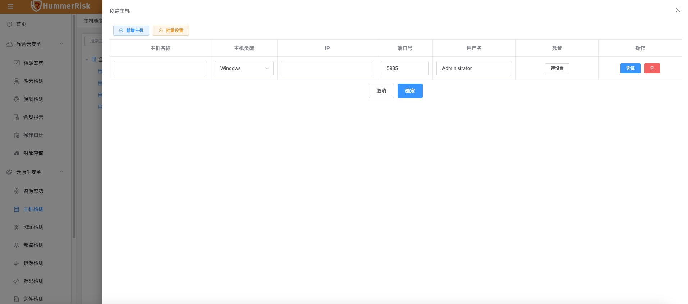{ width="95%" }    
    创建主机时可以添加多条信息一次性保存，同时为了简化操作，可以使用批量设置，这样将当前的多条数据一次设置好。     
    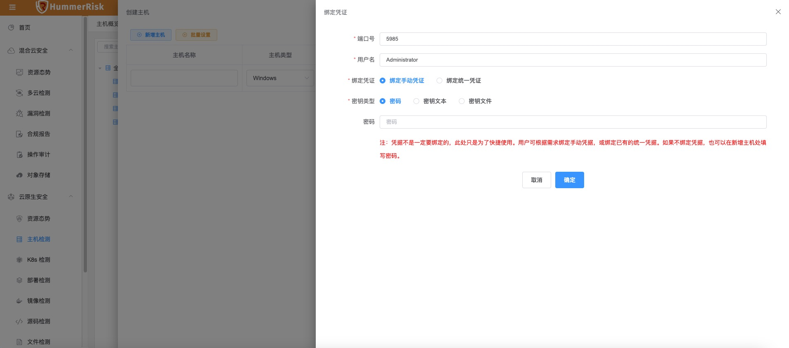{ width="95%" }    
!!! abstract "校验状态"
    已经创建好的主机可以执行一键校验。选择一台主机，点击「一键校验」，会使用已经配置好的信息去校验主机是否正常连接，同时在列表中更新状态。     
    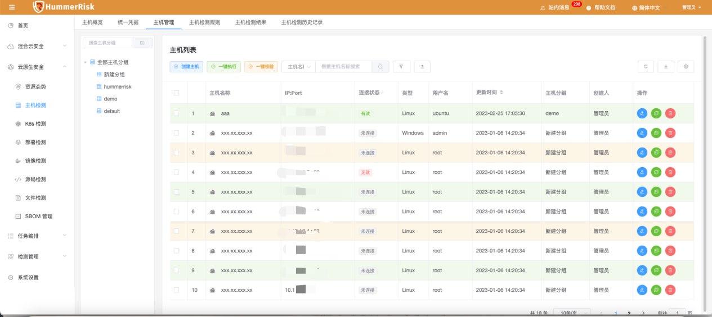{ width="95%" }      
!!! abstract "主机分组"
    HummerRisk还提供了对主机的分组管理能力，可以根据需要，将主机分配到不同的组中。

### 执行检测

!!! abstract "执行检测"
    在系统中添加好主机后，我们就可以对其执行检测了。
    找到希望执行检测的主机，之后点击操作中的「一键检测」按钮，在弹出的页面中选择希望执行的检测规则组，就可以对目标主机进行检测了。相关规则组的配置，我们在下一小节会进行介绍。
    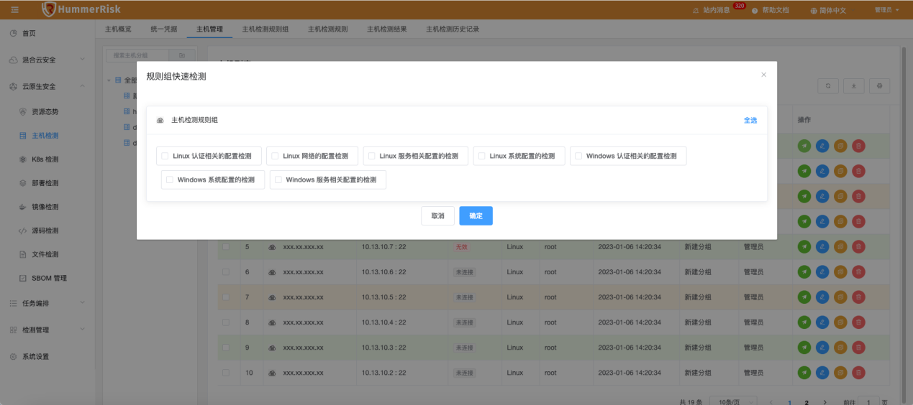{ width="95%" }      
    执行检测前需要注意主机的状态，只有状态为有效的主机才能顺利执行检测。
    执行检测后，会跳转到检测结果页面查看检测结果。

### 检测规则

!!! abstract "主机检测规则"
    接下来介绍一下主机检测的规则，进入主机检测规则页面，就以看到全部的检测规则了。点击列表前方的箭头，可以展开查看规则的内容。每一条规则都有启用状态，如果不想某些规则被执行，可以关闭启用。    
    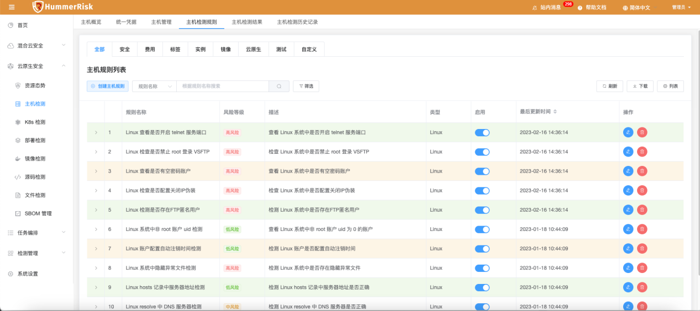{ width="95%" }    
    在这里用户可以根据自己的需要去添加检测规则，也可以对系统中自带的检测规则进行编辑。定义检测规则时，还可以添加参数，对应的在脚本中写入key，就可以实现变量传递的作用。      
    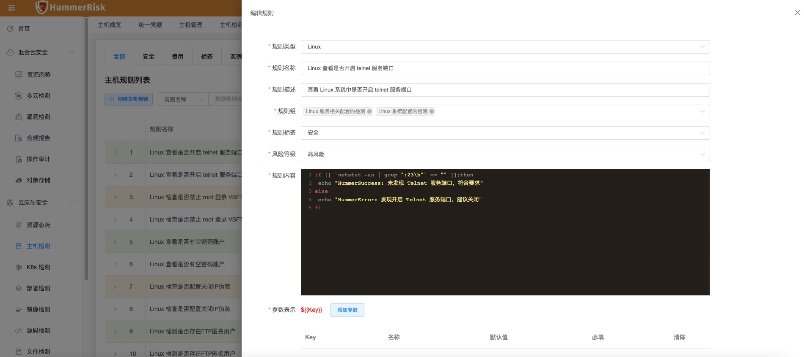{ width="95%" }    

### 检测规则组

!!! abstract "检测规则组"
    我们在检测规则之上设计了规则组，用户可以根据自己的需要对检测规则进行分类管理，例如可以根据检测场景或者检测的类型。    
    基于规则组的分类管理，用户可以更加精准达到检测目标。
    { width="95%" }    
    在这里也可以直接选择一个规则组，在操作中选择执行，之后选择目标主机，来执行单组规则的检测。
    规则组中可以绑定多条规则，同一条规则也可以归属于不同的规则组。    
    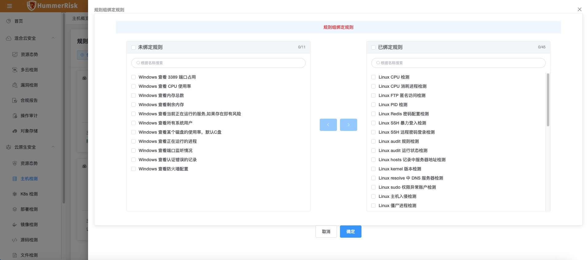{ width="95%" }    

### 检测结果
点击进入检测结果页面，这里检测结果可以分为两个维度来查看，一是检测规则维度，二是主机维度。    
!!! abstract "检测规则维度"
    规则维度也就是基于每一条检测规则来查看检测结果。在执行一键检测后，检测任务会自动拆分成每条规则进行执行。如果希望针对某条规则重新执行，看可以点击对应规则后的重新检测按钮。   
    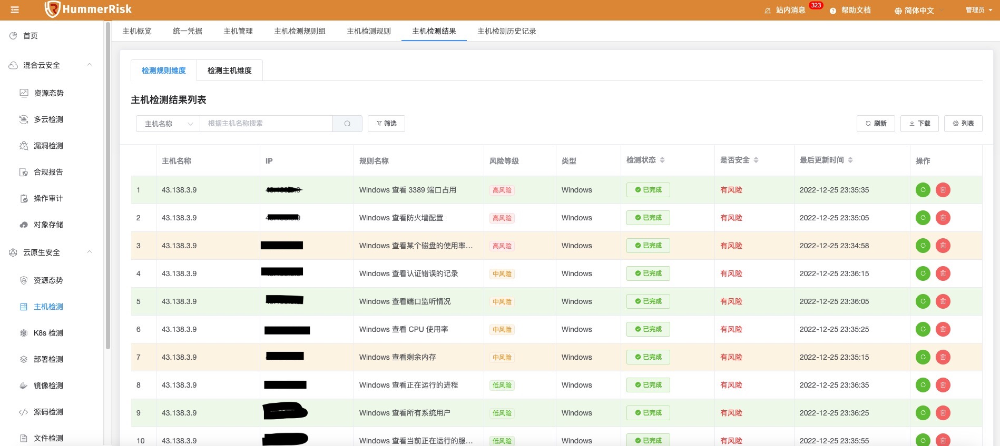{ width="95%" }    
    *检测状态*
    检测状态会显示当前规则的执行状态，状态包括：    

    * 已完成：检测已经结束。    
    * 进行中：检测正在进行中    
    * 异常：进程任务执行存在异常。    
    * 点击按钮可以查看详细的执行状态日志，同时会显示检测的结果是否存在风险，分有风险和无风险两种情况。    

    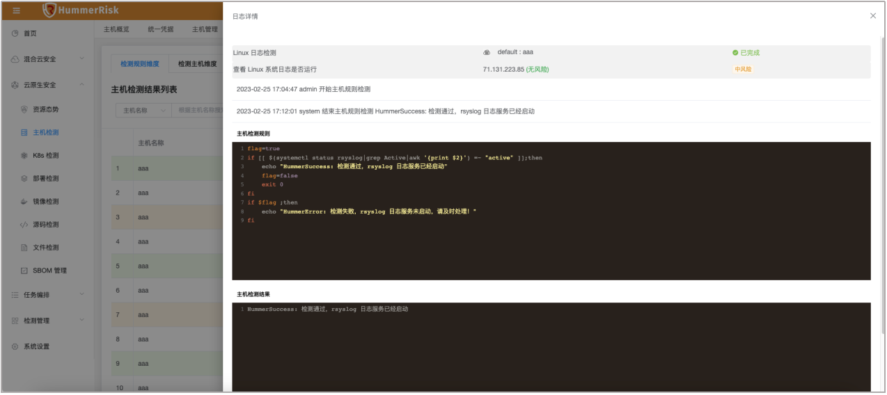{ width="95%" }    

!!! abstract "检测主机维度"
    这里会按检测主机进行汇总，直观查看到各个主机的检测情况，这里我们希望可以更直观的给出各个主机的检测中是否存在风险。点击每台主机卡片的详情按钮，可以查看相关的规则执行情况。     
    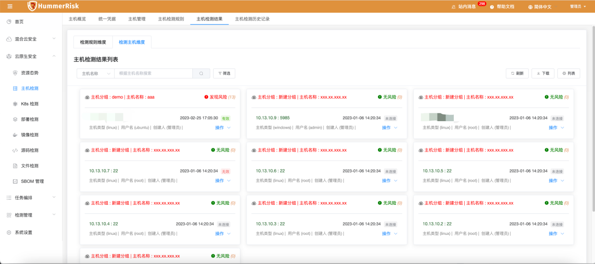{ width="95%" }    

### 检测历史记录    
!!! abstract "检测规则维度"    
    最后我们还可以查看到所有检测历史记录，查看过往的执行情况。
    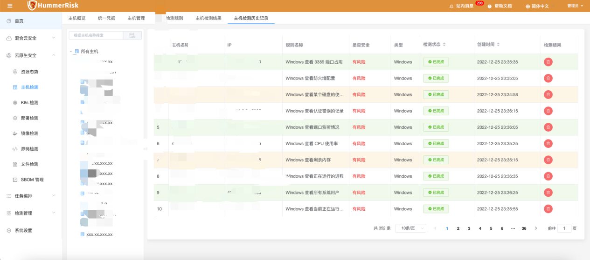{ width="95%" }    
    