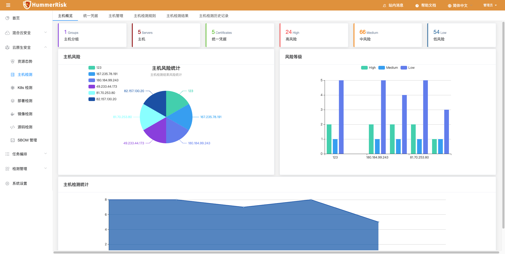
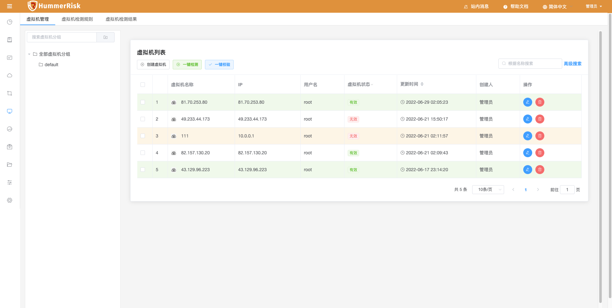
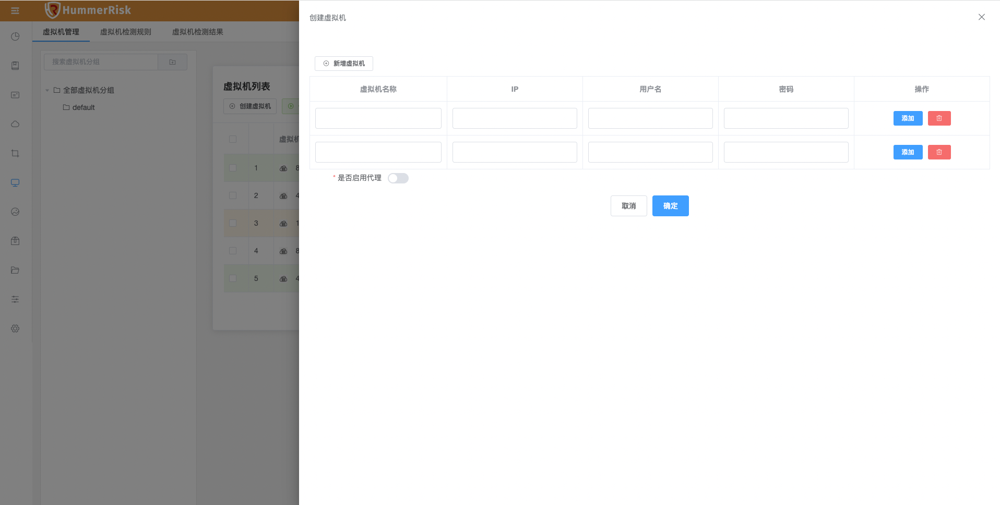
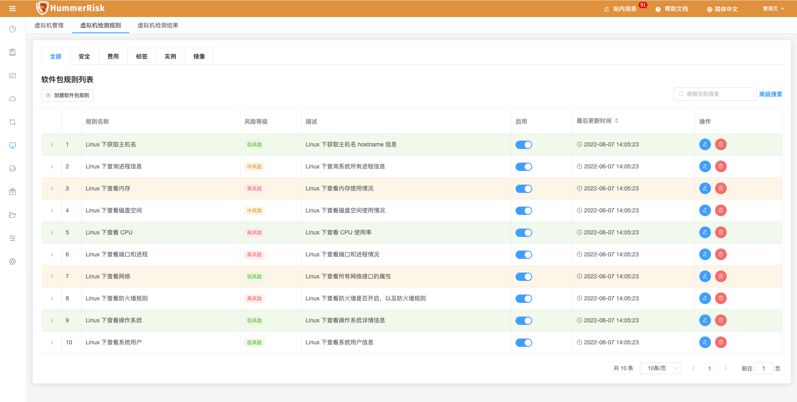
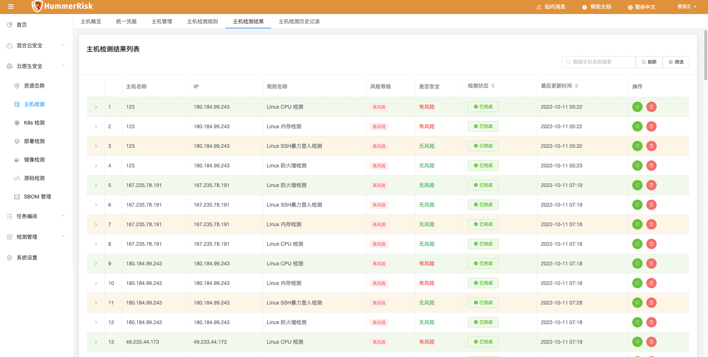
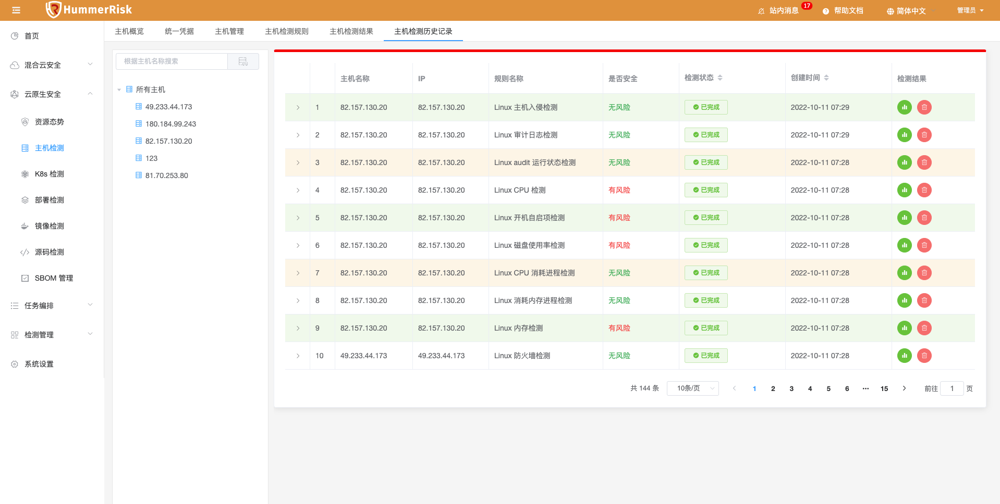

### 主机概览

主机数据概览。

{ width="95%" }

### 统一凭证

主机认证统一凭证，新建、修改主机信息时，可灵活绑定凭证，凭证由密码或密钥组成。

{ width="95%" }
{ width="95%" }
{ width="95%" }

### 主机管理

> 主机管理列表页面提供了对主机分组、主机的创建、删除、编辑、查找、校验、检测等操作。

> 新增主机信息（可批量）。主机可绑定代理。

### 主机检测规则

> 主机检测规则列表页面，可以添加、修改、查看所有主机检测规则。

### 主机检测结果

> 主机检测结果列表页面，可以查看所有主机检测结果。

> 

### 主机检测结果历史记录

> 查看所有主机历史检测结果。

> 
