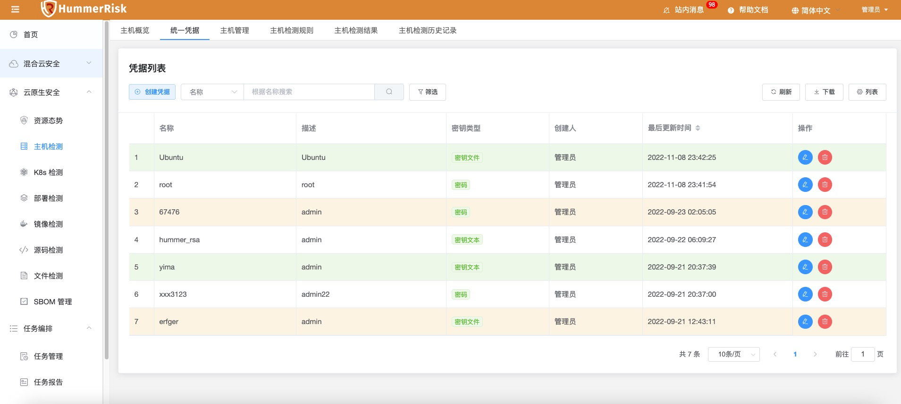
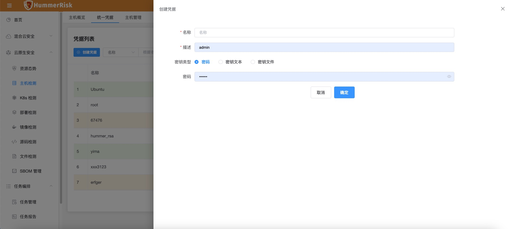
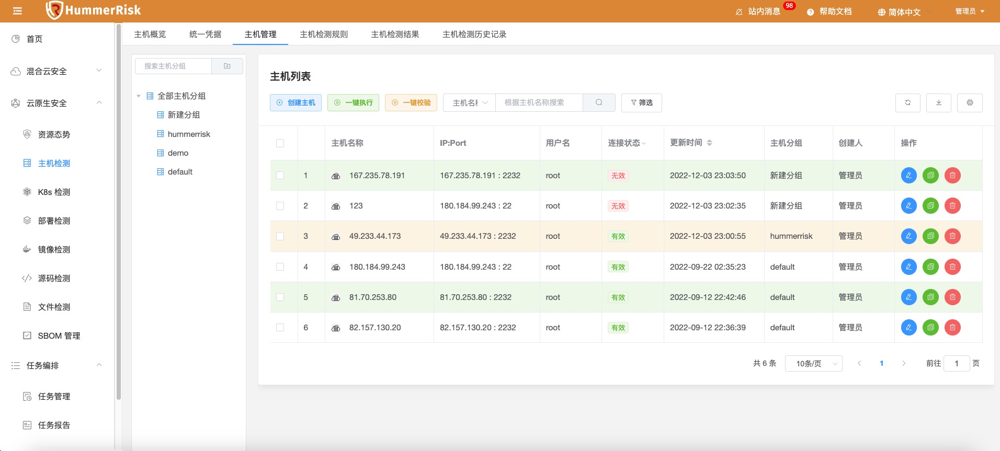
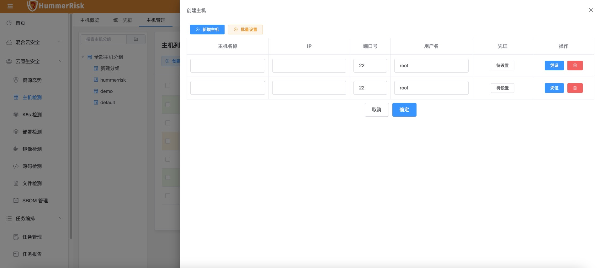
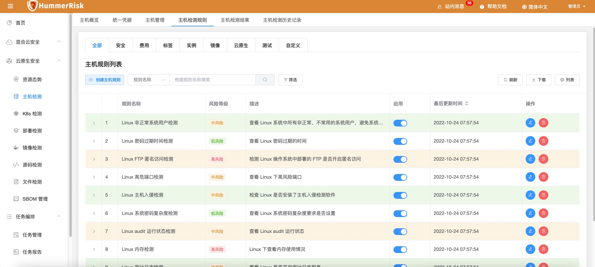
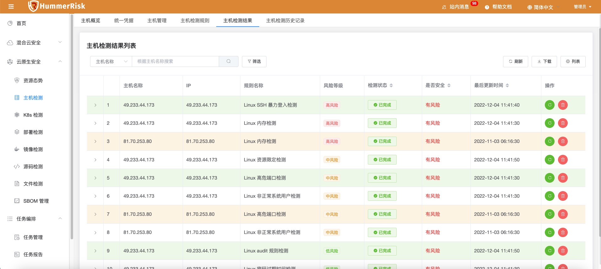

!!! abstract "模块概述"
    「主机检测模块」主要提供了给底层物理服务器或者虚拟机进行检测的能力，通过定制灵活的规则，可以实现发现主机层面潜在风险的目的。    
    使用本模块时，您需要在「主机管理」中添加主机，之后针对主机就以执行快速检测了，检测完成后可以在「主机检测结果」中查看到具体的结果。
    主机检测执行的规则都保存在「主机检测规则」中，您也可以根据自己的实际需要去定制或新建检测规则。
    您可以根据需要，在『统一凭证』中创建凭证来简化批量操作。

### 主机概览

!!! abstract "主机数据概览"
    展示主机风险检测统计数据。

{ width="95%" }

### 统一凭证

!!! abstract "统一凭证"
    - 在统一凭证中，我们可以管理待检测主机的认证凭证，在新建、修改主机信息时，可灵活绑定凭证，无需每一次都重复输入。
    - 凭证可以由密码或密钥组成。

{ width="95%" }
{ width="95%" }

### 主机管理

!!! abstract "主机管理"
    需要进行检测的主机都在本模块中管理，主机管理提供了对主机分组、主机的创建、删除、编辑、查找、校验、检测等操作。

{ width="95%" }

!!! abstract "主机新增/编辑"
    新增主机信息（可批量）。主机可绑定代理。

{ width="95%" }

### 主机检测规则

!!! abstract "主机检测规则"
    主机检测规则列表页面，可以添加、修改、查看所有主机检测规则。

{ width="95%" }

### 主机检测结果

!!! abstract "主机检测规则"
    主机检测结果列表页面，可以查看所有主机检测结果。

{ width="95%" }

### 主机检测结果历史记录

!!! abstract "主机检测结果历史记录"
    查看所有主机历史检测结果。

{ width="95%" }
