## 1. 系统设置

### 用户管理

!!! info "用户管理"
    用户列表页面提供了对系统用户的创建、关闭、删除、编辑、查找、密码修改等操作。

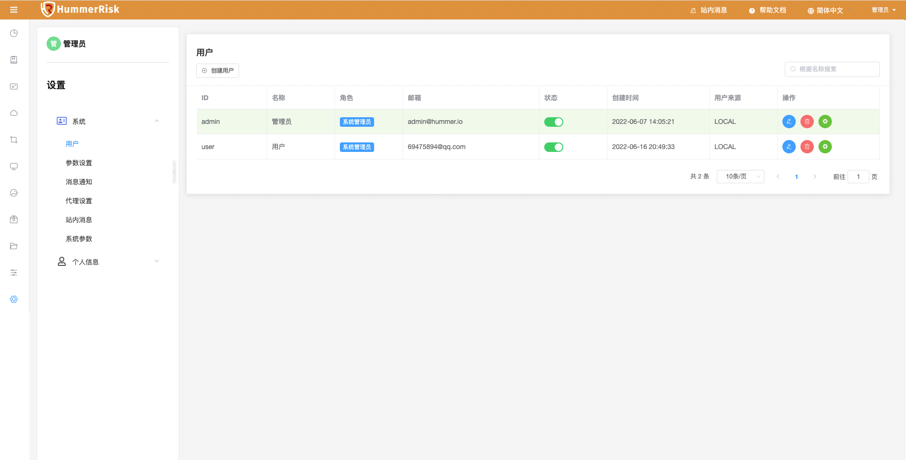

### 参数设置

!!! abstract "邮件设置"
    通过邮件设置配置 SMTP 主机、SMTP 端口、SMTP 账户、SMTP 密码等信息。

!!! abstract "企业微信设置"
    通过企业微信设置配置 cropid、agentid、secret、测试用户等信息。

!!! abstract "钉钉设置"
    通过钉钉设置配置 AppKey、AgentId、AppSecret、测试用户等信息。

!!! abstract "检测参数设置"
    通过检测参数设置， 配置云原生安全检测的参数，例如是否离线检测、检测安全项、风险等级等信息。

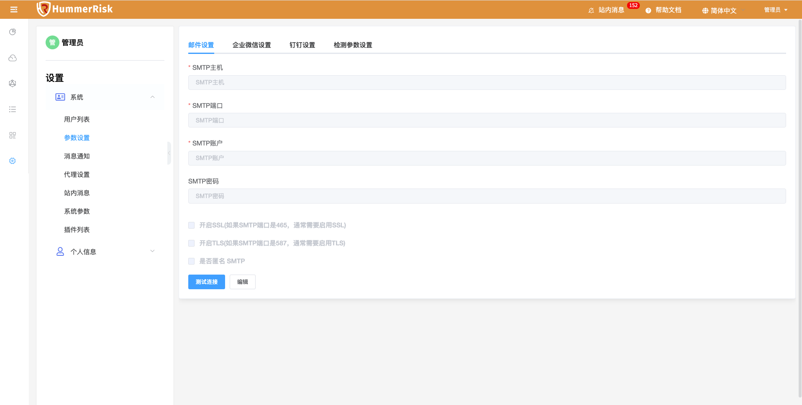

### 消息通知

!!! abstract "消息通知"
    通过消息通知，配置安全合规规则检测资源的通知事件、接收人、接收类型等信息。

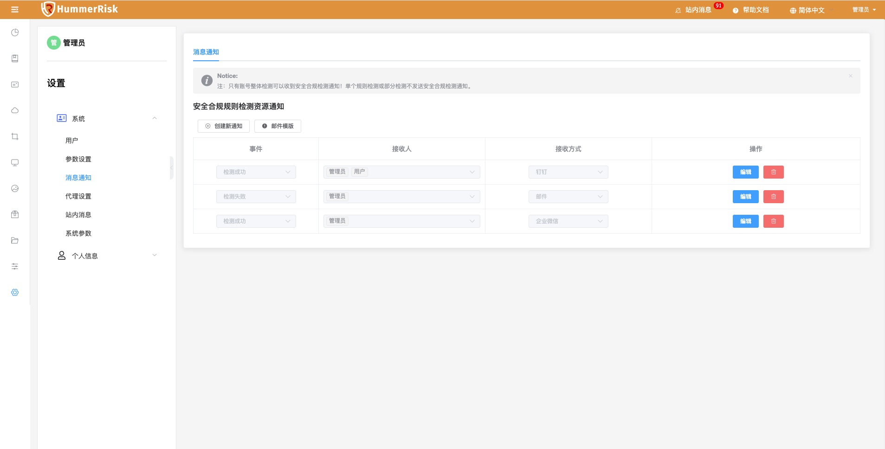

接收到的邮件通知。

### 代理设置

!!! abstract "代理设置"
    通过代理设置，配置 Proxy 类型、Proxy IP、Proxy 端口、Proxy 用户名、Proxy 密码等信息。

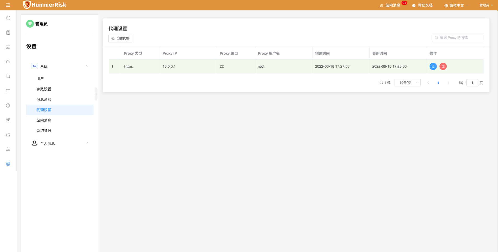

### 站内消息

!!! abstract "站内消息"
    右上角显示未读消息，每次有新的检测结果都会添加到站内消息的队列中。

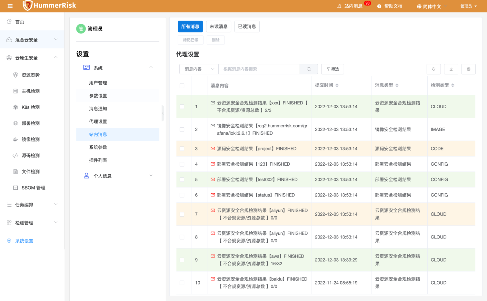

### 系统参数

!!! abstract "系统参数"
    可以查看部署 HummerRisk 宿主机的系统参数，并且手动更新。

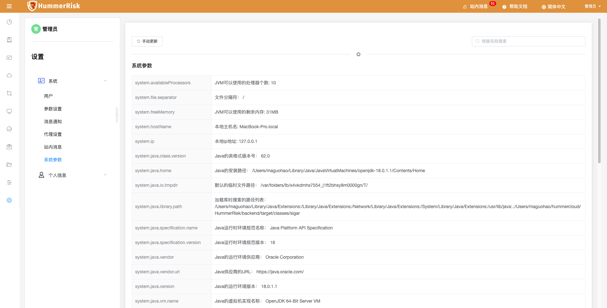

### 插件列表

!!! abstract "插件列表"
    插件列表，展示云插件与云原生插件信息。

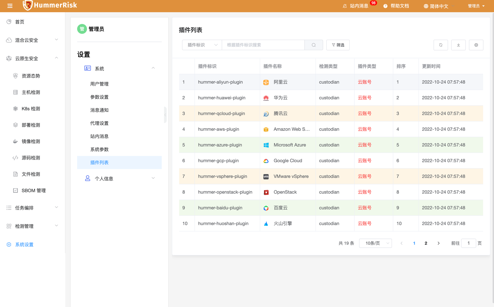

## 2. 个人信息

### 个人设置

!!! tip "个人设置"
    个人设置页面提供了对当前系统用户的编辑、密码修改等操作。

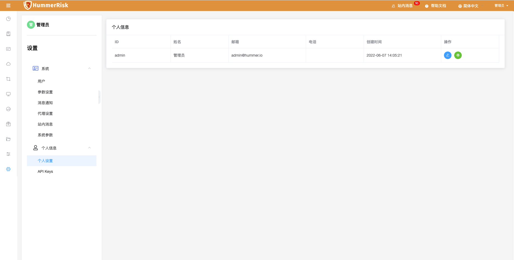

### API Keys

!!! tip "API Keys"
    API Keys 页面提供了对 Access Key 与 Secret Key 的创建、关闭、删除、复制等操作。

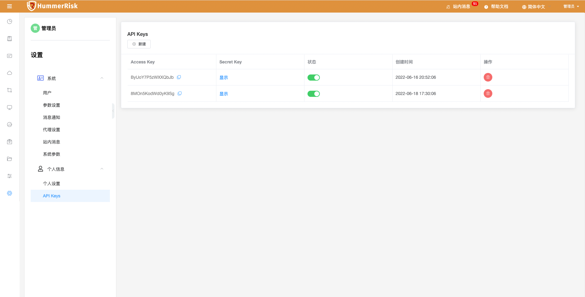

### API 文档

!!! tip "API 文档"
    点击右上角展开的 API 文档按钮进入 Restful APIs 文档页面，该功能提供了对 API 接口的查看、复制、调试等操作。

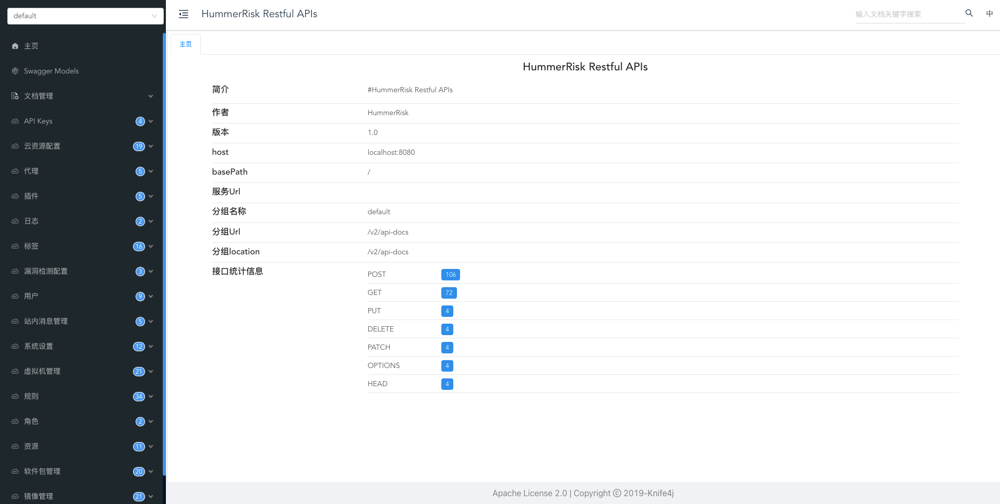

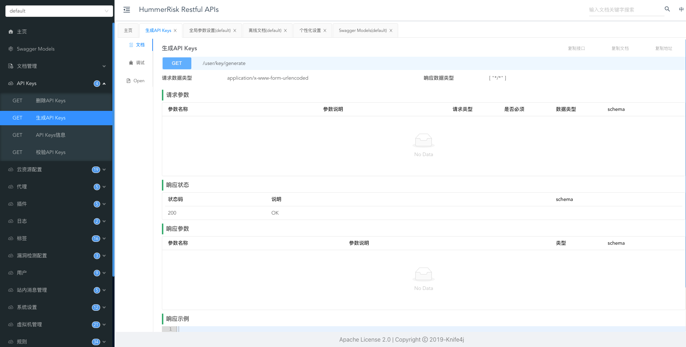
