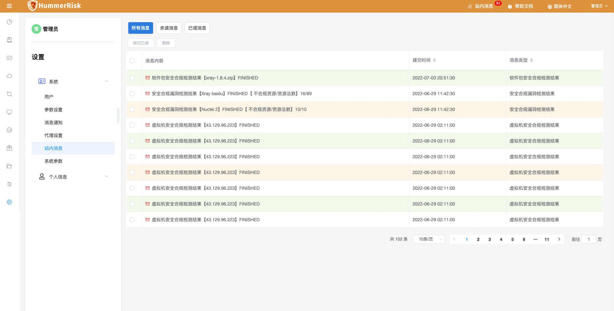
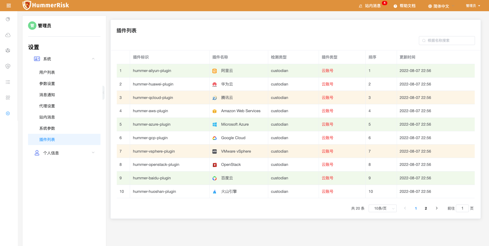

## 系统

### 用户

> 用户列表页面提供了对系统用户的创建、关闭、删除、编辑、查找、密码修改等操作。

### 参数设置

> 通过邮件设置配置 SMTP 主机、SMTP 端口、SMTP 账户、SMTP 密码等信息。

> 通过企业微信设置配置 cropid、agentid、secret、测试用户等信息。

> 通过钉钉设置配置 AppKey、AgentId、AppSecret、测试用户等信息。

### 消息通知

> 通过消息通知，配置安全合规规则检测资源的通知事件、接收人、接收类型等信息。

> 接收到的邮件通知。

### 代理设置

> 通过代理设置，配置 Proxy 类型、Proxy IP、Proxy 端口、Proxy 用户名、Proxy 密码等信息。

### 站内消息

> 右上角显示未读消息，每次有新的检测结果都会添加到站内消息的队列中。

### 系统参数

> 可以查看部署 HummerRisk 宿主机的系统参数，并且手动更新。

### 插件列表

> 插件列表，展示云插件与云原生插件信息。

## 个人信息

### 个人设置

> 个人设置页面提供了对当前系统用户的编辑、密码修改等操作。

### API Keys

> API Keys 页面提供了对 Access Key 与 Secret Key 的创建、关闭、删除、复制等操作。

### API 文档

> 点击右上角展开的 API 文档按钮进入 Restful APIs 文档页面，该功能提供了对 API 接口的查看、复制、调试等操作。

