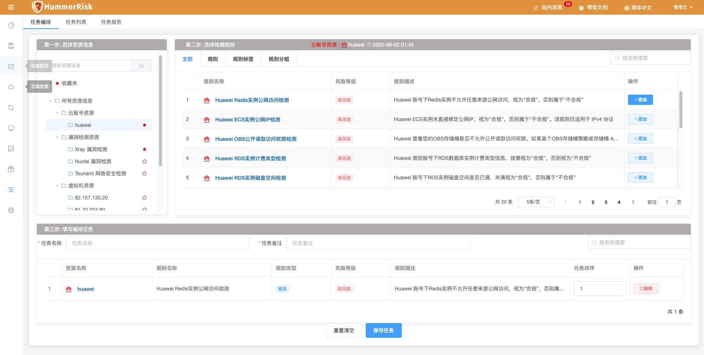
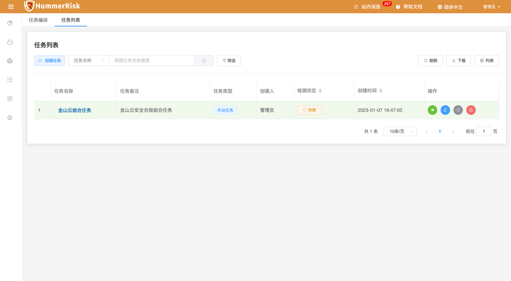
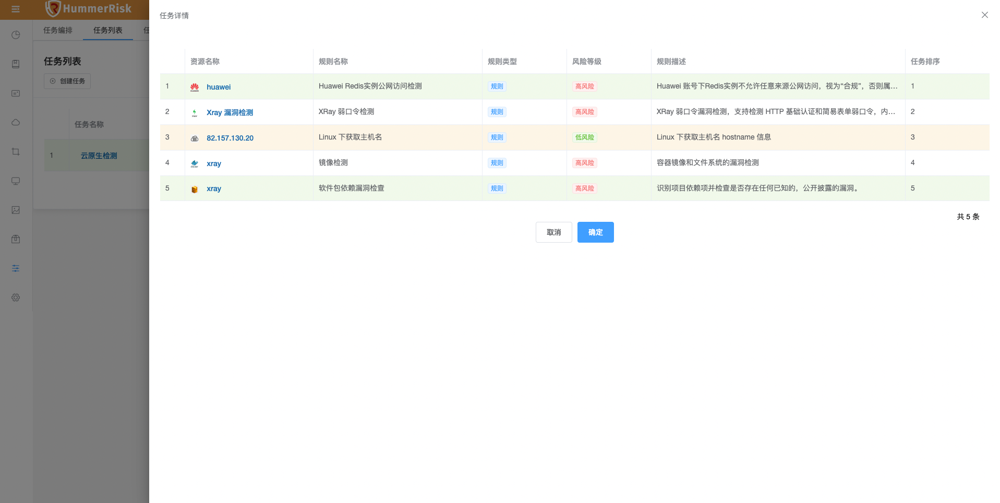
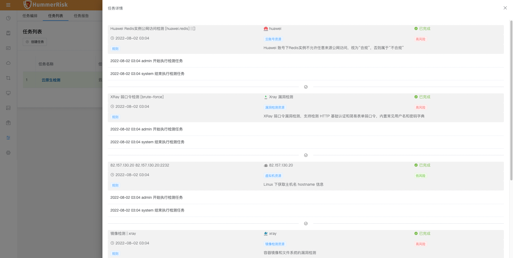

### 任务编排

!!! info "任务编排"
    在任务编排部分可以自由将各个模块中的检测任务进行编排，组合成一个综合检测任务，简化用户进行跨模块、跨资源的检测操作。  

!!! abstract "要创建一个编排任务，需要几步"  
    1. 在左侧的资源信息中选择需要检测的资源类型。 
        * 目前支持进行编排的资源类型包括：多云检测、漏洞检测、主机检测、K8s检测、部署检测、镜像检测、源码检测和文件检测。 
    2. 选着一个资源类型后，右侧检测规则会列出和该资源类型相关的可选规则，选择合适的检测规则。
        * 检测规则会列举出规则和标签两种类型，方便进行批量操作。
    3. 在底部编排任务信息部分中，填写编排任务的名称和备注信息，调整编排任务的执行顺序，就可以保存成为一个新的编排任务了。

{ width="95%" }

### 任务列表

!!! info "任务列表"
    任务编排中创建生成的任务会在列表显示，任务列表页面可以查看任务与日志信息。

{ width="95%" }

!!! abstract "任务详情"  
    点击任务列表中任务名称可查看任务详情。

{ width="95%" }

!!! abstract "新建任务"  
    新创建的任务状态为 [待检测] ，点击列表右侧的执行按钮，开始检测任务，任务会按照编排顺序执行检测任务,完成检测的状态为 [已完成]。

!!! abstract "任务状态"
    * 任务状态分为：[待检测] 、[正在处理] 和 [已完成]

!!! abstract "查看任务"
    点击任务列表中任务状态可查看任务状态，并可跳转至检测类型对应的检测结果页面。

{ width="95%" }

!!! abstract "结果报告"
    任务完成后, 可以进入任务报告界面，查看任务生成详细结果报告。
