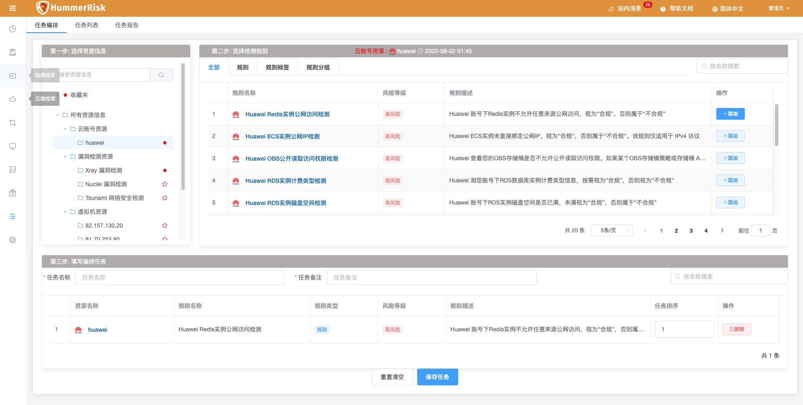
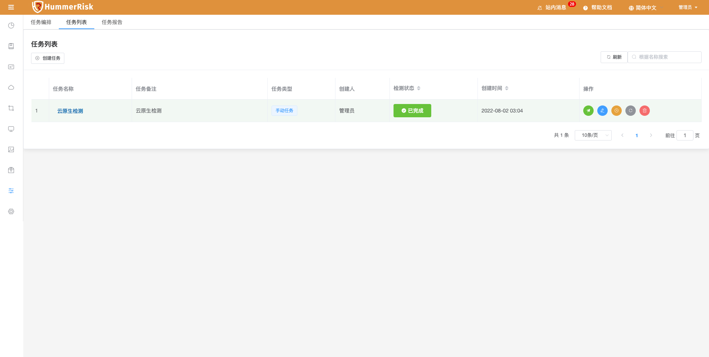
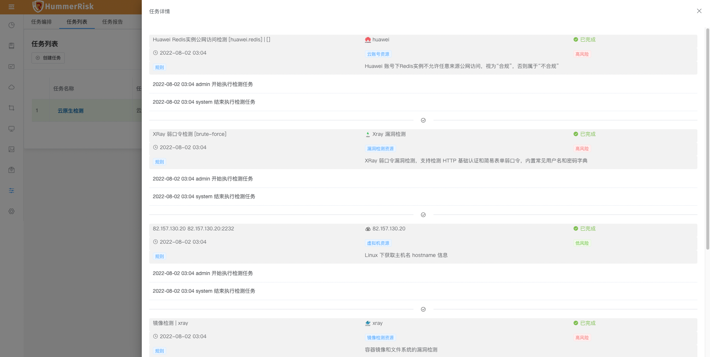

### 任务编排

> 任务编排页面可以自由添加排列检测资源、检测分类、检测规则，便于用户每次检测不用每种资源都独立操作。

> 首先，在任务编排页面选择需要检测的账户类型：云端检测、漏洞检测、虚拟机检测、镜像检测、软件包检测。
> 其次，添加右侧对应的规则类型，选择需要检测的规则并在下方列表中进行编排并保存。

{ width="900px" }

### 任务列表

> 根据任务编程生成任务列表，任务列表页面可以查看任务与日志信息。

{ width="900px" }

> 点击任务列表中任务名称可查看任务详情。

{ width="900px" }

> 点击任务列表中任务状态可查看任务状态，并可跳转至检测类型对应的检测结果页面。

{ width="900px" }

> 任务完成后, 进入任务报告界面，选择需要生成报告的任务。
