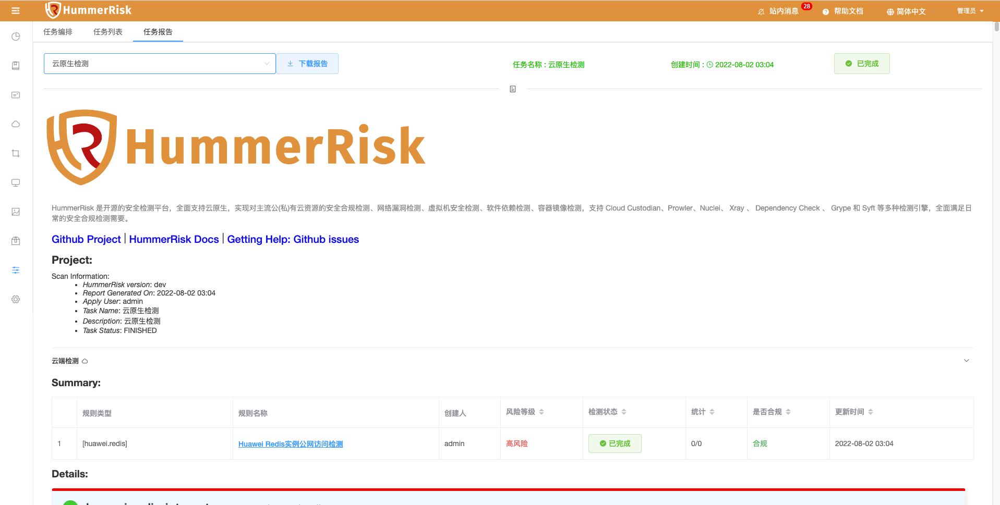
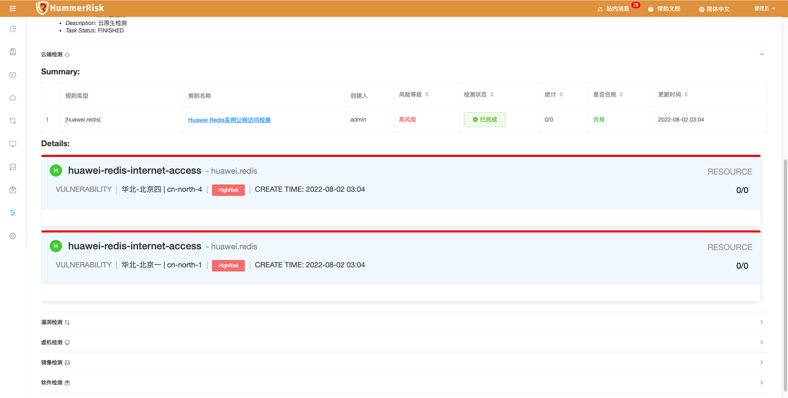
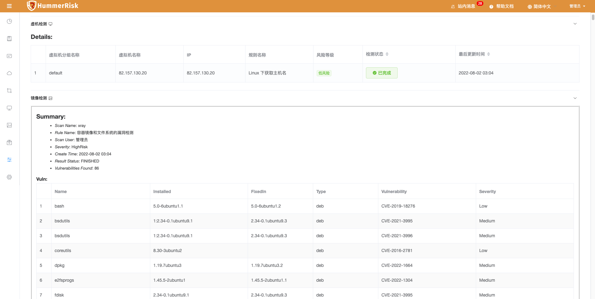
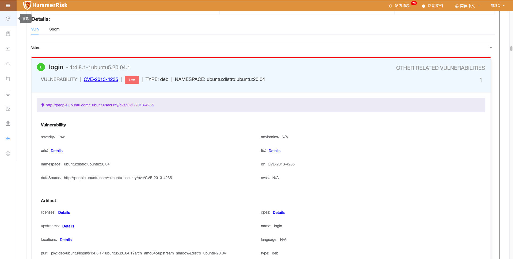

### 任务报告

!!! info "任务报告"
    基于任务编排的检测结果进行分析，并生成整合报告，显示合规报告，并支持导出和下载。

{ width="95%" }

!!! tip "分类"
    - 任务报告分为：
        - 多云检测
        - 漏洞检测
        - 主机检测
        - K8s检测
        - 部署检测
        - 镜像检测
        - 源码检测
        - 文件检测

#### 多云检测报告示例

{ width="95%" }
{ width="95%" }

#### 漏洞检测报告示例

{ width="95%" }

#### 主机检测报告示例

{ width="95%" }

#### 镜像检测报告示例

{ width="95%" }
{ width="95%" }

