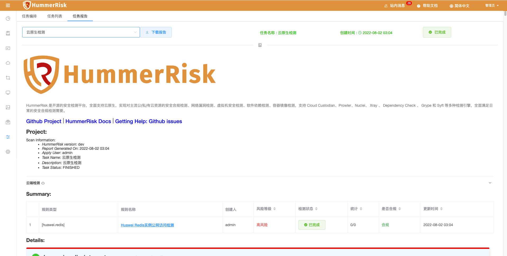
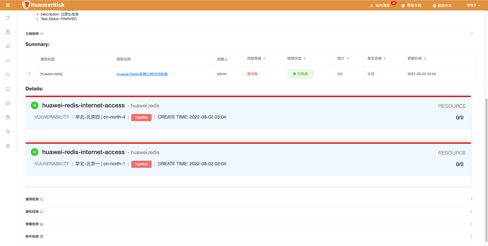
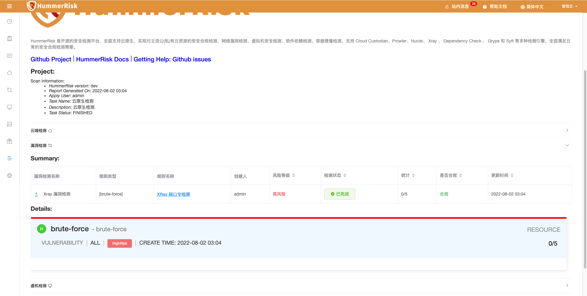
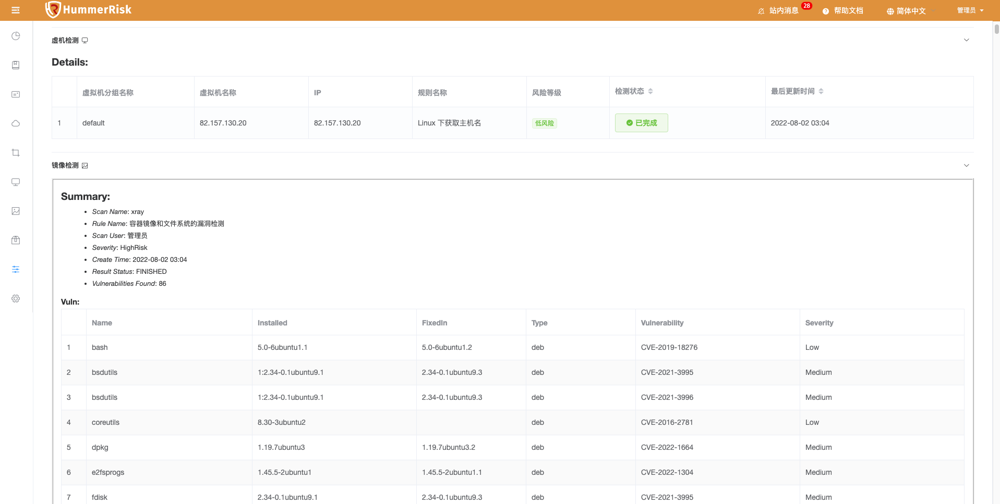
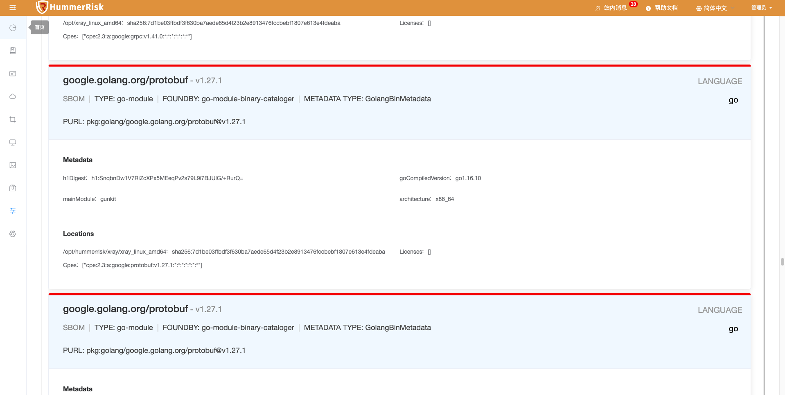
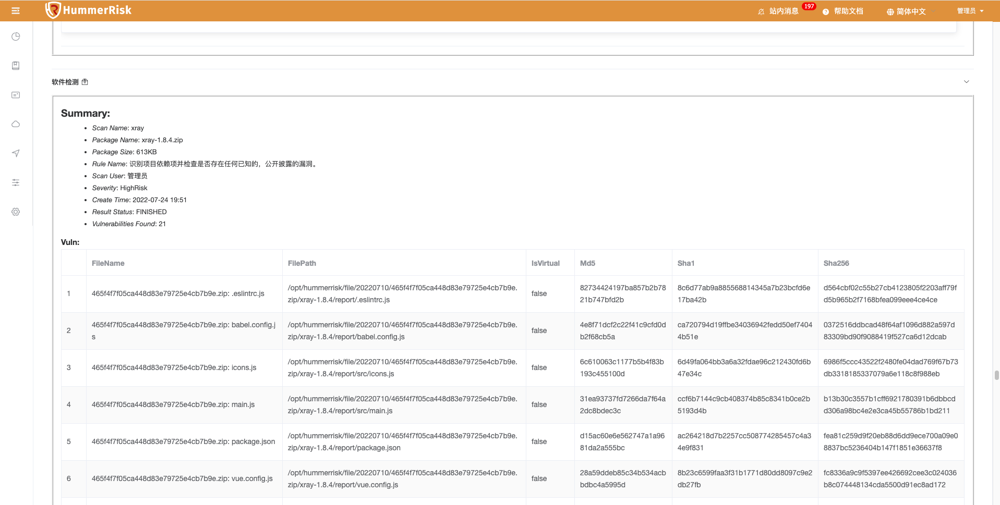
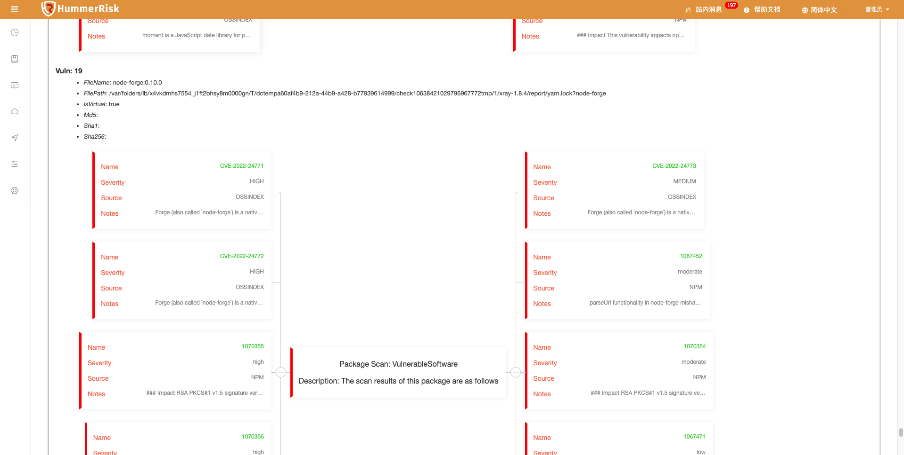

### 任务报告

> 基于任务编排做检测结果分析，显示合规报告。
> 任务报告: 根据任务编排功能进行检测，并生成相应的报告（包括云端检测、漏洞检测、虚拟机检测、镜像检测、软件包检测）。

{ width="900px" }

> 任务报告分为云端检测、漏洞检测、虚拟检测、镜像检测、软件包检测等五部分。

> 云端检测

{ width="900px" }
{ width="900px" }

> 漏洞检测

{ width="900px" }

> 虚机检测

{ width="900px" }

> 镜像检测

{ width="900px" }
{ width="900px" }

> 软件包检测

{ width="900px" }
{ width="900px" }
