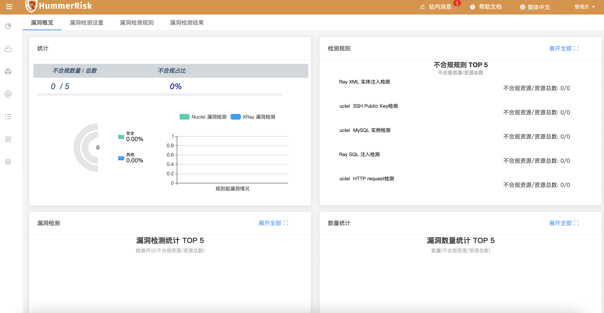
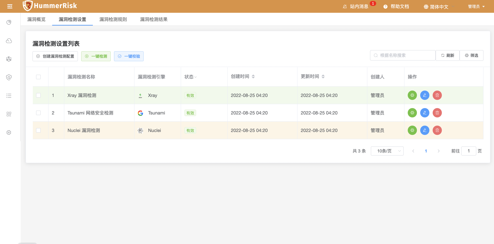
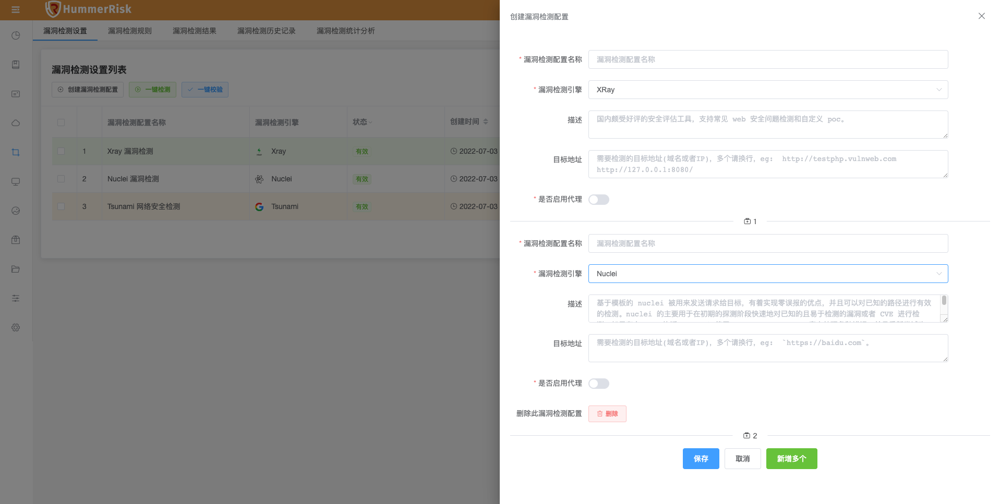
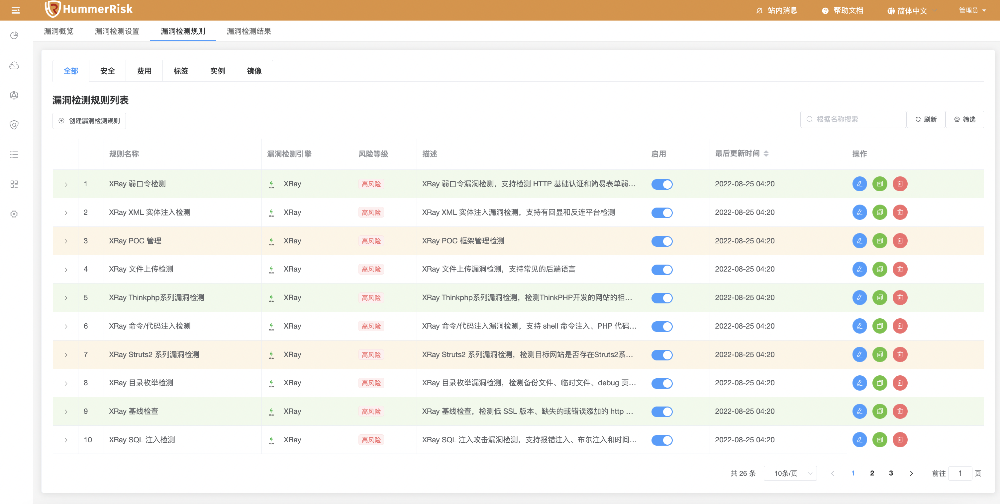
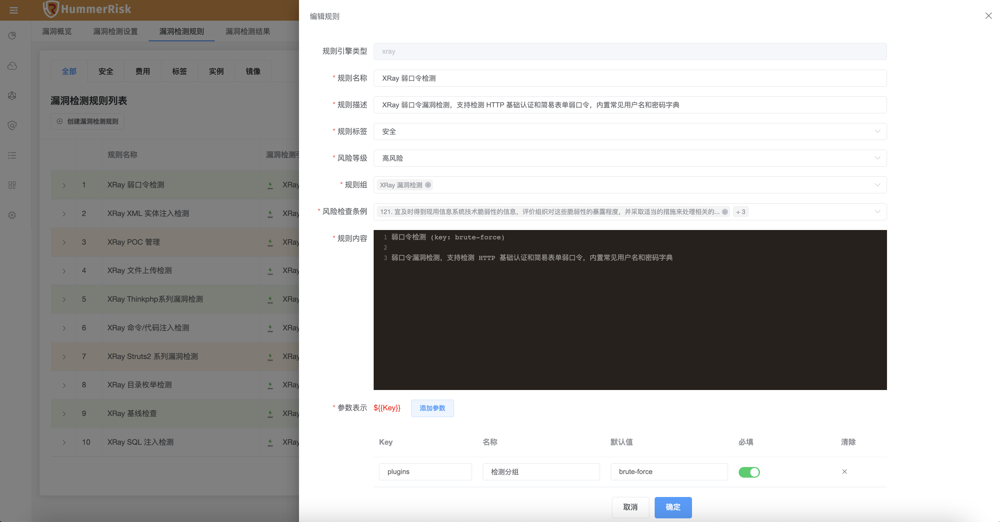
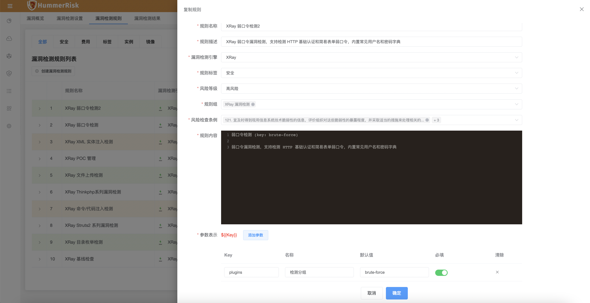
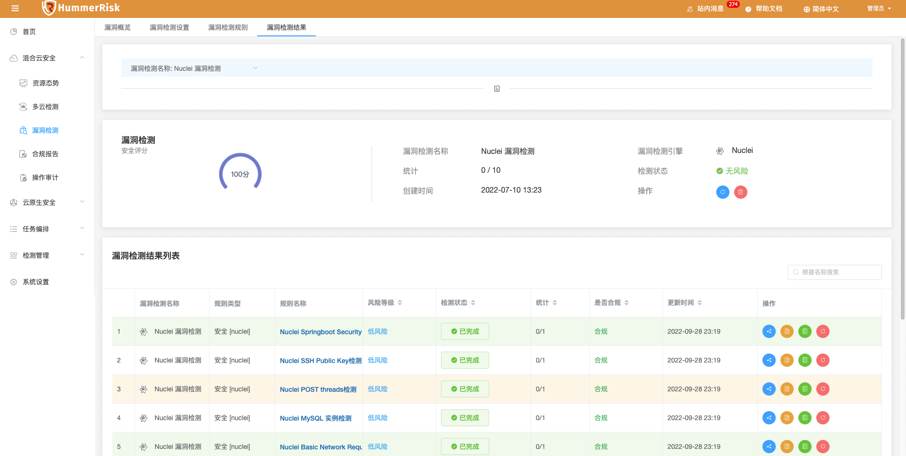

!!! info "漏洞检测"
    漏洞检测采用市面上主流的 Xray、Nuclei 技术，直接填写需要扫描的网络地址即可快速扫描，发现漏洞风险，并且可以自定义Xray、Nuclei格式的规则。

### 漏洞检测概览

!!! abstract "漏洞检测概览"
    漏洞检测概览，对漏洞进行统计分析，可以直观的看到系统漏洞情况。

{ width="95%" }

### 漏洞检测设置

!!! abstract "漏洞检测设置"
    1. 漏洞设置，主要用来记录漏洞信息，保存检测参数，用于按检测规则检测目标地址漏洞数据。
    2. 漏洞列表页面提供了对漏洞的创建、删除、编辑、查找、校验、检测、调参等操作。
    { width="95%" }
    3. 新增漏洞信息（可批量）。漏洞可绑定代理。
    { width="95%" }

### 漏洞检测规则

!!! abstract "漏洞检测规则"
    漏洞检测规则列表页面，可以添加、修改、查看所有漏洞检测规则。

{ width="95%" }

!!! abstract "编辑漏洞检测规则"
    漏洞检测规则编辑，可对漏洞规则进行编辑。

{ width="95%" }

!!! abstract "复制漏洞检测规则"
    漏洞检测规则复制，可对已有的规则进行复制。

{ width="95%" }

### 漏洞检测结果

!!! abstract "漏洞检测结果"
    漏洞检测结果列表页面，可以查看所有漏洞检测结果。

 { width="95%" }
 { width="95%" }

