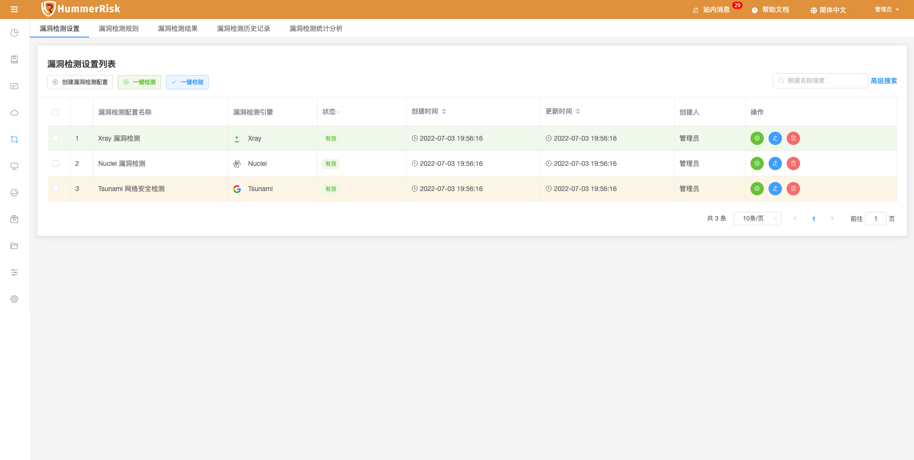
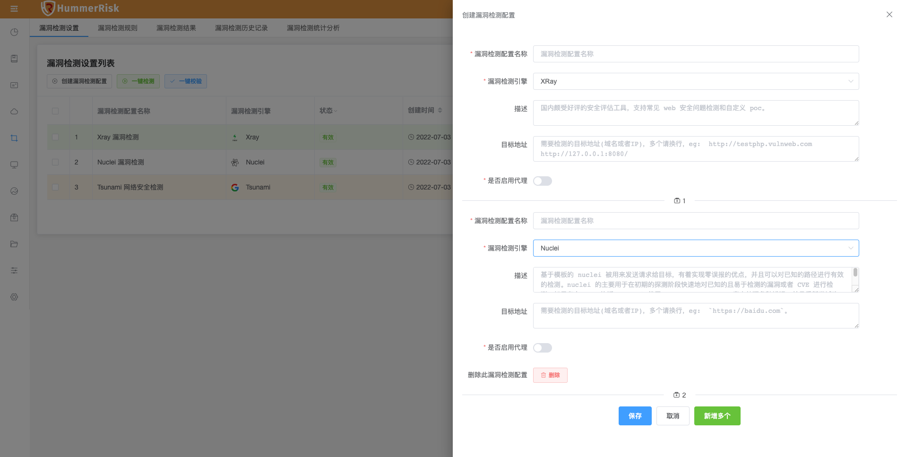
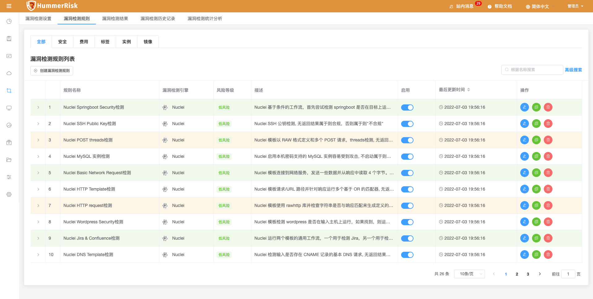
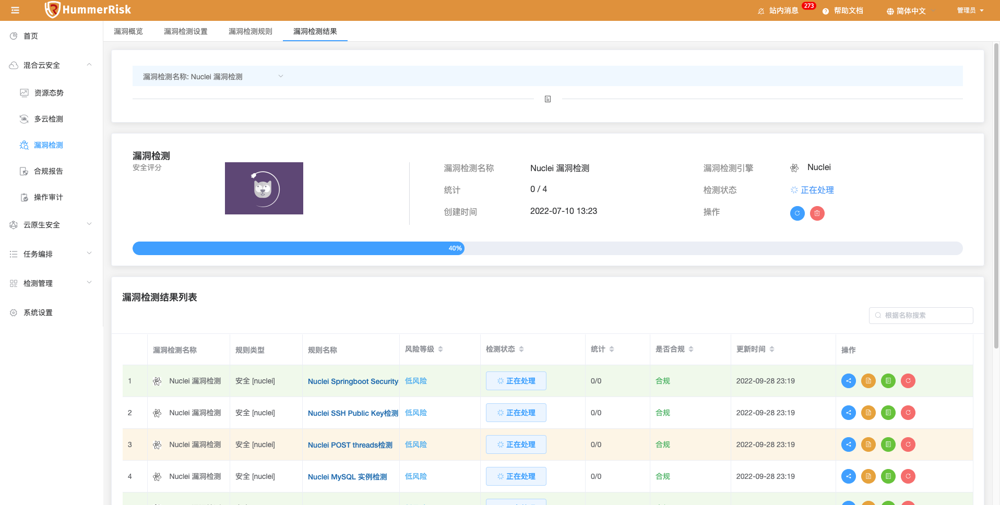
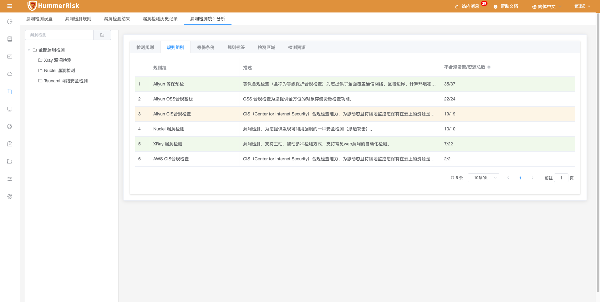

> 漏洞设置，主要用来记录漏洞信息，保存检测参数，用于按检测规则检测目标地址漏洞数据。

### 漏洞检测设置

> 漏洞列表页面提供了对漏洞的创建、删除、编辑、查找、校验、检测、调参等操作。

> 新增漏洞信息（可批量）。漏洞可绑定代理。

### 漏洞检测规则

> 漏洞检测规则列表页面，可以添加、修改、查看所有漏洞检测规则。

### 漏洞检测结果

> 漏洞检测结果列表页面，可以查看所有漏洞检测结果。

> 

### 漏洞检测历史记录

> 漏洞历史记录根据漏洞，展示历史检测安全评分。

> 

### 漏洞检测统计分析

> 漏洞统计分析根据漏洞，展示不同维度的检测结果信息，包括检测规则、规则组别、等保条例、规则标签、检测区域、检测资源等维度展示数据。

> 
