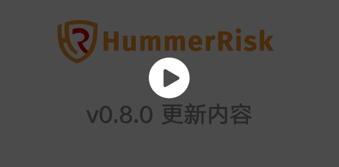

## 1 安装
[{ width="280"}](https://www.bilibili.com/video/BV1JK411d79A/)

## 2 快速入门

[{ width="280"}](https://www.bilibili.com/video/BV1g84y1b79N/?vd_source=40cffdce443e3b05aff80ddde424f0c3)
[{ width="280"}](https://www.bilibili.com/video/BV1yA411D7kc/)

## 3 使用教程

[{ width="280"}](https://www.bilibili.com/video/BV1DN411A7ch/)
[{ width="280"}](https://www.bilibili.com/video/BV1pm4y1r7fu/)
[{ width="280"}](https://www.bilibili.com/video/BV1J24y187tD/)

## 4 更新日志

[{ width="280"}](https://www.bilibili.com/video/BV13P4y1d7kn/)
[{ width="280"}](https://www.bilibili.com/video/BV1mD4y1h7cg/)
[{ width="280"}](https://www.bilibili.com/video/BV1Mv4y1X7sT/)
[{ width="280"}](https://www.bilibili.com/video/BV1AP4y1C73y/)
[{ width="280"}](https://www.bilibili.com/video/BV1Gy4y1R7SV/)
[{ width="280"}](https://www.bilibili.com/video/BV1uY411r7DP/)